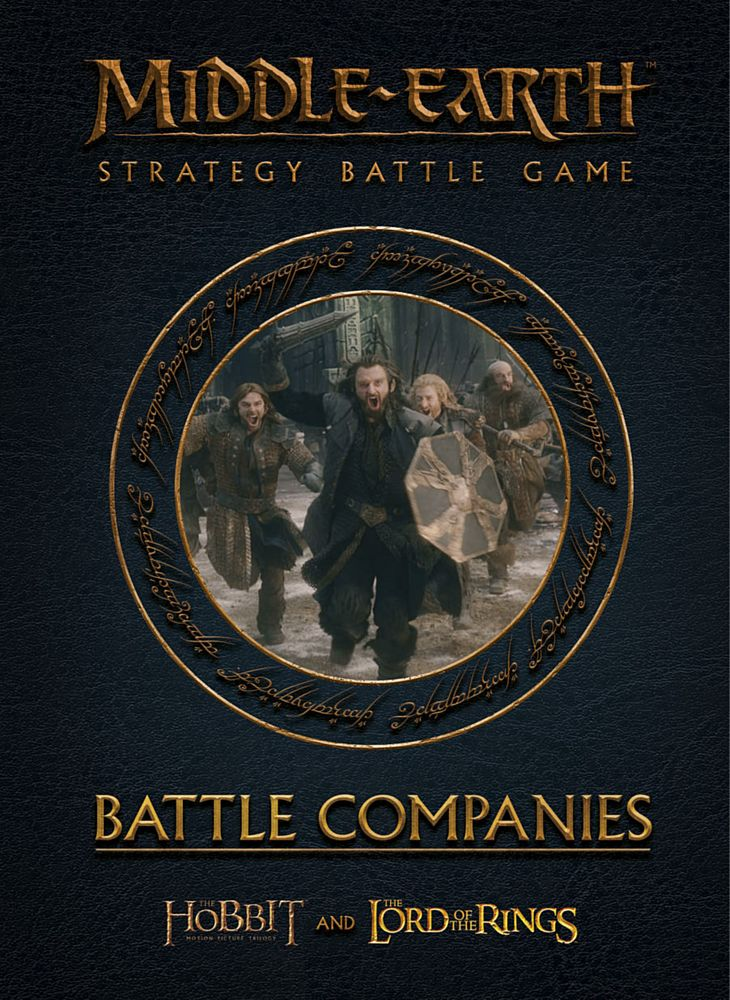



The stories of *The Lord of the Rings* and *The Hobbit* are ones of heroic deeds, boundless courage and daring adventure that have captured the hearts and minds of millions of people worldwide. These stories are often focused around a small group of unlikely heroes embarking on seemingly impossible quests and adventures as they strive to overcome the evil that stands in front of them. Thorin's Company numbered just 15 when they set out from Bag End to try to reclaim their homeland of Erebor from the clutches of Smaug; and the Fellowship of the Ring consisted of only nine heroes from across the races of the Free Peoples of Middle-earth, yet were able to endure great hardship and overthrow the Dark Lord Sauron.

It is this sense of taking a small group of heroes and having them embark on fantastical journeys of daring and adventure that this supplement allows you to accomplish. Within these pages you will find all of the rules to enable you to gather together your own band of intrepid heroes using your collection of Citadel and Forge World models, and take them on their own series of adventures. Welcome to *Battle Companies: Second Edition*!

*Battle Companies* is a supplement for the Middle-earth Strategy Battle Game, and builds on and improves the rules and gameplay of the first *Battle Companies* supplement to provide what we believe to be the best Battle Companies experience to date!
