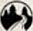
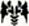
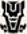
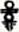
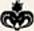

Whilst the Journey to the Blue Mountains Narrative Campaign takes your Battle Company on a specific journey with an end goal, a map-based campaign is a whole different experience entirely. Battle Companies spend huge amounts of time travelling across Middle-earth, traversing all kinds of various terrain as they set about accomplishing whatever tasks they have been set; and a map-based campaign allows you and a group of friends to fight over all of Middle-earth as your companies vie for control of it.

Over the next few pages we are going to present to you a simple and fun map-based Battle Companies campaign that's ideal for 4-10 players — although you can have more if you don't mind it getting a tad hectic!

### HOW DOES IT WORK?

The first thing you will need to do is gather a group of players for your campaign, and then get them all to gather together their starting Battle Company — an even number works much better for this, so if you have an odd number try to encourage another player to join! Players are free to use any Battle Company they wish, though we feel the campaign works best when each player uses a different company; that way each player is representing a different faction or region, which adds to the excitement of the campaign.

We recommend between 4-10 players for this campaign, as that way the map does not get too crowded and each faction has room to expand their own territories. However, this is by no means a hard and fast rule, and if you want to have more players in the campaign, that is absolutely fine — just be prepared for some companies to be right on top of each other from the start!

Once you have gathered your players and they have chosen their Battle Companies, each player will need to choose their starting location. These are all spaces in the wilderness of Middle-earth where your Battle Company currently resides, and are denoted on the map by the shaded yellow hexes and the  symbol. As there are only 10 of these starting locations on the map, if you have more than 10 players in your campaign, you will have to agree on some other starting locations for the extra players.

When selecting starting locations, randomly determine an order for players to choose them in. The first player may select any of the starting locations; the second player may then choose any of the remaining starting locations, and so on until each player has a starting location for their Battle Company. Once every player has chosen where their company will start, you are ready to play!

The map-based campaign is played using a series of turns, each of which is made up of a number of phases as explained below:

- Campaign turn begins

- Expansion phase

- Battle phase

- Consolidation phase

- Turn ends

### EXPANSION PHASE

At the start of each campaign turn, each player's Battle Company gets the chance to expand the number of territories that they own. Starting with the player with the smallest Battle Company Rating, and then the player with the next smallest Battle Company and so on, each player may take control of an unoccupied territory that is adjacent to any territory already controlled by the Battle Company.

An unoccupied territory is any hex that is not controlled by any player. A hex controlled by a player is an occupied territory.

### BATTLEPHASE

Once each player has completed the Expansion phase, it is time to organise some games. There is no set rule for how to pair players up for the games; anyone can play against anyone else regardless of how far apart they are on the map. There are many ways you can arrange who plays who, either by having players challenge each other, drawing names out of a hat, oragnising a round robin style 'fixture' list so that players will play their games in a set order — the choice is really up to you, and there are many ways you can do this. If certain players are battling over specific territories, and both of them wish to fight each other, this can be a good reason to have them fighting — just be careful not just to do this every turn, as doing so will mean they only ever play each other rather than the rest of the group.

The most important thing is to ensure that every player has a game, that way one player doesn't just race off and play everyone first so that their Battle Company becomes far more experienced than everyone else's. Making sure players all play the same number of games keeps it fair for everyone!

In smaller campaigns with between four and six players, you can, if you wish, play more than one game in a Battle phase in order to help all players expand that bit quicker and reach each other's territories sooner.

After each game, players will need to go through the post-game sequences as laid out in the War's Aftermath section on **page 6**.

### CONSOLIDATION PHASE

After players have played their game and gone through the War's Aftermath section, the winner of the battle gets the chance to expand the lands that their Battle Company controls, whilst the loser regroups ready for the next game.

The winner of a game may choose to take control of one unoccupied territory that is adjacent to any one of their already controlled territories. Alternatively, the player can choose to take control of one occupied territory that is adjacent to any one of their already controlled territories, provided that they have just defeated the current owner of the territory.

If, for whatever reason, a player is victorious but cannot claim a territory using the criteria provided, they instead receive a bonus D6 Influence Points.

The losing player does not get to take a territory; however, as their company is busy regrouping and planning their next attack, they will receive a small bonus in their next game.

If a player lost their previous game then they may choose whether they are the Attacker or Defender in the next scenario (if this is relevant). If there is no Attacker or Defender in

the next scenario, they may choose their deployment zone instead. If both players in a game lost their previous battle, neither player gains these benefits — the planning and efforts of both Battle Companies cancel each other out.

In this campaign, turns don't take very long at all, probably no more than an hour each. This means that you can get a good few turns of the campaign in each time you meet up with your gaming group and the campaign will progress at a very reasonable pace.

---

***Example 1**: Jay has just won a game of Battle Companies and, as he is only adjacent to unoccupied territories, chooses one of them to claim for his Battle Company.*

***Example 2**: Here, Jay's Minas Tirith Battle Company has just defeated Ben's Moria Battle Company. Jay could choose to take control of territory A as he was victorious and it is currently unoccupied. Jay could also choose to take control of either territory B or territory C as both are owned by Ben, who Jay has just defeated in the previous game. Jay could not choose to take control of territory D as it is owned by Adam's Easterling Battle Company and, although he was victorious, Jay would need to defeat Adam specifically to lay claim to that territory.*

---

### WINNING THE CAMPAIGN

When you start a campaign, you will need to determine when the end point will be so that you can establish an eventual winner. At the end of the campaign it will be the player with the most Campaign Points that will be declared as the victor (we'll explain how to score points later in this section).

Much like organising which players will play against each other, there is no right or wrong way to choose the end point for your campaign; it is really whichever best fits your particular gaming group. There are many ways to choose an end point; some ideas are listed below:

- You could play until each player has completed a set number of turns, at which point the player with the most Campaign Points is the winner.

- You could play for a set number of weeks or months, at which point the player with the most Campaign Points is the winner.

- You could play until one player reaches a pre-determined number of Campaign Points, and the first to reach that limit is the winner.

### CAMPAIGN POINTS

A map-based campaign is won by obtaining points. Battle Companies earn points depending on the number and type of territories that they hold. Points are always calculated at the end of a turn, so any new territories claimed in a turn are not added onto the Battle Company's total until the turn ends.

There are two types of territories: Wilderness Territories and Special Territories, and each is worth a different number of points.

**Wilderness Territories** are quite simply any hex that is not a Special Territory; this includes the starting locations. Wilderness Territories are worth one Campaign Point.

**Special Territories** are those areas of Middle-earth that have a much greater significance than the others — they are determined on the map by the shaded red hexes. Special Territories are worth 5 Campaign Points. Additionally, each Special Territory has a unique special rule associated with it depending on what the territory represents. As long as a Battle Company holds a Special Territory, they gain the associated benefit. The list of Special Territories and their associated benefits are listed over the next few pages.

Each Special Territory will also have its own symbol on the map, making it easy to locate each at a glance.

### SPECIAL TERRITORIES

As mentioned previously, dotted around the campaign map is a selection of 30 Special Territories. These are not only worth significantly more Campaign Points, but each one also has a special rule associated with it — making them well worth fighting over, as they can very easily be the deciding factor in a campaign!

Over the next three pages we will highlight each of these Special Territories and the special rules associated with them. The special rule for each of these applies as soon as a Battle & Company takes control of the territory, but is also lost as soon as a company loses control of the territory.

 **ABRAKHÂN** 

At the end of each Battle phase, a Battle Company that controls Abrakhân gains an additional 1 Influence Point.

 **BLUE MOUNTAINS** 

A Battle Company that controls the Blue Mountains may swap their hand weapons for another type for free rather than having to pay an Influence Point to do so.

 **BRANDYWINE**

At the end of each Expansion phase, a Battle Company that controls the Brandywine may roll a D6. On a 4+, they may immediately make another expansion just as if it was the Expansion phase. This additional expansion does not allow the controlling Battle Company to roll again after doing so.

 **CIRITH UNGOL**

If a Battle Company controls Cirith Ungol then all of the models within the company benefit from the Poisoned Weapons special rule for all of their weapons.

 **DEAD MARSHES**

If a Battle Company controls the Dead Marshes, then **Infantry** models in the company are not slowed by difficult terrain. Additionally, **Cavalry** models in the company may move at half of their Move allowance whilst within difficult terrain, rather than a quarter.

 **DOL AMROTH**

If a Battle Company controls Dol Amroth then any **Hero** models in the company may choose to re-roll the results on Progression charts. If they do this, they must take the second result.

 **EDORAS**

A Battle Company that controls Edoras may purchase horses or armoured horses for one fewer Influence point than they would normally pay. Alternatively, if the Battle Company cannot purchase horses normally, they will now be able to do so at the normal cost in Influence Points.

 **EREBOR**

At the end of each Battle phase, a Battle Company that controls Erebor gains an additional 1 Influence Point.

 **ERECH**

At the start of each Battle phase, a Battle Company that controls Erech rolls a D6. On a 4+, a single Warrior of the Dead joins the Battle Company for the upcoming game. Immediately after the game is completed, the Warrior of the Dead fades to dust and is not added to your company's roster.

 **FANGORN**

All models in a Battle Company that controls Fangorn gain the Woodland Creature special rule.

 **FORNOST**

If a Battle Company controls Fornost then any **Hero **models in the company may choose to re-roll results on Progression charts. If they do this, they must take the second result.

 **THE GREY HAVENS**

A Battle Company that controls the Grey Havens may expand into any unoccupied territory that is along the coastline of Middle-earth as if they were adjacent to them. They may do this either during the Expansion phase or during the Consolidation phase.

 **GUNDABAD**

A Battle Company that controls Gundabad may swap their hand weapons for another type for free rather than having to pay an Influence Point to do so.

 **ICEBAY OF FOROCHEL**

Models in a Battle Company that controls the Icebay of Forochel gain a bonus of +2 to all Swim tests.

 **IRON HILLS**

All models in a Battle Company that controls the Iron Hills gain the Mountain Dweller special rule.

 **ISENGARD**

Once per game, a Battle Company that controls Isengard can choose to have Priority rather than either player rolling as normal. This must be done before either player rolls their dice.

 **KÂRNA**

Models in a Battle Company that controls Kârna gain a bonus of +1 to their Courage value.

 **KHAND**

A Battle Company that controls Khand may purchase horses or armoured horses for one fewer Influence point than they would normally pay. Alternatively, if the Battle Company cannot purchase horses normally, they will now be able to do so at the normal cost in Influence Points.

 **LAKE OF RHÛN**

At the end of each Expansion phase, a Battle Company that controls the Lake of Rhûn may roll a D6. On a 4+, they may immediately make another expansion just as if it was the Expansion phase. This additional expansion does not allow the controlling Battle Company to roll again after doing so.

 **LAKE-TOWN**

A Battle Company that controls Lake-town may purchase wargear and Equipment (with the exception of mounts) for 1 Influence Point fewer than normal (to a minimum of 1 Influence Point).

 **LOTHLÓRIEN**

All models in a Battle Company that controls Lothlórien gain the Woodland Creature special rule.

 **MINAS TIRITH**

A Battle Company that controls Minas Tirith gains a bonus of +1 to their Reinforcement rolls.

 **MIRKWOOD**

At the start of each Battle phase, a Battle Company that controls Mirkwood rolls a D6. If the company is Good, then on a 4+, a single Mirkwood Ranger joins the Battle Company for the upcoming game. If the company is Evil, then on a 4+ a single Mirkwood Spider joins the Battle Company for the upcoming game. Immediately after the game is completed, the Mirkwood Ranger or Mirkwood Spider wanders back into the forest and is not added to your company roster.

 **MORIA**

All models in a Battle Company that controls Moria gain the Mountain Dweller special rule.

 **MOUNT DOOM**

A Battle Company that controls Mount Doom gains a bonus of +1 to their Reinforcement rolls.

 **OSGILIATH/MINAS MORGUL**

At the start of each Battle phase, a Battle Company that controls Osgiliath/Minas Morgul rolls a D6. If the company is Good, then on a 4+ a single Ranger of Gondor joins the Battle Company for the upcoming game. If the company is Evil, then on a 4+ a single Dead Marsh Spectre joins the Battle Company for the upcoming game. Immediately after the game is completed, the Ranger or Spectre wanders back to their own city and is not added to your company roster.

 **RHOSGOBEL**

All models in a Battle Company that controls Rhosgobel gain the Resistant to Magic special rule.

 **THE SHIRE**

Models from a Battle Company that controls the Shire gain a bonus of +1 when making Injury rolls. This bonus is ignored if the model rolls the Dead result — they are beyond saving.

 **UMBAR**

A Battle Company that controls Umbar may expand into any unoccupied territory that is along the coastline of Middle-earth as if they were adjacent to them. They may do this either during the Expansion phase or during the Consolidation phase.

 **WEATHERTOP**

Once per game, a Battle Company that controls Weathertop can choose to have Priority rather than either player rolling as normal. This must be done before either player rolls their dice.
