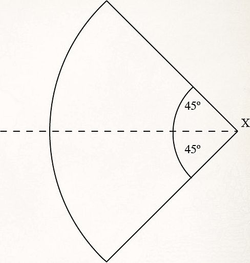

## ARMY COMPOSITION

This army may include: Dáin Ironfoot, Lord of the Iron Hills; Iron Hills Captains; Múrin & Drár; Iron Hills Dwarves; Iron Hills Goat Riders; Iron Hills Chariots; Iron Hills Ballistae.

## ARMY BONUS

**"Ironfoot has come!"** – In Scenarios where you roll for additional forces to arrive (such as those that use the Reinforcements rule), you may modify your own Reinforcements rolls for warbands from this army list by +1 or -1. In Scenarios where you roll to see which part of the board your warbands deploy in, you may modify the dice roll by +1 or -1.

Additionally, Dáin Ironfoot, Lord of the Iron Hills receives the [Master of Battle] 4+ special rule.

## HEROES OF THE IRON HILLS

### DÁIN IRONFOOT, LORD OF THE IRON HILLS [140 POINTS]
*DWARF, IRON HILLS, INFANTRY, HERO — HERO OF LEGEND*

| Mv  | F    | S   | D   | A   | W   | C   | M   | W   | F   |
| :-: | :--: | :-: | :-: | :-: | :-: | :-: | :-: | :-: | :-: |
| 5"  | 6/4+ |  5  |  8  |  3  |  3  |  7  |  3  |  3  |  3  |

**WARGEAR:**

- [Heavy Dwarf armour]
- *[Two-handed]* [hammer]

**HEROIC ACTIONS:**

- [Heroic Resolve]
- [Heroic March]
- [Heroic Strike]
- [Heroic Strength]
- [Heroic Challenge]

**OPTIONS:**

- War boar: 20 points

---

**WAR BOAR**

| Mv  | F    | S   | D   | A   | W   | C   |
| :-: | :--: | :-: | :-: | :-: | :-: | :-: |
| 8"  | 4/5+ |  4  |  6  |  0  |  2  |  3  |

---

**SPECIAL RULES:**

- [Burly]
- [Fearless]
- **Lord of the Iron Hills (PASSIVE)**

Whilst Dáin Ironfoot, Lord of the Iron Hills is alive on the battlefield, all Iron Hills Dwarf models within 12" of Dáin automatically pass all Courage tests they are required to make.

- **Fiery Temper (ACTIVE)**

As soon as Dáin Ironfoot, Lord of the Iron Hills kills an enemy model, for the rest of the game, if Dáin is in range to Charge, he must do so if he is able to.

- **Fearsome Charge (PASSIVE)**

In a turn that Dáin Ironfoot, Lord of the Iron Hills Charges into combat, he causes Terror until the end of the turn. 

- **Headbutt (ACTIVE)**

If Dáin Ironfoot, Lord of the Iron Hills wins a Duel roll but fails to slay his opponent, select one enemy Man-sized (or smaller) model in the fight and roll a D6. On a 5+, Dáin will headbutt that model and it will be Knocked to the Ground.

---

### MÚRIN & DRÁR [140 POINTS FOR BOTH]
*DWARF, IRON HILLS, INFANTRY, HEROES OF FORTITUDE*

**MÚRIN**

| Mv  | F    | S   | D   | A   | W   | C   | M   | W   | F   |
| :-: | :--: | :-: | :-: | :-: | :-: | :-: | :-: | :-: | :-: |
| 5"  | 5/4+ |  4  |  8  |  2  |  2  |  5  |  3  |  1  |  1  |

**WARGEAR**

- [Dwarf armour]
- [Shield] 
- Kalazâl
- **Kalazâl (ACTIVE)**

This is a [sword]. Additionally, Múrin receives a bonus of +1 To Wound when making Strikes against Orc models, Goblin models and Uruk-hai models.

**HEROIC ACTIONS**

- [Heroic Strike]

**DRÁR**

| Mv  | F    | S   | D   | A   | W   | C   | M   | W   | F   |
| :-: | :--: | :-: | :-: | :-: | :-: | :-: | :-: | :-: | :-: |
| 5"  | 5/4+ |  4  |  7  |  2  |  2  |  5  |  3  |  1  |  1  |

**WARGEAR**

- [Dwarf armour] 
- [Dwarf bow][Bow]

**SPECIAL RULES**

- [Expert Shot]

**HEROIC ACTIONS**

- [Heroic Accuracy]

---

### IRON HILLS CAPTAIN [80 POINTS]
*DWARF, IRON HILLS, INFANTRY, HERO — HERO OF FORTITUDE*

| Mv  | F    | S   | D   | A   | W   | C   | M   | W   | F   |
| :-: | :--: | :-: | :-: | :-: | :-: | :-: | :-: | :-: | :-: |
| 5"  | 5/4+ |  4  |  8  |  2  |  2  |  5  |  2  |  1  |  1  |

**WARGEAR**

- [Heavy armour]
- [War spear]
- [Sword]
- [Shield]

**HEROIC ACTIONS**

- [Heroic March]

**OPTIONS**

- May exchange war spear for mattock: Free
- War goat (see page 30): 10 points

- **Mattock (ACTIVE)**

A mattock is a *[two-handed]* weapon that can either use the [Bash][Hammer] or [Piercing Strike][Spear] Special Strikes.

**SPECIAL RULES**

- [Master of Battle] (5+)
- [Shieldwall]

---

## WARRIORS OF THE IRON HILLS

### IRON HILLS DWARF [11 POINTS]
*DWARF, IRON HILLS, INFANTRY, WARRIOR*

| Mv  | F    | S   | D   | A   | W   | C   |
| :-: | :--: | :-: | :-: | :-: | :-: | :-: |
| 5"  | 4/4+ |  4  |  7  |  1  |  1  |  4  |

**WARGEAR**

- [Heavy armour]
- [Sword]
- [Shield]

**SPECIAL RULES**

- [Shieldwall]

**OPTIONS**

- May exchange shield for mattock: Free
- May exchange shield for [crossbow]: 1 point
- [Spear]: 1 point
- [Banner]: 25 points

- **Mattock (ACTIVE)**

A mattock is a *[two-handed]* weapon that can either use the [Bash][Hammer] or [Piercing Strike][Spear] Special Strikes.

---

### IRON HILLS GOAT RIDER [20 POINTS]
*DWARF, IRON HILLS, CAVALRY, WARRIOR*

| Mv  | F    | S   | D   | A   | W   | C   |
| :-: | :--: | :-: | :-: | :-: | :-: | :-: |
| 5"  | 4/4+ |  4  |  7  |  1  |  1  |  4  |

**WARGEAR**

- [Heavy armour]
- [Sword] 
- [War spear]
- War goat

**OPTIONS**

- May exchange war spear for mattock: Free
- [Banner]: 25 points

- **Mattock (ACTIVE)**

A mattock is a *[two-handed]* weapon that can either use the [Bash][Hammer] or [Piercing Strike][Spear] Special Strikes.

---

**WAR GOAT (GOAT, IRON HILLS)**

| Mv  | F    | S   | D   | A   | W   | C   |
| :-: | :--: | :-: | :-: | :-: | :-: | :-: |
| 8"  | 2/6+ |  4  |  5  |  0  |  1  |  3  |

**SPECIAL RULES**

- [Mountain Dwellers]

- **Devastating Charge (ACTIVE)**

When this model Charges into combat against one or more Man-sized (or smaller) models, roll a D6 for each. On a 5+, that model is immediately Knocked to the Ground.

---

---

### IRON HILLS BALLISTA [90 POINTS]
*SIEGE WEAPON, IRON HILLS*

| Siege Engine | Strength | Defence | Wounds |
|:--:|:--:|:-:|:--:|
|Ballista | (8) | 10 | 4 |

**CREW**

An Iron Hills Ballista is a large Siege Engine and is crewed by four Iron Hills Dwarves with heavy armour and swords. One of these is automatically the [Siege Veteran] (we recommend the Dwarf who is pointing). All crew members have the *Dwarf, Iron Hills, Infantry and Warrior* keywords.

| Mv  | F    | S   | D   | A   | W   | C   |
| :-: | :--: | :-: | :-: | :-: | :-: | :-: |
| 5"  | 4/4+ |  4  |  6  |  1  |  1  |  4  |

**OPTIONS**

* Iron Hills Dwarf Engineer Captain: 75 points
* Superior Construction: 15 points
* Additional Dwarf Crew: 10 points each

**SPECIAL RULES**

- **Reliable (ACTIVE)**

When firing an Iron Hills Ballista at a target, the shot will only scatter 3", rather than 6". Furthermore, the Iron Hills Crew may re-roll 1s to hit.

- **The Old Twirly Whirlies (ACTIVE)**

The Iron Hills Ballista always counts as declaring a Heroic Shoot – there is no need to spend Might. Additionally, the Ballista follows the rules for Volley Fire. When the Ballista hits a target, place a marker under the centre of the target model. Draw a line from the centre of the Ballista to the centre of the marker. Shooting attacks that are Strength 6 or less cannot target any model within 3" of that line for the remainder of the turn. Additionally, shooting attacks that are Strength 6 or less cannot be made if they cross the line at any point. If a shooting attack that is Strength 7 or more targets a model that is either within 3" of the line, or the shot crosses the line, roll a D6. On the roll of a 5+, the shooting attack is prevented. At the end of the turn, remove any marker placed due to this special rule.

- **Tremendous Impact (ACTIVE)** –

If an Iron Hills Ballista scores a hit against a Battlefield Target, all Man-sized (or smaller) models within 2" are Knocked to the Ground. Cavalry models within 2" must take a Thrown Rider test. Additionally, any model within 2" also suffers a Strength 4 hit.

---

### IRON HILLS CHARIOT [175 POINTS]
*DWARF, IRON HILLS, WARRIOR*

**IRON HILLS CHARIOT CREW**

| Mv  | F    | S   | D   | A   | W   | C   |
| :-: | :--: | :-: | :-: | :-: | :-: | :-: |
| 5"  | 4/4+ |  4  |  6  |  1  |  1  |  4  |

**IRON HILLS CHARIOT**

| Mv  | F    | S   | D   | A   | W   | C   |
| :-: | :--: | :-: | :-: | :-: | :-: | :-: |
| 8"  | 4/4+ |  4  |  8  |  2  |  5  |  3  |

**WARGEAR** 
- [Heavy armour]
- [Sword]

**OPTIONS**

- Iron Hills Captain (replaces driver): 75 points
- Champions of Erebor (replaces crew, see page 34): 325 points

**SPECIAL RULES**

- [Fearless]
- [Monstrous Charge]

- **Dwarven Crew (ACTIVE)**

Any Iron Hills Dwarf Warrior may replace a slain crew member by ending their Move phase in base contact with the Chariot. Any Iron Hills Dwarf Warrior who joins the Chariot immediately drops their spear, shield, mattock, crossbow or banner.

Should the driver be killed, another Iron Hills Dwarf on the Chariot immediately takes their place. Any Chariot that has all of its crew slain is removed as a casualty.

- **Rapid Fire Bolt Thrower (ACTIVE)**

Any Iron Hills Dwarf, that is not the driver, may man the rapid fire bolt thrower. This is a crossbow that fires D6 shots per turn. The bolt thrower only has a limited field of fire of 45˚ to its left or right. The Chariot may still fire even if it has moved its full distance that turn. Additionally, the Chariot does not suffer the -1 penalty for moving and shooting.

The Chariot may still shoot even if Engaged in combat and does not need an In The Way test for models Engaged with it. Each shot may target a different enemy. If it does this, then the Dwarf operating the rapid fire bolt thrower may not add its Attacks or Fight value to the Duel roll, and may not make Strikes, in the following Fight phase.

- **Chariot Charge (ACTIVE)**

The Iron Hills Chariot is an unusual model and moves in the following way:

• At the start of the Move phase, the controlling player may pivot the Chariot up to 45º. When pivoting, the Chariot may touch models or terrain. In the case of models, move them out of the way by the shortest route possible. In the case of terrain, move the Chariot away just enough to complete its pivot.

• The Chariot may then move up to 4" in a straight line.

• If it has moved a full 4", it may pivot a further 45º.

• The Chariot may then move up to a further 4" in a straight line.

• When the Chariot moves, it ignores enemy models' Control Zones. Any models the Chariot comes into contact with whilst moving (not pivoting) will suffer three Strength 6 hits. If the model is slain then the Chariot may continue with its movement. Cavalry models suffer three hits on both the rider and the mount. If the rider survives but the mount is slain, the rider is thrown and, after testing on the Thrown Rider chart, is placed in base contact with the Chariot. Might may not be used to affect the result of these hits. A Chariot that is affected by a Heroic March may still inflict these hits as normal.

• If the model the Chariot Charged survives, the Chariot will still gain the benefits of its Monstrous Charge special rule.

• The Chariot may instead choose to forego its movement in order to pivot to face any direction. If a Chariot is moved by an enemy model, it may not pivot in this way.

* **The Chariot in Combat (ACTIVE)**

The Chariot counts as one model in a fight. Any surviving crew member that is not driving the Chariot adds their Attacks to the Duel roll. Additionally, the Chariot will also use the highest Fight value of any Dwarf that is on the Chariot (including the driver). No model that is riding on an Iron Hills Chariot can declare a Heroic Combat.

If beaten, any model wishing to Strike the crew must roll to see if they hit the crew or the Chariot. To do this, roll a D6 for each Strike. On a 4+, the Strike hits the crew member of the attacker’s choice – anything else hits the Chariot.

If the Chariot loses the Fight, it does not Back Away. It also never counts as Trapped. If the Chariot is slain, then the crew inside are lost – remove the model as a casualty.

- **Large War Machine (ACTIVE)** 

On a turn in which the Iron Hills Chariot Charges, it gains the Extra Attack and Knock to the Ground bonuses as if it was a Cavalry model. The Iron Hills Chariot still gets these bonuses even if it charges a Cavalry model. When the Chariot is hit by a shooting attack, the shooter must take an In The Way test to determine if the Chariot or the crew are hit. On a 1-4, the Chariot has been hit and on a 5-6, it hits the Dwarf closest to the shooter. The Chariot may not make Jump, Climb, Leap or Swim tests, and may not lie down or defend barriers. It may not enter difficult terrain other than shallow water features (including swamps, rivers, etc.), which it is completely unimpeded by. The Chariot cannot be Barged, Hurled or knocked Prone for any reason.

- **The Chariot and Magic (ACTIVE)** 

Models with Magical Powers can use them on the Chariot, selecting either the Chariot itself or one of the crew members as the target. Magical Powers that affect multiple targets will automatically affect both the Chariot and its crew, if in range of the model. Only by affecting the Driver will a Magical Power such as Transfix or Compel impede the Chariot’s movement (thereby causing it to remain stationary or take a move as described by the Magical Power). Finally, Magical Powers such as Sorcerous Blast, Nature’s Wrath and Call Winds will not move the Chariot or knock it Prone, although they will still inflict any damage as detailed in the Magical Power’s description.

- **Iron Hills Captain (ACTIVE)** 

If this upgrade is taken for the Chariot, then an Iron Hills Captain will replace the driver. The Iron Hills Captain will have all of the usual wargear and special rules that an Iron Hills Captain would normally possess whilst riding the Chariot (see page 29). The Chariot counts as a Hero for the Iron Hills army list and may be the army leader. If the Iron Hills Captain is taken, replace the Warrior keyword with Hero whilst the Captain remains alive.

#### CHAMPIONS OF EREBOR AS CREW: DESIGNER’S NOTE

* **Champions of Erebor (ACTIVE)** 

If this upgrade is taken for the Chariot, then instead of being crewed by four Iron Hills Dwarves, it is crewed by Balin the Dwarf, Champion of Erebor; Dwalin the Dwarf, Champion of Erebor; Kili the Dwarf, Champion of Erebor and Fili the Dwarf, Champion of Erebor. If the Champions of Erebor are taken, replace the Warrior keyword with Hero. 

The Chariot is also subject to the following exceptions:

• Balin must always be the driver. Should Balin the Dwarf, Champion of Erebor be slain, another Dwarf on the Chariot immediately takes his place. Should all the Dwarves be slain, then the Chariot is removed as a casualty. If the Chariot is slain, the Dwarves take a Thrown Rider test instead.

• The Dwarves who ride the Chariot have all of their usual wargear and special rules (see pages 38-39) whilst riding in the Chariot.

• Dwalin must always man the rapid fire bolt thrower until he is slain.

• Unlike other Iron Hills Chariots, only Balin, Dwalin, Kili and Fili may ride this Chariot.

• Magical Powers may be directed at the Dwarves individually, in which case they will Resist and be affected individually with no impact on each other.

• In combat, the Chariot is very unusual in that a Duel can effectively have multiple models on both sides of the Fight. When making a Duel roll, make sure to roll each Dwarf’s attacks separately for the purpose of using Might points. Additionally, each Dwarf may decide to use Special Strikes. If Kili or Fili use the Feint Special Strike, then the Fight values of all of the crew and the Chariot itself will be reduced by D3. If Kili or Fili use the Stab Special Strike, then only they will be affected. If Dwalin uses the Piercing Strike Special Strike then only his Strength and Defence will be affected.

• This version of the Chariot counts as four models for the purpose of working out Break points.
 
• The Chariot counts as a Hero for the Erebor Reclaimed army list and may be the army leader. It may not, however, lead a warband. If the Chariot is chosen as the leader of your army, then Balin is the leader for all intents and purposes.

#### IRON HILLS CHARIOT - MOVEMENT AND SHOOTING TEMPLATE

On this page is a template for use with your Iron Hills Chariot.

It is ideal for measuring the angle for pivoting your Iron Hills Chariot during its movement, and for working out which enemy models are within the rapid fire bolt thrower’s field of fire.

Feel free to print out this page for your own personal use or simply use the template on screen.

To use this template, place the corner marked X over the centre of the rapid fire bolt thrower with the dotted line running along the pole of the Chariot (the long wood and metal shaft running between and connecting the goats).

When pivoting the Chariot, keep the template still and pivot the Chariot about point X so that the pole is now facing up to 45º to either the left or the right, as shown by the template.

When firing the rapid fire bolt thrower, place the template as described above. This is the rapid fire bolt thrower’s field of fire.

