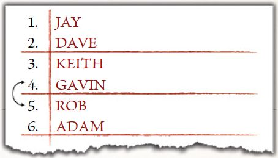

Here we present you with our recommended tournament style, one that we believe will give all players the best experience. It covers things such as roles and responsibilities, scoring, tiebreakers, tournament rules and more.

## ROLES AND RESPONSIBILITIES

Depending on how formal you wish your event to be, it's always a good idea to make sure that everyone involved is aware of their role and the responsibilities that go alongside it. These are important to ensure that everything runs smoothly and, above all, that everyone has a good time!

## ORGANISER

Every event will need a single Organiser, who will be responsible for all aspects of running the tournament. It will be their job to think about such things as gaming space and equipment for the players, appointing any Referees and Scorekeepers, and generally being easily accessible on the day to ensure everything goes according to plan. The Organiser is essentially in charge on the day, and all participants must accept that the Organiser has the authority to expel or disqualify anyone for breaking the rules of the event — although this should, hopefully, never have to happen. It is also the Organiser's job to check everyone's Army Lists. The Organiser can also be the Referee and/or Scorekeeper if they wish; though in larger events it may be best to share these responsibilities around. We recommend that the Organiser does not participate in the actual tournament so that they are always easy to get hold of.

## REFEREE

Every event needs a Referee, who is often the Organiser at smaller events. It is the Referee's job to observe the games as they are played, enforce the rules, answer any rules queries the players may have, and settle any disputes between players in a calm manner. The Referee should have a good knowledge of the rules of the game, and have a copy of the Rules Manual and any Army Books, Supplements and Errata on hand in case of rules queries. A Referee's ruling is final as far as the event is concerned, and all players must agree to honour the rulings of the Referee in these situations. We recommend that a Referee does not participate so that they are always accessible.

## SCOREKEEPER

Every event will need a Scorekeeper, which again is often the Organiser in small events. It is the job of the Scorekeeper to collect the results after each round from each game, and to rank the players after each round. They will also be responsible for the pairings of each round, including randomly pairing opponents in the first round of the tournament. Again, we recommend that the Scorekeeper does not participate so they can collect every result as soon as possible.

## SPARE PLAYER

Often tournaments will have an odd number of players, and that would mean that in each round there would be one player without an opponent. Whilst this player could be given a Bye (covered on page 6), it is much more satisfying if they have a game to play — after all that is why they are at the event! Because of this we recommend organising a Spare Player for the event. This should be someone who knows how to play the game, and will provide their opponent with a fun and enthusiastic game, so they are not sat around waiting for the round to finish. The Spare Player should not be trying to win the event, cannot win any awards, and should play each game in an appropriate manner. We recommend that the Spare Player is someone different to the Organiser, Referee and Scorekeeper.

## PLAYER

Each player is responsible for bringing their own miniatures, dice, rules manuals and tokens, and for accepting all of the tournament's rules. Depending on how serious you want your event to be, you may wish to let players know in advance that they are expected to have a decent working knowledge of the
game.

## TOURNAMENT RULES

All games played at a Middle-earth Strategy Battle Game tournament use the Middle-earth Rules Manual, any current Army Books and Supplement books, and the most recent FAQs and rules clarifications as found at warhammer-community.com. All players are expected to know the following
rules:

### MINIATURES

Players may only use official Citadel and Forge World miniatures at the event, and all models must be fully built, based and painted. Players must use the appropriate models for their army. Conversions are permitted at the Organiser's discretion, so long as they only include parts from official Citadel and Forge World miniatures, and clearly represent what they are meant to be. You may wish to ask for any players wishing to use conversions to submit them to the Organiser before the event so they can check if they are happy with them.

### CONDUCT

All games of the Middle-earth Strategy Battle Game should be played in a generous spirit; one befitting the gentlest and noblest of Hobbits! This is especially true for tournament games where all players are expected to show good conduct in all aspects of the event. Players are expected to treat each other with respect and behave in a mature and considerate manner, including during any rules disputes.

## SCORING & TIEBREAKERS

### GAMES

At the end of each game, players will need to record the result. This includes who won, lost or drew, the Victory Points each player scored, and if either player killed the enemy leader. If the players do not finish their game before time runs out, they must finish the turn they are on and then work out the winner at the end of that turn.

For tournaments, players will earn a number of Tournament Points depending on how they did in their games. Players earn 3 Tournament Points for a win, 1 Tournament Point for a draw, and 0 Tournament Points for a loss.

It is important that both players provide all of the information as it is all used for the tiebreakers to work out who is where in the rankings.

### RANKING

Players are ranked according to the number of Tournament Points they have; the more Tournament Points a player has, the higher they are in the rankings.

Where players are tied on the number of Tournament Points, there are a number of Tiebreakers to be used to determine who is higher placed.

The first Tiebreaker is a player's Victory Point Difference, which is equal to the number of Victory Points scored across all of their games minus the number of Victory Points conceded across all their games.

*For example, if a player has played two games and had the results 3-0 and 7-4, their Victory Point Difference would be +6.*

If players are still tied, the second Tiebreaker is the total number of Victory Points scored across all of a player's
games.

If players are still tied, the next Tiebreaker is the number of enemy leaders each player has killed across all of their
games.

Further Tiebreakers are then used at the Tournament Organiser's discretion. These could be anything from Favourite Opponent scores, Secret Objectives scored (if using Secret Objectives as listed on page 45), or anything else the Tournament Organiser
wishes; however, they should make it clear to all players before the event which Tiebreakers will be in use and in what
order.

## PAIRING SYSTEM

You are free to use any pairing system that you wish, though we would recommend using the system detailed here when running your own tournaments.

## ROUND 1

For the first round, players are paired together randomly using player numbers generated upon registration. If there is an odd number of players then one player will be randomly paired with the Spare Player or given a Bye.

## SPARE PLAYER

If a player is paired against the Spare Player, then they will play the game as normal, and record the result in the same way as any other game. When working out standings for pairings later on, the Spare Player is not counted and instead will always play the player who is at the bottom of the standings for each round. If a player who has already played the Spare Player is drawn against them again then the next lowest player who has not already played the Spare Player will play them instead. We would always recommend that a tournament has a Spare Player, as that is more fun for your attendees than having a Bye.

## BYE

Sometimes you may be unable to find a Spare Player for your event. In this case, the player that would normally be paired with the Spare Player (as described above) will instead receive a Bye. A Bye counts as winning the game with 6 Victory Points for, and 0 Victory Points against. The player also counts as having killed the enemy leader.

## CONCEDING

Should a player concede a game, their opponent will automatically receive a 12-0 win and will count as having slain the enemy leader.

## SUBSEQUENT ROUNDS

For subsequent rounds, players are paired as follows:

The player who is highest in the rankings will play the player who is second in the rankings, the player in third will play the player in fourth, the player in fifth will play the player in sixth and so on until all players are paired up. If a player is supposed to play an opponent they have already played, the lowest ranked of the two will swap places with the highest ranked player on the table below them.

*Here we can see the draw for the next round of an event. Keith and Gavin have already played each other in a previous round and so cannot play again as this is not the final round. As Gavin is currently the lower ranked of the two players he will swap with the highest ranked player on the table below — in this case Rob.*

This system is used for all rounds after the first, including the final round with one small adjustment. In the final round players will not swap opponents if they draw a player they have already faced; the two are clearly equally matched and will face off one last time!

The points value of the event, and the number of days the event will go on for, will impact the number of games a tournament will run. Below is a series of guidelines for a variety of different points values, the number of games that should be run, the time given to each round and the size of board the event should
use.

| Points Limit | Number of Games (1-day event) | Number of Games (2-day event) |   Round Time   | Board Size |
| :----------: | :--------------------------------: | :---------------------------------: | :-------------: | :--------: |
|     500     |                 4                 |                  7                  | 1 hour 30 mins |   4'x4'   |
|     600     |                 4                 |                  7                  | 1 hour 45 mins |   4'x4'   |
|     700     |                 3                 |                  6                  |     2 hours     |   4'x4'   |
|     750     |                 3                 |                  6                  | 2 hours 15 mins |   4'x4'   |
|     800     |                 3                 |                  6                  | 2 hours 15 mins |   4'x4'   |
|    1,000    |                 3                 |                  5                  | 2 hours 30 mins |   6'x4'   |
