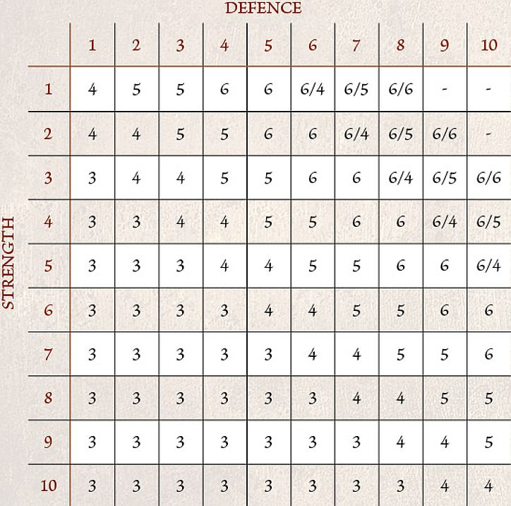

## INTRODUCTION

The rules presented here are a simplified, cut-down version of those found in the Middle-earth Strategy Battle Game rules manual designed to teach you the basics as you play through your first games in Middle-earth. As a result, you may notice some small differences in the rules, or that some rules are missing (such as In The Way rolls or separated mounts). This is done to ensure that you can get playing straight away without having to worry about too many new rules all in one go and to provide a quick, easy learning experience where you really throw yourself into the world of Middle-earth!

### PROFILES

A profile is a collection of letters and numbers that at first glance may seem abstract and confusing, however, each of these letters and numbers directly relates to a specific aspect or ability.

**Mv (Move)** - This characteristic tells you how far in inches (") that model may move in each of its Move phases.

**F (Fight)** - Fight is the characteristic that denotes a model's skill at fighting a Duel and firing a shooting weapon. This characteristic comprises two numbers divided by a slash. The first number is called the Fight value and shows how skilful the model is in a Duel; the better they are, the higher the Fight value. The second number is called the Shoot value and is always followed by the + sign; this shows the model's skill with missile weapons. The number indicates what score needs to be rolled in order for the model to hit its intended target; so in this instance, the lower it is, the better.

**S (Strength)** - This characteristic shows how strong the model is. The higher a model's Strength, the more easily it will injure an opponent.

**D (Defence)** - Defence represents how hard it is to hurt a model. The higher it is, the harder the model is to wound in battle.

**A (Attacks)** - The Attacks characteristic represents how many blows a model can land upon an enemy during a Duel. It literally translates to the number of dice that a model will roll during the Fight phase, both for making the initial Duel roll, and for making Strikes against an enemy.

**W (Wounds)** - This denotes how many injuries a model can sustain before it will succumb to its wounds and be slain. If at any point during the game a model's Wounds are reduced to 0, they are immediately removed from the board as a casualty.

**C (Courage)** - The bravery and determination of a model is measured by their Courage characteristic.

**M, W, F (Might, Will, Fate)** - Some models, known as **Hero **models, possess an additional three characteristics known as Might, Will and Fate. Unlike the other characteristics, these are represented by a store of points that can be spent during the game.

---

## BASIC PRINCIPLES

### LINE OF SIGHT

At many points during a game, you will need to work out if a model is able to see a target. The best way to do this is to get down to the 'model's eye view' and see if you can see the target. This is the model's Line of Sight.

### MEASURING

Throughout the game, you will need to measure distances across the battlefield. To measure between models, always measure between the closest two parts of the base. A model is always considered to be in range of itself. As you play, you may measure any distance at any time as often as you wish.

---

## TURN SEQUENCE

### TURNS

During each phase of the game, players use their models; the player who has Priority acts first and, when they have completed all of their actions with all of their models, the other player then acts with their models.

### PRIORITY PHASE

At the start of each turn both players will roll a D6 in the Priority phase to see which player has Priority that turn. The player who rolls highest has Priority. In the event of a tie, Priority passes to the player who did not have it in the previous turn. For this reason (and indeed, for reminding yourself who has Priority throughout the turn), it is a good idea to have a suitable counter or token so that it is easy for both players to see who currently has Priority, and to pass it between players as and when Priority changes during the course of the game.

### PRIORITY

In the Move phase, the player with Priority moves first. They may move all, some or none of the models under their control. Once the player with Priority is completely finished, the opposing player then gets to do likewise.

### TURN SEQUENCE

#### 1. PRIORITY PHASE
In the Priority phase, players roll off to see which player has Priority.

#### 2. MOVE PHASE
Both players move their models. First, the player with Priority moves any of their models that they wish. When they are finished, the other player moves their models.

#### 3. SHOOT PHASE
Players make shooting attacks with any of their models that are equipped with missile weapons, starting with the player with Priority. Once they have finished with all of their models, the other player makes shooting attacks with their models.

#### 4. FIGHT PHASE
In the Fight phase, all models from both sides that are engaged in hand-to-hand combat will fight. The player with Priority chooses the order in which combats are resolved.

#### 5. END PHASE
In this phase, resolve any effects that remain until the End phase, and then clear any stray tokens and dice before starting the next turn.

---

## MOVE PHASE

### MOVING MODELS

You can move each of your models in the Move phase, in any order that you choose, as long as you complete the move of one model before starting the move of a different one. When a model moves it may move a number of inches up to its Move allowance (Mv). Models are not required to move only in straight lines and may move in any direction, as long as it does not exceed its Move allowance.

Models may not move 'through' other models. For a model to move past or between other models, there must be enough space for its base to be able to pass through without disrupting another model's base. If there is not enough room to pass through, then the model will have to go around or wait.

Sometimes, a model will be unable to move for one reason or another. When this is the case, it will be made clear in the rules.

### CONTROL ZONES

Although all of the models are immobile, you should imagine that they are, in fact, quite dynamic, ready to fight in the swirling maelstrom of battle. To represent this, every model has a Control Zone -al" imaginary ring that extends out from the edge of the model's base. No model may enter the Control Zone of an enemy unless they are charging the model in question.

There may be occasions when a model is forced into an enemy model's Control Zone due to some other rule, such as being forced to Back Away after losing a Fight. Note that a model cannot choose to enter an enemy's Control Zone without Charging - it can only happen when another rule forces it to.

It is possible for a model to start its move already within an enemy model's Control Zone. In these circumstances, your model has three choices:

* Remain where it is and forego its movement.

* Charge one of the enemy models whose Control Zone it is in.

* Move Away. In this third instance, a model may move within the Control Zone of an enemy, provided that it doesn't get any closer to the enemy whose Control Zone it started in.

### CHARGING ENEMIES

Making a Charge is simple - measure the distance as you would for making any other move and, if you have enough movement to reach your target, move your model into base contact with the target.

Once a model has charged into an enemy and is in base contact with it, they are both Engaged in combat and cannot move any further in the Move phase, unless they subsequently become unengaged and have not yet moved that turn.

Control Zones play an important part when Charging. If a model enters an enemy model's Control Zone, then it must Charge that model; though it may continue moving within that model's Control Zone in order to Charge a different part of the model's base if they so wish and have movement remaining.

Additionally, a model that is Engaged in combat has its Control Zone cancelled out.

Once a charging model enters a Control Zone, it may ignore the Control Zones of other models in order to continue charging its original target. This means that a model is always able to Charge the first enemy model whose Control Zone it moves into.

### CHARGING MULTIPLE ENEMIES

Charging multiple enemies is very straightforward. As long as your model has a high enough Move characteristic to reach all of its intended targets, and its base is large enough to touch multiple models, move its base into contact with its enemies.

### PAIRING OFF FIGHTS

At the end of the Move phase, it is important to work out which models are Engaged in combat with one another, for the sake of clarity. Any models that are Engaged in combat with an enemy need to be paired off into Fights.

At the end of the Move phase, opponents are always paired off into one-on-one Fights where possible. You may have situations where two, or maybe more, enemies face a single model. This is called a Multiple Combat.

First, all models in base contact with an enemy must fight, so make sure all models Engaged in combat are still in a Fight when you are done.

Second, if a model could be involved in more than one Fight, the player with Priority may choose which of the possible combats they are assigned to. To make it easy to see which models are fighting which when they are paired off, you may wish to slightly separate the combats from each other so there is no confusion. This should only be done for ease of seeing who is in a combat, and not to gain an advantage. Models will still count as being in base contact with models they were previously.

#### PRONE MODELS

During battles in Middle-earth, there are times when a model will find itself lying on the ground, such as as a result of being charged by a **Cavalry** model. A model that is Knocked to the Ground is said to be Prone and should have a Prone marker placed next to it to show that the model is on the floor. Prone models do not have a Control Zone and do not block Line of Sight.

#### CRAWLING

A model that is Prone may crawl 1" in the Move phase, regardless of its maximum Move allowance or the manner of terrain it is in. If a model crawls, the only other movement it may make that turn is to stand up. Prone models may not Charge - they must stand up first.

#### STANDING UP

A Prone model may stand up at the cost of half of its maximum Move allowance, and may still Charge if it does so. Models that stand up will still count as having moved. A Prone model may still stand up whilst within an enemy model's Control Zone without charging them, so long as they do not move closer to that model.

#### CHARGING PRONE MODELS

Prone models may be charged as normal. As they have no Control Zone, an enemy can move within 1" of them unimpeded, provided it doesn't come into base contact.

---

## SHOOT PHASE

### PRIORITY

The player with Priority shoots first. They select one of their models and resolve its shooting attack. Once they are finished, they select another of their models and resolve its shooting attack - repeating this process until they have made all of the shooting attacks that they wish to. Once the player with Priority has resolved all of their shooting attacks, the other player may then do likewise.

### WHO CAN SHOOT?

If a model has a missile weapon, has a target to shoot at, hasn't moved too far in the preceding Move phase, such as when firing a bow, and is not Engaged in combat, it may make a shooting attack. A model may only make a single shooting attack each turn, unless otherwise stated.

### HOW TO SHOOT

Making a shooting attack is simple. First, select the model that is going to shoot; then, choose who they are going to shoot at. The shooting model must have Line of Sight to the target model, and the target model must be in range - the range of each missile weapon can be found on the Missile Weapon chart. Sometimes, when you are taking shots with your models, you will find that other models partially obscure your potential target. When this is the case, the model may not make the shot and may choose a new target if able.

To shoot, roll a D6 and compare it to the shooting model's Shoot value (the one with the '+' after it). If the score is equal to or higher, then you have hit and will need to roll to wound the target.

When rolling To Wound, compare the Strength of the missile weapon (found on the Missile Weapon chart) and then compare it to the Defence of the target using the To Wound chart below. This will give the score needed to cause a Wound. Roll a D6, and if the score is equal to or greater than the score given, the model has been wounded. A score of 6/4, 6/5 or 6/6 means you must roll a single dice and score a 6, followed by a further dice that must score either 4+, 5+ or another 6, respectively. A '-' means that model cannot wound the target.

### TO WOUND CHART

### MOVING AND SHOOTING

A model who wishes to shoot in the same turn that it has moved suffers
a penalty to their Shoot value. This is represented by making the Shoot
value of a model that has moved 1 point worse for the rest of the turn. A
model with a Shoot value of 4+ that has moved will instead require a 5+ to
hit their target that turn. A roll of a 6 always hits.

### MISSILE WEAPON CHART

| NAME           | RANGE | STRENGTH |
|----------------|-------|----------|
| Bow            | 24"   | 2        |
| Orc bow        | 18"   | 2        |
| Throwing spear | 8"    | 3        |
| Uruk-hai bow   | 18"   | 3        |

---

## FIGHT PHASE

### WHEN TO FIGHT

Fights are resolved one at a time. The player with Priority picks a Fight that is yet to be resolved, and players use dice to determine who wins and whether any casualties are caused. Once the Fight is completely resolved, the player with Priority chooses another to resolve, repeating the process and continuing until all the Fights have been dealt with.

### RESOLVING A FIGHT

#### DUEL ROLL

To see who wins a Fight, you must make a Duel roll. To make a Duel roll, each player rolls a number of D6s equal to the total number of Attacks their models in the light have and the player with the highest single result wins.

**WHEN RESOLVING A FIGHT, FOLLOW THE STEPS BELOW IN ORDER:**

* Gather the number of dice you need for the Duel roll; use a different colour dice for each model with modifiers or Might points available.
* Declare any two-handed attacks.
* Roll all of your dice.
* Apply any modifiers to the dice rolls.
* Lise any re-rolls.
* Lise Might.
* Winner makes Strikes.

### DRAWN COMBATS

Quite often, the highest score that both players get in the Duel roll will be tied. When this is the case, compare the Fight value of the models - the model with the highest Fight value wins.

If the Fight values of the models are also drawn, then the player with Priority rolls a D6 to see who wins. On a 1-3, the Evil side wins the Fight, whilst on a 4-6, the Good side is victorious.

### LOSER BACKS AWAY

The loser of a fight must Back Away 1" in a straight line away from the winner in a direction chosen by their controlling player. This may allow a model to move into an enemy model's Control Zone, but not into base contact.

### TRAPPED

If a model cannot Back Away a full 1" when they lose a Fight, they are Trapped. If this is the case then it does not move and the models are left in base contact until after the winners have made their Strikes, after which separate them by just enough so that they are no longer in base contact.

### PRONE MODELS

If a Prone model is charged, they light as normal - with one exception. If the Prone model wins the Fight, they will make no Strikes, but may immediately stand up instead if they wish. When resolving Strikes against a Prone model, they are always considered to be Trapped.

### MAKE WAY

Sometimes, a defeated model will find themselves Trapped because a friendly model is blocking their path of retreat. In these situations, it is possible for the friendly model to make a special Make Way move of up to 1" to clear a path for their ally to Back Away through, so long as they themselves are not Engaged in combat. Simply move the ally the shortest distance possible to enable their comrade to escape being Trapped. Making Way is entirely optional, though not doing so will likely result in a friendly model being Trapped. Making Way for a friend may take a model into an enemy's Control Zone, but not into base contact with an enemy model.

Finally, only one model may Make Way for a defeated friend - if one model making way is not enough to prevent a model from being Trapped, then no Make Way move is made and the model is still Trapped.

### WINNER MAKES STRIKES

Once the loser has backed away, the winner of the Duel roll must Strike against their opponent. To make a Strike, roll To Wound, comparing the Strength of the winner against the loser's Defence to find the target number, in the same way as rolling To Wound when shooting. If the target is wounded, reduce its remaining Wounds by 1 - if this reduces the model's Wounds total to 0, remove it as a casualty.

### MULTIPLE ATTACKS

If a model with multiple Attacks wins a Fight, they make one Strike for each Attack on their profile when striking their victim. You may choose to fully resolve these Strikes one at a time or all together if you wish, so long as both players understand exactly what is happening.

### STRIKING A TRAPPED MODEL

Each Attack that is directed against a Trapped model becomes a set of two Strikes rather than one. Thus, a model with one Attack would deal a set of two Strikes against their Trapped victim, a model with two Attacks would deal two sets of two Strikes, and so on.

Note that you cannot split these sets of Strikes - you get a set of two Strikes for each Attack you direct against a Trapped model, but both Strikes must be directed against the same target.

### MULTIPLE COMBATS

In Fights where two or more models are fighting against one model, things work in exactly the same way as a one-on- one Fight. When comparing the dice rolls in a Duel roll to see which side has won, only consider the highest scoring dice and the highest Fight value on each side. If it is the lone model who wins the Duel roll, all of the enemy models in the Fight must Back Away. If the more numerous foes are victorious, the loser must Back Away.

If the lone model wins the Duel roll, it can make Strikes against any of the models that it is fighting.

If the lone model loses the Duel roll, the winners each make their Strikes against the loser in an order chosen by the winners' controlling player.

If the winner of a Multiple Combat has more than one Attack, they may choose to resolve Strikes against one target or against different models. It is allowed to see the result of one Strike before rolling for the next. Regardless of how a model directs its Attacks, you must resolve all of one model's Strikes before rolling for the next model.

---

## CAVALRY

### CAVALRY

A **Cavalry** model consists of a rider and its mount. In the case of a Cavalry model, as the rider is directing their mount, Line of Sight is always taken from the perspective of the rider and is never blocked by the mount. A **Cavalry** model moves in the same way as an **Infantry** model.

### CAVALRY AND FIGHTS

**Cavalry** models fight in the same way as an **Infantry** model; however, to represent the force of a cavalry charge, **Cavalry** models gain two bonus rules when they Charge - Extra Attack and Knock to the Ground. They will only get these bonuses if they have charged exclusively **Infantry** models, and have not been subsequently charged by an enemy **Cavalry** model.

### EXTRA ATTACK

A **Cavalry** model with this bonus gains one additional Attack when making Duel rolls and when making Strikes in the following fight. So, a model with 1 Attack rolls two dice when making a Duel roll, a model with 2 Attacks rolls three dice, and so on.

### KNOCK TO THE GROUND

If a **Cavalry** model with this bonus wins a Fight, all of their opponents are Knocked to the Ground. A model that is Knocked to the Ground is knocked Prone after Backing Away. This means that they will also be Trapped, as described in the rules for Prone models.

---

## HEROES

Models that are also heroes will have the **Hero** keyword in their profile.

### MIGHT, WILL AND FATE

Unlike other characteristics, Might, Will and Fate points are expended when they are used - so players need to mark them off as they are used up. When a **Hero** model runs out of Might, Will or Fate points they may spend no more during that game, unless they are somehow able to regain these points during its course.

All **Hero** models have an extra section to their characteristic profile, which shows how much Might, Will and Fate they have at their disposal.

### MIGHT

Might points can be used to modify a **Hero** model's dice rolls.

A **Hero** model is able to spend a point of Might to adjust a dice roll made on their behalf (not an ally), after the roll has been made, and after any re-rolls or modifiers have been applied. For each point of Might that is expended, alter the dice score by 1. This can only be used to increase a dice roll in order to succeed in a particular situation.

If two opposing **Hero** models are fighting, both may use Might in order to win the Fight. The player whose **Hero **is currently losing has the first opportunity to use Might. Should they choose to use Might to win the Fight, then their opponent may elect to use Might as well in order to win. The opportunity then keeps switching between players until both players have used all of the Might points they would like to, or no more can be used.

### WILL

**Hero** models may expend Will points in three situations:

#### CAST A MAGICAL POWER

To cast a Magical Power, a **Hero** expends one or more Will points - this is the number of dice the controlling player rolls in their casting attempt. Note that the player must choose how many Will points they will expend before they roll any dice.

#### RESIST A MAGICAL POWER

A **Hero** who is the victim of a Magical Power cast by an enemy model may attempt to Resist it by expending Will points.

#### PASS A COURAGE TEST

A **Hero** who has failed a Courage test may spend Will points to adjust the score of their test. For each Will point they expend, their Courage is raised by 1 for that test. A **Hero** may spend a mixture of Will points and Might points to modify their score in this manner if they wish to.

#### TAKING COURAGE TESTS

To take a Courage test, roll 2D6 and add the scores together. Then, add the model's Courage value. If the total is 10 or more, then the Courage test is passed. If the total is 9 or lower, then the Courage test has been failed. The effect of failing the Courage test is described by the special rule, Magical Power or ability that caused the test to be taken.

#### FATE

Whenever a model with Fate points is wounded, the controlling player may choose to expend a Fate point to attempt to prevent a Wound. Roll a D6 and, on a 4+, the Wound has no effect; do not reduce the **Hero** model's remaining Wounds.

If the Fate roll is unsuccessful, and the Hero has more Fate points remaining, another Fate roll can be attempted if you wish - expend the next Fate point and roll again. Might can be used to alter the results of a Fate roll, but because Fate rolls are taken one at a time, you must decide whether to adjust your Fate roll before using another Fate point.

---

## WEAPONS & WARGEAR

### SINGLE-HANDED WEAPONS

Wherever a weapon is listed without it being defined as either a hand-and-a-half or two-handed weapon, the weapon in question will be a single-handed weapon. There are no additional rules for a single-handed weapon.

### HAND-AND-A-HALF WEAPONS

Whenever a model armed with a hand-and-a-half weapon is involved in a Fight, the controlling player must decide at the start of the Fight whether they will be using their weapon as a single-handed weapon or a two-handed weapon.

### TWO-HANDED WEAPONS

A model using a two-handed weapon in close combat suffers a -1 penalty to Duel rolls. When a model makes Strikes with a two-handed weapon, add 1 to its To Wound roll.

### SPEARS

An **Infantry** model that is armed with a spear may assist a friendly model, with the same base size or smaller, in a Fight in a special way. If an unengaged model armed with a spear is in base contact with a friendly model, then it may contribute a single Attack to the Fight using its own Fight value and Strength.

Models that are assisting another model in this way are not considered to be part of the Fight and so cannot be targeted by Strikes, or be knocked Prone by a charging **Cavalry** model.

A model can only gain Support from one spear-armed model at a time, and a spear-armed model may only ever Support a single model during each turn, even if it is subsequently moved into base contact with another friendly model after Supporting a Fight that turn. A spear-armed model can even Support a friendly model that is Prone or armed with a two- handed weapon. A model that is Prone cannot Support under any circumstances.

A spear-armed model may Make Way for their ally if they lose a Fight. This counts as the one model who is allowed to Make Way for a friend.

### PIKES

The rules for pikes are the same as those for spears with the following exceptions. A pike-armed model can Support a friend Engaged in close combat by being in base contact with another pike-armed model that is already doing so (note they must both be pikes; neither can be a spear), so two pike- armed models can Support one comrade.

As models with pikes can effectively fight in battle lines three models deep, it can be very easy for them to trap their own models as only one model may Back Away, not two.

### ELVEN-MADE WEAPONS

Models using an Elven-made weapon are more likely to win the dice roll to see who wins a Drawn Combat. A Good model using an Elven-made weapon will win the roll-off on a 3-6 instead of a 4-6. Should an Evil model be using an Elven- made weapon (an odd situation, granted), they will win the roll on a 1-4. If both sides are using Elven-made weapons, neither receives an advantage.

### LANCES

A **Cavalry** model using a lance receives a bonus of + 1 To Wound when making Strikes in a turn that they have Charged. A **Cavalry** model using a lance even gets this bonus against other **Cavalry** models, as long as it has Charged.

### STAFF OF POWER

A Staff of Power is a hand-and-a-half staff. In addition, the bearer can expend 1 point of Will each turn without reducing their own Will store.

### BOWS

A model can shoot a bow (of any type) in the Shoot phase provided it has not moved more than half of its maximum allowance in the preceding Move phase.

### THROWING SPEARS

A model with a throwing spear can shoot with it in the Shoot phase, even if they have moved more than half of their maximum Move distance, so long as they didn't throw it in the preceding Move phase.

Once per turn, during the Move phase, a throwing spear can be used as its bearer Charges into combat. The player moves the model as if it were going to Charge the enemy, but instead of moving into base contact, they stop 1" away. They then throw the spear at the enemy they are about to Charge. This shot is resolved using the rules for shooting, even though it takes place in the Move phase. Throwing spears thrown as a model Charges into combat do not suffer the -1 penalty for moving and shooting.

If the target is not slain, the charger then moves into base contact with the same enemy model. If the original target is slain, the charger may complete their move in any way the controlling player wishes - stopping straight away, charging another target or anything in between.

### ARMOUR

A model upgraded to wear armour adds 1 to their Defence.

#### HEAVY ARMOUR

A model upgraded to wear heavy armour adds 2 to their Defence.

#### SHIELDS

A shield increases the Defence characteristic of its bearer by 1. A model with a shield may elect to be Shielding during a fight they are involved in; this must be declared before any dice are rolled. When a model is Shielding it will double its Attacks when rolling to see who wins the fight. However, if a model who is Shielding wins a Fight they may not make any Strikes. Cavalry models cannot elect to be Shielding.

---

## MAGICAL POWERS

### USING MAGICAL POWERS

A Hero with Magical Powers (and Will points available) can attempt to cast one (and only one) during each Move phase. They can use the power before they move, during their move or at the end of it. A Hero can even use a Magical Power in the same turn that it Charges, or if they don't move at all. Each Magical Power will state who can be targeted by it. Models need Line of Sight to the target of their Magical Power, but may still target a model that is obscured by other models. The range of each model's Magical Powers is listed in their profile. A model that is already Engaged in combat or is Prone cannot use a Magical Power.

### MAKING A CASTING ROLL

To successfully cast a Magical Power, the Hero must take a Casting test. Every Magical Power has a Casting value (given as a dice score), listed in the entry of the model casting it.

The controlling player states which Magical Power the Hero is attempting to cast and expends one or more Will points. For each Will point the Hero expends, they roll a D6. All the dice are rolled together and if the score on any of the dice equals or exceeds the Magical Power's Casting value, the spell is successfully cast - resolve its effects as detailed in the Magical Power's entry. If a model wishes to increase the Casting roll using Might, they must do so before the Resist test (if any).

### RESISTING A MAGICAL POWER

If a model is targeted by a Magical Power, there is a chance they can Resist its effects. Before resolving the effects of the power, the player controlling the target must decide whether to spend Will to Resist the Magical Power (assuming the model has any). This is called a Resist test.

For each Will point spent, the defending player rolls a D6 in their Resist test. If any of the dice equal or beat the Casting roll, the model has resisted the power and there is no effect. Note, the player must choose how many Will points to expend before rolling any dice. If, when making a Resist test, any of the dice rolled from spending Will points rolls a natural 6, the Hero immediately regains that point of Will. Note that rolling a natural 6 with 'free' points of Will (such as those from Resistant to Magic) does not confer this effect.

### MAGICAL POWER DURATIONS

#### INSTANT

Magical Powers with this duration take effect straight away. After they are resolved, they end. These Magical Powers tend to be those that cause damage.

#### TEMPORARY

Magical Powers with this duration remain in play until the End phase of the turn in which they are cast.

#### EXHAUSTION

Magical Powers with this duration remain in play until the caster reaches 0 Will points.

---

## MAGICAL POWERS LIST

### BLACK DART

**DURATION: INSTANT**

This power targets one enemy model within range. The target immediately suffers one Strength 9 hit. This power can still be used on a target that is Engaged in combat.

### COMMAND/COMPEL

**DURATION: TEMPORARY**

This power targets one enemy model within range. The caster may move the target model up to half of its Move allowance. They can do this even if the model has already moved this turn, though cannot move a model out of combat. The move can even make them Charge an enemy. No Courage test is required to Charge Terror-causing foes. Once the target has finished the move, it may move no further that turn for any reason.

Finally, the target suffers the effect of the Immobilise/Transfix magical power.

### IMMOBILISE/TRANSFIX

**DURATION: TEMPORARY**

This power targets one enemy model within range. Whilst this power is in effect, the target model may not move (except to Back Away should they lose a Fight), shoot, cast Magical Powers, or use Active abilities, and may not Strike if they win a Duel.

### SORCEROUS BLAST

**DURATION: INSTANT**

This power targets one enemy model within range. The target is blasted D6" directly away from the caster and knocked Prone. If the target comes into contact with another model, it will immediately stop and both models will be knocked Prone; this can blast a model out of combat. If the target, or one of the models that is knocked Prone, is Engaged in combat, then all the models (friend and foe) in the same Fight are also knocked Prone. The target model suffers one Strength 5 hit, and any other model knocked Prone suffers one Strength 3 hit.

### TERRIFYING AURA

**DURATION: EXHAUSTION**

This power targets the caster themselves. Whilst this power is in effect, the caster causes Terror.

---

## SPECIAL RULES

### ACTIVE AND PASSIVE SPECIAL RULES

All special rules can be classed as either ***PASSIVE*** or ***ACTIVE***

A Passive special rule is one that takes effect regardless of other factors. They require no particular thought or effort to enact. Passive special rules still take effect even if the model is under the influence of another ability that would render it unable to move, such as the Transfix Magical Power.

An Active special rule is one that requires the user to physically act, think or move. These special rules are not usable if the model in question is under the effect of another ability that renders it unable to move or act, such as the Transfix Magical Power.

#### Harbinger of Evil 
**PASSIVE** 

Any enemy model within 12" of this model suffers a -1 penalty to its Courage.

#### Resistant to Magic 
**PASSIVE** 

If this model is targeted by a Magical Power, it may use an additional 'free' dice when it makes a Resist test, even if it has no Will remaining or decides not to use any Will points from its store.

#### Shieldwall 
**ACTIVE** 

If this model is armed with a shield, whilst in base contact with two or more non-Prone models with this special rule that are armed with a shield, this model gains a bonus of + 1 to its Defence. This bonus is only available whilst on foot.

#### Terror 
**PASSIVE** 

Should a model wish to Charge this model, it must first take a Courage test at the start of its move, before doing anything else. If the test is passed, the model may Charge as normal, though is not obliged to. If the test is failed, the model does not Charge and may not move at all this turn.

#### Will of Evil 
**PASSIVE** 

This model must give up 1 point of Will at the end of the Fight phase if it has been involved in one or more Fights that turn. Note that if a model is in base contact with an enemy model then it must fight - it cannot choose not to fight! Once the model is reduced to 0 Will points, it is banished and therefore removed as a casualty. A model with this special rule may not use their last point of Will to cast a Magical Power and cause themselves to be removed as a casualty.

---

## SCENARIO

### THE FORCES CLASH

**SCENARIO OUTLINE**

Two enemy forces have come across each other as they march to war, thrusting them both into an impromptu battle.

**THE ARMIES**

Players use the forces provided in one of the Middle-earth Strategy Battle Game Battlehosts.

**STARTING POSITIONS**

The size of the playing area doesn't matter too much, but it should be large enough to allow players to deploy their forces at least 12" apart from each other. Both players roll a D6. The player who scored the highest chooses one half of the board and deploys their models within their chosen half with all their Warrior models deploying within 6^11^ of their Hero. The other player then deploys their models in their half of the board, but not within 12" of any opposing model, with all their Warrior models deploying within 6" of their Hero.

**INITIAL PRIORITY**

Both players roll a D6. The player with the highest score has Priority in the first turn (in the case of a draw roll again until Priority is determined).

**OBJECTIVES**

This is a battle to the death; the first side to wipe out all their opponent's models is the winner!

**LAYOUT**

The battlefield is sparse and ready for conflict. There is no terrain used in this game.

