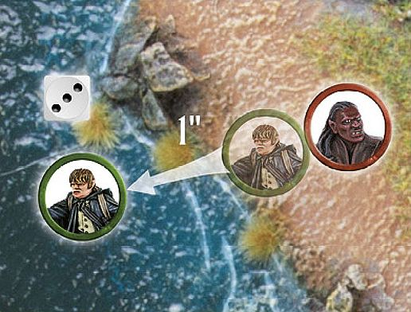
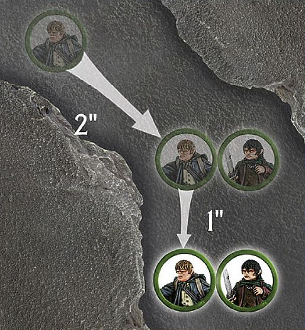

This section is given over to those rules which, while important to the game, will only appear in certain Scenarios or unusual circumstances. If you are creating your own adventures, or recreating other scenes from the history of Middle-earth, you may find these quite handy.

## WATER FEATURES

From fast-flowing rivers to shallow fords, there are many areas of Middle-earth where water can be found either on or around the battlefield. Before your game starts, if you have areas of water on the tabletop, it's a good idea to discuss how you'll treat them throughout your game. If all players know what they represent, they can plan their strategy accordingly.

#### SHALLOW WATER

Areas of water that present a minimal risk to those crossing them, such as streams, small ponds and fords, are shallow water. Although these will slow models down somewhat, they are highly unlikely to harm anyone. This kind of water is difficult terrain for all models except horses, *Wargs*, Cavalry and Monster models, who ignore shallow water and treat it as open ground. However, if any model is knocked Prone whilst in shallow water (including Wargs, Monster models, and so on), it must take a Swim test at the start of its next Move phase; roll a D6 and compare the result to the Swim chart.

#### DEEP WATER

Deep water is any stretch of water that is deep enough that a model could not stand with its feet on the bottom without drowning (Hobbits and Goblins probably find more areas of water deep than others). Any model that enters deep water must immediately take a Swim test, and must do so at the start of each Move phase they start in the water. Models in deep water may not shoot. Models that are knocked Prone whilst within deep water must immediately take a Swim test with an additional -1 modifier.

#### SWIM CHART

| D6 | RESULT                                                                                                                                 |
|-----------|-----------------------------------------------------------------------------------------------------------------------------------------|
| 1         | **Sink.** The model is overcome by the weight of its wargear (or complete inability to swim) and drowns. Remove the model as a casualty.   |
| 2‑5       | **Swim.** The model may move up to half its remaining Move allowance through the water.                                                     |
| 6         | **Swim Strongly.** The model may move its remaining Move allowance through the water.                                                       |

Note: Models that are heavily laden may fall foul of their burdens in deep water. All of the following modifiers which are applicable must be applied when taking a Swim test:

* + 1 The model is mounted

* - 1 The model is equipped with heavy armour or Dwarf armour

* - 1 The model is equipped with Heavy Dwarf armour

* - 1 The model is carrying a shield

* - 1 The model is carrying a banner

**SWIM TEST**

*Samwise Gamgee has lost a Fight against an Uruk-hai Scout, and now finds himself in the river. He must immediately take a Swim test. He rolls a 3, which means that he doesn't drown. At the start of his Move phase in the following turn, he must roll again. This time Sam rolls a 6 and, defying all of the stereotypes about Hobbits, swims strongly for the riverbank, moving his full Move allowance.*

## CARRYING OBJECTS

Throughout their quests and battles, our adventurers and fighters encounter dozens of situations where they need to carry items of variable sizes, from siege ladders or demolition charges to keys, mysterious magical rings or even prisoners. Obviously, the heavier or more cumbersome an item is, the stronger an individual will need to be to carry it. Burdens fall into three categories: Light, Heavy and other models.

#### LIGHT OBJECTS

Light Objects are small things that are not models in their own right — the likes of keys, rings, healing draughts or even weapons. When a Scenario calls for you to keep track of such an item, it will be clearly listed in the special rules — you can do this by placing a token, coin or counter of some description on the
tabletop.

A model can pick up such an item by moving into base contact with it. The object can be passed from one model to another; just move the bearer into base contact with the new model and declare who now carries the item. A Light Object may only be moved once and passed once in each Move phase — so it's not possible to do 'relay race' style antics with them.

A model may only pass or drop a Light Object (both willingly or otherwise) if it is not already Engaged in combat. Note that if the item is on the floor, Cavalry models must dismount before picking it up, unless they have the Expert Rider special rule.

If a model carrying a Light Object is slain in close combat, then the model that slew them immediately takes possession of the Light Object.

#### HEAVY OBJECTS

Items that are especially large or cumbersome are considered to be Heavy Objects for the purposes of our rules. Such things might include siege ladders, demolition charges, or similar. These tend to be large enough that they are normally represented by a model of some kind.

A model can carry a Heavy Object by moving into base contact with it.  While they carry it, their maximum Move distance is halved. If two or more models are carrying the object together, they can move without penalty. Note that when two or more models are carrying a Heavy Object, they will move simultaneously, in an exception to the normal movement rules. A Heavy Object can only be moved once each Move phase.

Models carrying a Heavy Object must drop it before charging. If a model carrying a Heavy Object is charged by an enemy model, place the object in base contact with the carrier (somewhere it isn't in the way of the ensuing Fight). If there are two bearers and only one is charged, the other bearer immediately takes sole possession of the object.

**Cavalry** cannot carry Heavy Objects, except to load an unconscious ally onto a horse as a passenger (see below). **Monster** models treat Heavy Objects the same as other models treat Light Objects.

#### CARRYING OTHER MODELS (PRISONERS, UNCONSCIOUS ALLIES AND CORPSES...)

There are times when a model will need to carry a fallen ally or a prisoner — this is typically only done in Narrative Play, in which case the models that are eligible to carry are clearly explained in the Scenario special rules. The weight of the model being carried (in relation to the bearer's brawniness) will determine how the burden is treated.

A model is a Light Object if its Defence value is half of the Strength of the bearer, or less. A model is a Heavy Object if its Defence value is greater than half of the Strength of the bearer.

**CARRYING OTHER MODELS**

*Frodo has fallen foul of Shelob's stinger, and as such has fallen unconscious — he will need to be carried. Sam wishes to carry his friend to safety, but as Frodo's Defence is more than half of Sam's Strength, he will count as a Heavy Object. Sam moves 2" so that he is in base contact with his friend who he then picks up. Sam then carries on with his movement, halving his remaining Move allowance of 2", and moves a further 1" whilst carrying Frodo.*

## PASSENGERS

In the heat of battle, or at the height of some daring encounter, there are times when a combatant will need to scramble into the saddle behind a friend or ally.

The passenger rules are not typically used in Matched Play games, but rather in Narrative Play. Of course, feel free to introduce them into your own games, if you want.

In Scenarios that call for a model to travel as a passenger alongside a **Cavalry** model, either replace the model in question with a suitable substitute or place the passenger upon or beside the base of the mount.

#### MOUNTING

A model can mount up as a passenger by moving into base contact with a **Cavalry** model (or if a **Cavalry** model moves into base contact with it) and taking a Jump test. On a 1, the model fails to mount up and neither model can move further that turn. On a 2‑5, the model successfully mounts up, but neither model may move any further that turn. On a 6, the model successfully mounts up and the **Cavalry** model may continue to move, deducting any distance moved that turn by the passenger from its maximum Move distance.

#### DISMOUNTING

A passenger can dismount at any point in the Cavalry model's move — simply place the model on foot in base contact, and then continue to move the Cavalry model if you wish. Note, however, that a passenger that dismounts in this way may not move any further that turn.

#### HITTING PASSENGERS

While they are a passenger, a model cannot shoot or fight in close combat — although they may be struck by enemies.

When shooting at Cavalry models carrying passengers, any shots that would hit the rider may hit the passenger instead — roll a D6. On a 1-3, they hit the passenger, on a 4-6, the rider. Strikes in close combat may be targeted upon either model at the Attacker's discretion.

Should the rider be thrown from their horse, be killed or dismount, the passenger is automatically thrown, and must immediately roll on the Thrown Rider table ([see page 61]).

## SENTRIES

Some Scenarios will require the use of Sentries — these are models that are unaware of the enemy sneaking around and therefore cannot engage them directly until they are discovered.

Before each Sentry takes their Move phase, their controlling player must roll on the chart below to see how they get to move this turn.

SENTRY CHART

| D6  | Result                                                                                                                         |
|-----------|---------------------------------------------------------------------------------------------------------------------------------|
| 1         | The Sentry is searching around in its vicinity — it may not Move this turn.                                                     |
| 2-3       | The Sentry has been distracted by a noise elsewhere on the board. The opposing player may move the model up to half of its Move allowance in any direction. |
| 4-5       | The Sentry walks carefully to where they believe an intruder to be — the controlling player may move the model up to 3" in any direction. |
| 6         | The Sentry is convinced they have spotted an intruder and moves as quickly as possible to investigate. The model may move as normal. |

If during the End phase of any turn there is an unengaged Sentry within 3" and Line of Sight of an enemy model, then the alarm has been raised. Once the alarm has been raised, all Sentries revert back to the normal rules for movement for the remainder of the game.
