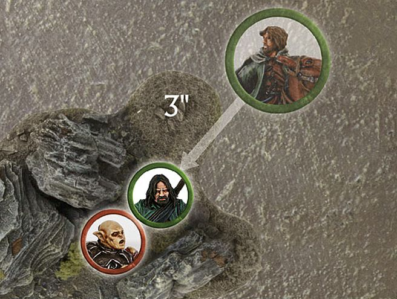
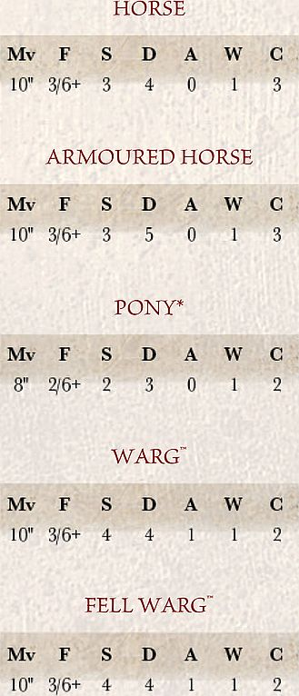
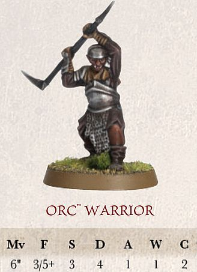
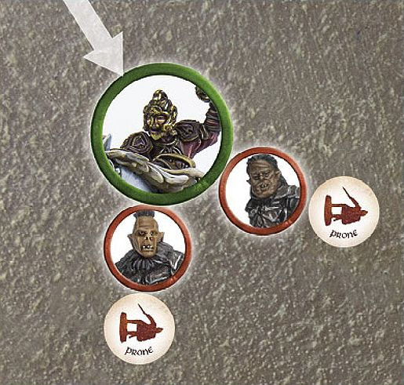
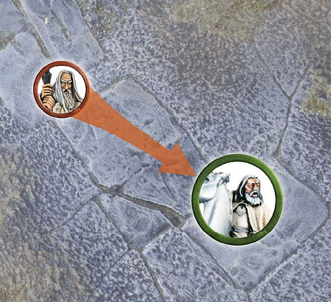

Many of the most formidable and best-known warriors in Middle-earth have earned their reputation in battle from the back of a horse, *Warg* or some other mount. From Théoden's Riders of Rohan, famed for their devastating charge at the Battle of Pelennor Fields, to the scouting Hunter Orcs sent by *Azog* to hunt down Thorin's Company en route to *Erebor*, there is an abundance of cavalry troops available to the armies of Middle-earth.

## WHAT IS A CAVALRY MODEL?

A **Cavalry** model consists of a rider and its mount. Riders who dismount from their steeds and mounts that lose their riders are no longer considered to be **Cavalry** models and will replace their **Cavalry** keyword with the **Infantry** keyword. Additionally, if an **Infantry** model purchases a mount, then whilst they remain mounted they will replace the **Infantry** keyword with the **Cavalry** keyword.

#### WHICH MODELS CAN RIDE?

The only models that are able to ride mounts are those who have them listed in their wargear or as options. **Monster** models can never ride ordinary mounts, but we will discuss **Monster** models later, starting on [page 76].

#### WHO SEES — RIDER OR MOUNT?

In the case of a **Cavalry** model, as the rider is directing their mount, Line of Sight is always taken from the perspective of the rider and is never blocked by the mount. This is important for establishing whether a model has Line of Sight to an enemy they are about to Charge or that they intend to shoot.

#### CHARACTERISTICS FOR MOUNTS 

 

A **Cavalry** model has two sets of characteristics: one for the rider and one for the mount:

One of the benefits of riding a mount is that a rider uses some of the mount's characteristics. In a Fight, a rider may use their mount's Fight, Strength and/or Attacks characteristics if they are better than their own. **Cavalry** models always use the Move value of the mount.

In the example above, the Orc could use the Warg's Strength of 4 as it is better than its own.

## CAVALRY AND MOVEMENT

A **Cavalry** model moves in the same way as **Infantry** models, except they may not make Climb tests, lie down or crawl. **Cavalry** models must use the Move characteristic of the mount. It's probably also worth pointing out that **Cavalry** models cannot use ladders, ropes or similar...

When comparing the height of the **Cavalry** model to an Obstacle or gap, always use the height of the mount at the top of its shoulders. If a **Cavalry** model is in an unusual pose, use the mount's true height (not the height of it if it is rearing up or is hunched low).

#### CAVALRY AND DIFFICULT TERRAIN

Difficult terrain is either too dense or too dangerous for **Cavalry** models to move through at full speed. However, a **Cavalry** model can negotiate its way through difficult terrain by moving very slowly and carefully.

Any **Cavalry** model that moves whilst within difficult terrain counts the distance it moves whilst within the terrain as four times what it would normally be. Thus, a **Cavalry** model that moves 0.5" through a piece of difficult terrain has used up 2" of movement, and so on. This penalty is applied all the time that even part of the **Cavalry** model's base is within difficult terrain. In addition, whilst in difficult terrain, **Cavalry** models never gain any of the combat bonuses they normally get when charging, including the bonus for using a lance (see page 86), if the rider carries one.

**CAVALRY AND DIFFICULT TERRAIN** 

*Éowyn is riding her horse towards the Orcs at the* Pelennor Fields, *however she needs to pass through a rocky outcrop. A horse can move 10" in total. Éowyn spends 2" of movement to move up to the difficult terrain, leaving her with 8" of movement remaining. This allows Éowyn to move 2" through the rocks this turn.*

#### JUMPING AND LEAPING

**Cavalry** models make Jump tests and Leap tests in the same way as other models — roll a D6 and consult the appropriate table (see pages 28 and 29, respectively). Jumping fences and leaping divides from the back of a horse or Warg is not without risk, however, so beware rolls of a 1. If a **Cavalry** model fails their Jump test or Leap test, there is a chance that the rider has been thrown from their steed. Roll a further D6; on a 1, the rider is Knocked Flying exactly as if it had rolled a 1 on a Thrown Rider test ([see page 61]).

#### DESCENDING

**Cavalry** models find it more difficult to descend than **Infantry** models — while they may descend from drops that are equal to or less than the height of the mount without penalty, they may not descend further than this without risking injury.

If a **Cavalry** model descends a distance greater than the height of the mount, the mount takes one Strength 3 hit, plus one additional Strength 3 hit for every 1" more than its height it has descended. If the mount is slain, the rider must take the same number of Strength 3 hits as their mount, followed by a Thrown Rider test [(see page 61]).

**CAVALRY DESCENDING**

*Éomer and his horse wish to descend from a large boulder. Because the drop is taller than the mount, there is a risk that they will be injured. The horse suffers one Strength 3 hit. If it survives, it may complete its move as normal.*

#### STAIRS, DOORWAYS AND WATER FEATURES

There are a number of situations that may occur during your games that will give you pause for thought with your **Cavalry** models.

#### STAIRS

Whilst **Cavalry** models cannot climb ropes or ladders, they may well be able to negotiate staircases that are not too steep. Steps that are broad and shallow can be moved on, counting the distance moved as double, whilst a Cavalry model may not traverse steep stairs. If in doubt about a feature, make sure that both sides agree whether steps are accessible to **Cavalry** models before the game begins.

#### DOORWAYS

**Cavalry** models cannot pass under doorways or ceilings that are too low. See if the model will fit through the doorway — of course, be reasonable here; as long as the mount fits through, it is safe to assume the rider is ducking down low in the saddle. As long as both players agree, it's fine to move the **Cavalry** model through the doorway.

#### WATER FEATURES

**Cavalry** models can swim — in fact, they receive a bonus on the Swim chart ([see page 109]).

## CAVALRY AND COURAGE TESTS

Ordinarily, when you are required to take Courage tests with a **Cavalry** model, only the rider, and not the mount, needs to pass a Courage test.

#### SEPARATED MOUNTS

In the thick of the fray, a **Cavalry** rider and their mount fight as one. When they are separated, however, in most cases the mount will flee.

Whenever a mount loses its rider, whether the rider is slain, knocked from his steed or dismounted for some other reason, the mount must immediately take a Courage test. If the test is failed, the mount is startled (or delighted by its new- found freedom!) and flees — remove the model from play. If the test is passed, the **Cavalry** model should be replaced with a suitable unridden mount model (note, if no such model is available, remove the mount as if it had in fact failed the test).

Mounts that have a value of 0 for either their Attacks or Courage characteristic (such as horses or ponies) are considered too timid to stand their ground and automatically fail this test — fleeing as soon as they no longer have a rider.

If, at any point, a **Cavalry** model is knocked Prone for any reason, the rider will automatically suffer the effects of the Knocked Flying result on the Thrown Rider chart ([see page 61)].

#### REMOUNTING

Once a rider has become separated from their mount, they cannot remount during the game (we assume their mount is too skittish or unruly to let them approach).

## CAVALRY AND SHOOTING

Cavalry models shoot in the same way as other models. Remember, we always measure Line of Sight from the point of view of the rider.

#### SHOOTING AT CAVALRY

When shooting at a **Cavalry** model, a successful Shoot roll might hit either the rider or the mount. Because of this, the mount is treated as if it were In The Way of the rider and the rider is treated as being In The Way of the mount. Each time one of your shots hits a **Cavalry** model, roll a D6. On a 1-3 the mount is hit, while on a 4-6 the rider is hit. You must always target the model as a whole: you cannot normally target either part specifically.

#### HITS ON RIDERS AND MOUNTS

If the rider is slain, remove the rider from the model or replace the **Cavalry** model with a suitable unridden mount (if you don't have such a model, remove it as described earlier). Remember that when a rider is slain, their steed becomes a Separated Mount and there is a good chance that it will run away immediately ([see page 59]).

Should a mount be slain, make a Thrown Rider test (see [page 61]). If the rider survives, remove the **Cavalry** model and replace it with a dismounted **Infantry** version within the footprint of the **Cavalry** model's base as close to the centre as possible — the **Infantry** model replaces the **Cavalry** model in all regards (if you don't have such a model, you can instead mark the **Cavalry** model's base with a counter to remind yourself that the mount is slain). If the model was in a Fight, it will remain in the Fight with all models that were Engaging it. This may create a weird encounter where they are no longer in base contact with an enemy model they are Engaged with, just remember who they were fighting.

## CAVALRYAND DISMOUNTING

*Whether an Elven Warrior wishes to leave their horse to climb a cliff face or an Orc needs to abandon its Warg to pursue a troublesome foe, there are times when a warrior needs to continue the battle on foot.*

#### DISMOUNTING

A **Cavalry** model may dismount from their steed at any point in their Move. Dismounting is automatic — there is no roll required. Place the newly dismounted **Infantry** model in base contact with the original **Cavalry** model. If the model has any remaining move left (subtract the distance that the **Cavalry** model has moved prior to the dismount) then the **Infantry** model may complete its remaining move. The steed automatically becomes a Separated Mount ([see page 59]) and, if it stays on the battlefield, may not move any further during the Move phase. Models may not dismount directly into combat, but may dismount and then move into combat if they have Movement allowance remaining.

**DISMOUNTING 1**

*Éomer wishes to move under a low arch, whilst riding his horse. The arch, however, is too low — and he cannot fit underneath it. Éomer must either dismount and walk through, or find an alternative route.*

**DISMOUNTING 2**

*Aragorn has chased his enemy, Gothmog, down, and now wishes to fight him. Because he is in difficult terrain, Aragorn decides to dismount and fight the Orc. Aragorn dismounts and then moves 3" to Charge Gothmog on foot.*

#### THROWN RIDER TABLE

| D6 | RESULT                                                                                                                                                                                                                                  |
|-----------|-------------------------------------------------------------------------------------------------------------------------------------------------------------------------------------------------------------------------------------------|
| 1         | **KNOCKED FLYING** The rider hits the dirt and immediately suffers one Strength 3 hit. If they survive, the model is Prone and can do nothing else for that turn. If the mount survives, place the rider in base contact with the mount. If Engaged in combat, they fight as a Prone model. |
| 2‑5       | **RISES FROM THE DUST** The rider disentangles themselves from their mount but can do nothing else for that turn.                                                                                                                         |
| 6         | **LEAPS INTO ACTION** The rider bounds from the saddle ready to face their enemy. The Cavalry model is replaced by an Infantry model and suffers no further penalty.                                                                      |

#### CAVALRY STEEDS

Various models can take a mount of some kind. The more unusual ones are listed in the rider's entry, but the more common steeds are listed here.

*Ponies are timid creatures, not used to warfare and will need to be coaxed into battle should the time arise. If a model riding a Pony wishes to charge, the model must make a Courage test. If the test is failed, the model may not Charge but may move as normal. Note that a model must always take this Courage test, even if it would usually automatically pass it. A model riding a Pony does not get the Extra Attack or Knock to the Ground bonuses when charging.*  

## CAVALRY AND FIGHTS

When a **Cavalry** model fights, we assume it is the rider doing most of the fighting, with the mount lending its weight and speed to the impetus of the charge. However, in the case of ferocious beasts such as the Wargs ridden by some Orcs, for example, the mount is the more dangerous of the two and can even continue to fight if its rider is killed.

To represent this, **Cavalry** models fight as one model, with both rider and mount acting together. A **Cavalry** model always uses the highest Fight, Strength and Attacks characteristics available to the rider and mount. It can even mix the use of these characteristics, such as using the rider's Fight value but the mount's Strength, and so on.

To illustrate this point, compare the characteristics of a Knight of Minas Tirith mounted on a horse with those of a Warg Rider.

The Knight of Minas Tirith uses their own characteristics (except for Move, of course), as they are better than (or at least the same as) those of the horse they are riding. The Orc Warrior, on the other hand, uses its Warg's Strength of 4 when rolling To Wound against its opponents — a considerable advantage!

#### CAVALRY CHARGE

One of the greatest advantages of riding a steed into battle, is that a fighter on a powerful mount is very difficult to stop — the sheer weight and momentum of a mounted attack will often bowl the enemy to the ground! We have two rules that represent this extra fighting ability. If a **Cavalry** model charges an **Infantry** model, they receive two special bonuses in the ensuing Fight: Extra Attack and Knock to the Ground.

They receive these bonuses regardless of the number of enemy models they have charged, so long as all of their opponents are **Infantry** models. The bonuses apply even if other enemies that are **Infantry** subsequently charge the **Cavalry** model.

These bonuses do not apply when charging enemy Cavalry. In order to claim these bonuses, **Cavalry** models must have charged only **Infantry** models and be in base contact exclusively with **Infantry** models when the Fight is resolved.

**CAVALRY CHARGE 1**

*Théoden charges into a pair of Morannon Orcs, meaning he will receive the Extra Attack bonus. Having won the Duel roll against them, he knocks them both to the ground. With 3 Attacks (2 on his profile and +1 for the Extra Attack bonus for charging as a **Cavalry** model), Théoden must now choose how to assign them. He assigns the first Attack to the first Orc, which becomes two Strikes. He rolls these and checks the results before deciding which Orc to assign the next attack (pair of Strikes) to.*

**CAVALRY CHARGE 2**

*Éomer has charged a Morannon Orc and is subsequently charged by a Warg Rider. Since Éomer is no longer fighting against just **Infantry** models, he no longer gets the Knock to the Ground and Extra Attack bonuses he would normally get for charging. This means that Éomer only rolls three dice, the number of attacks on his profile, when seeing who wins the Fight.*

#### EXTRA ATTACK

A **Cavalry** model with this bonus gains one additional Attack when making Duel rolls and when making Strikes in the following fight. So, a model with 1 Attack rolls two dice when making a Duel roll, a model with 2 Attacks rolls three dice, and so on.

Note that, even if the rider is using the Attacks value of their mount (see left), they still get the additional Attack.

#### KNOCK TO THE GROUND

If a **Cavalry** model with this bonus wins a Fight, all of their opponents are Knocked to the Ground, except for Monster models or other models with a Strength of 6 or more.

A model that is Knocked to the Ground is knocked Prone after Backing Away. This means that they will also be Trapped, as described in the rules for Prone models ([see page 32]).

#### STRIKES AGAINST CAVALRY MODELS

If you win a Duel roll against a **Cavalry** model, you may choose to Strike either the rider or the mount. This is the choice of the player making the Attacks. If they have several Attacks to distribute, they can resolve them one at a time in the usual fashion, alternating between rider and mount if they wish. If this slays the mount, a Thrown Rider test will need to be taken after all other Strikes have been made. Note that, in this case, a mount isn't considered to be In The Way as it is for hits from shooting — combatants are close enough to place their blows with greater accuracy.

If the rider is slain, their mount becomes a Separated Mount (see [page 59]) and there is a chance that it will run away.

If the mount is slain after all Attacks against the mount and rider have been resolved, the rider must roll on the Thrown Rider table ([see page 61)].

#### FIGHTING ACROSS BARRIERS

Cavalry models can defend and Fight across Barriers, but they do not receive any of their **Cavalry** Charge bonuses (including bonuses for using a lance — see page 86) when charging models that are defending a Barrier against them. Remember that the Barrier must be at least half as tall as the Attacker (or in this case their mount) to count as a Barrier.

#### CAVALRY AND MAGICAL POWERS

If a model employs a Magical Power against a **Cavalry** model, the whole model is considered to be the target of the power. This means that either the rider or the mount can use Will points to resist the Magical Power, and if the power is successful, both feel the effects unless otherwise stated ([see page 95]).

**CAVALRY AND MAGIC**

Gandalf the White *is mounted upon* Shadowfax *and is the target of Saruman's Flameburst Magical Power. As this is a **Cavalry** model, both* Gandalf *and his mount feel the effects of the Magical Power and so both will suffer its effects.*

#### CAVALRY AND BREAK POINTS

As stated earlier, **Cavalry** models can have an unusual impact upon the Break Point of an army. There are situations when a mount is killed but the rider is not and vice versa. This can cause some confusion about how many casualties have been inflicted. For example, a Warg Rider army may have had two mounts slain and two riders slain from different models, yet a full model has not yet been removed, which begs the question — has the army suffered any casualties?

To solve this, a **Cavalry** model will count as a casualty when both a rider and a mount have been slain, however, they do not necessarily need to be from the same model. For example, if one Warg Rider has its rider slain and the Warg stays, and another Warg Rider has the Warg slain and the rider survives — this will count as one casualty, as one full Warg Rider (the rider from one and the Warg from the other) has been slain.
