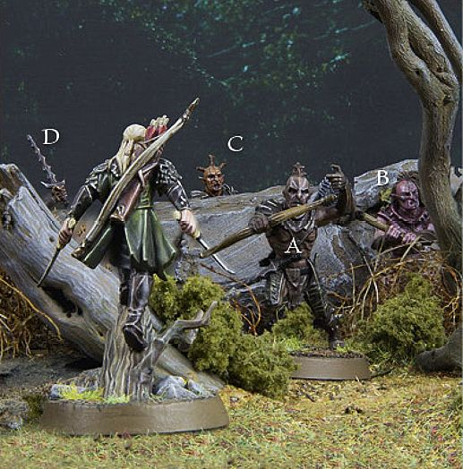
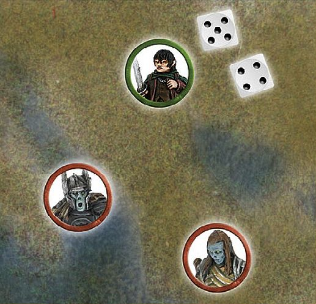
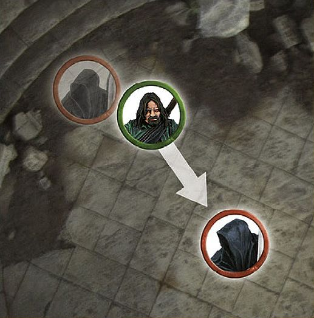

As a battle rages on, warriors become surrounded by death, destruction and the horrors of warfare. Surrounded by such peril, the mettle of even the most valiant of warriors will be pushed to breaking point. As the tide of the battle shifts, a warrior's resilience can begin to fade; their will to continue on in this fight ebbing away.

## TAKING COURAGE TESTS

There are many occasions in a battle when a model will be forced to take a Courage test (the most common ones are listed below). To take a Courage test, roll 2D6 and add the scores together.

Then, add the model's Courage value. If the total is equal to 10 or more, then the Courage test is passed. If the total is 9 or lower, then the Courage test has been failed. The effect of failing the Courage test is described by the special rule, Magical Power or ability that caused the test to be taken.

#### WHEN TO TEST

The most common circumstances that cause a Courage test to be undertaken are:

* **Broken Force:** When a model's force is reduced to below half of its starting number of models, usually during a Matched Play game ([see page 128]).

* **Separated Mounts:** If a mount loses its rider, it must immediately take a Courage test ([see page 59]).

* **Terror:** When a model wishes to charge an enemy model that has the Terror special rule ([see page 107]).

There are other situations that require a model to take a Courage test. When these occur, it will be clearly stated in the relevant special rules.

**TAKING COURAGE TESTS**

*A lumbering* Cave Troll *has charged Frodo. Wishing to save their friend from this terrifying beast, Merry and Pippin both attempt to Charge the Troll. As the Cave Troll has the Terror special rule, both Merry and Pippin must take a Courage test. Merry goes first and rolls a 3 and a 4. After adding these together, then adding his Courage value of 4, Merry scores a total of 11 and may immediately Charge the Troll. Next, Pippin makes his Courage test. However, Pippin only rolls a 1 and a 2. After adding his Courage value of 4, Pippin only scores a total of 7 and so cannot Charge the Troll — or move at all this turn.*

#### TAKING MULTIPLE COURAGE TESTS

If a model passes a Courage test caused by a special rule or ability, it automatically passes any subsequent Courage tests it is required to take because of the same special rule or ability for the rest of the turn, unless otherwise stated.

**TAKING MULTIPLE COURAGE TESTS 1**

*Frodo has been targeted by a Spectre's A Fell Light is in Them special rule, and must now make a Courage test. Rolling a 5 and a 4, Frodo adds his Courage value of 6 and scores a total of 15 — a clear pass. A second Spectre then also targets Frodo with the A Fell Light Is in Them special rule. However, as Frodo has already passed one Courage test this turn due to the A Fell Light is in Them special rule, he will automatically pass the second test.*

**TAKING MULTIPLE COURAGE TESTS 2**

*Aragorn has charged a* Ringwraith *after passing his Courage test due to the Ringwraith’s Terror special rule. Aragorn calls a Heroic Combat (explained on [page 69]) and successfully slays the Nazgûl. Aragorn does not need to take a second Courage test to charge the second Ringwraith as he already passed one Courage test due to the Terror special rule earlier in that turn.*

#### BROKEN FORCE

*When the slaughter is thickest, the resolve of many a brave warrior will crack. Some flee in fear of their lives. Others will lose faith in their cause, or prefer to slink away and live to fight another day.*

When you write your army list for Matched Play (or gather the models required to play certain Scenarios), you must also calculate your Break Point. This is always equal to half of the models in your army at the start of the game. Even if the number of models in your army increases as the game goes on, your Break Point remains unchanged. A force with 50 models would have a Break Point of 25, whilst one with 13 models would have a Break Point of 6.5.

During the game, you should keep track of how many casualties your force has suffered. If, at the beginning of any turn, the number of casualties suffered by your force is greater than your Break Point, your force is considered to be Broken. From then on, every remaining model in your force must take a Courage test at the start of its Move. Even models that do not intend to move must still test. The only exceptions to this are models who are already Engaged in combat (they are too busy fighting for their lives) or who are unable to move due to the effects of Magical Powers or other special abilities.

If the test is passed, the model stays in the fight. Complete its move before  proceeding on to the next model. If the test is failed, the model has lost its nerve and is removed as if it had lost its last Wound. Whether this means they have turned tail and fled, surrendered or are simply playing dead, the result is the same.

**Cavalry** models require an adjustment to this in terms as to when the model counts as slain, [see page 63].

**BROKEN FORCE**

*The Fellowship has been frantically fending off the Uruk-hai Scouts, felling as many as possible. At the start of the game there were 30 Uruk-hai Scouts, but at the start of the 10th turn, 16 of them have been slain. As the Uruk-hai Scouts had a Break Point of 15, they have started the turn having exceeded their Break Point and so are now considered to be Broken — they must now start taking Courage tests.*

#### STAND FAST!

The following rule applies only to Courage tests which are taken on account of the army being Broken. This is often the point where battles will be won or lost, and where only heroes can help ordinary warriors to find their courage. Rules for Hero models are given later.

**Warrior** models do not have to take their Courage test for their force being Broken if there is a visible friendly **Hero** model within 6" who has already taken and passed their Courage test that turn  (including those **Hero** models that pass this test automatically because of a Magical Power or special rule). For a **Warrior** model to benefit from this rule, a **Hero** model must test and move before testing for the **Warrior** model. Remember that other **Hero** models are not affected by this rule, and must therefore take a test even if a **Hero** model within 6" has already passed their test.

**Hero** models that are Engaged in combat do not test on their Courage, so they cannot use the Stand Fast! rule (they are too busy defending themselves to rally the troops around them).

**STAND FAST!**

*Éomer's army has been Broken. At the start of the next Move phase, Éomer takes a Courage test and passes it. After Éomer finishes his movement, Warriors of Rohan A, B and C are within 6" so they automatically pass their Courage test due to Éomer's Stand Fast! rule. Warrior of Rohan D, however, is not within 6" and so is not subject to Éomer's Stand Fast! rule. Warrior of Rohan D must make their own Courage test.*