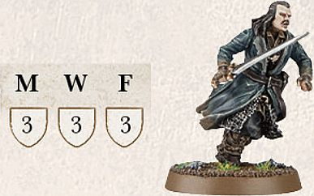
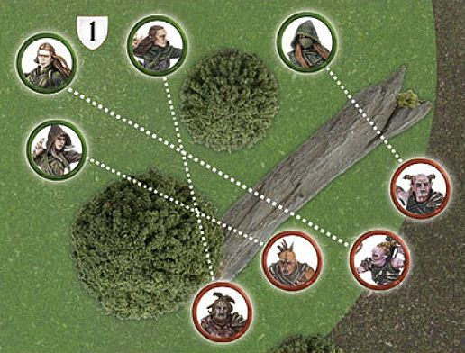

Throughout the extensive history of Middle-earth, there have been countless individuals who have left their mark upon the world, either for good or for ill. These individuals can be loosely referred to as heroes (although villains would probably suit the followers of the Dark Lord) and encompass various famous characters from Middle-earth's history. From mighty warriors and kings such as Aragorn or Théoden, to the humble Hobbits of The Shire that journeyed to Mordor to destroy The One Ring, heroes can come in all shapes and sizes.

Models that are also heroes will have the **Hero** keyword in their profile.

**Hero** models have a number of special abilities that separate them from the rank and file Warrior models that are found within Middle-earth, all of which
are discussed here.

## MIGHT, WILL AND FATE

The most obvious difference between a **Hero** model and an ordinary Warrior model is that **Hero** models have three extra characteristics on their profile: Might, Will and Fate. These three things do a great deal to separate the heroes of Middle-earth from the rest of those who fight alongside them.

Unlike other characteristics, Might, Will and Fate points are expended when they are used — so players need to watch out for the best opportunities to use them and mark them off as they are used up. When a **Hero** model runs out of Might, Will or Fate points they may spend no more during that game, unless they are somehow able to regain these points during its course.

#### HEROIC PROFILES

All **Hero** models have an extra section to their characteristic profile, which shows how much Might, Will and Fate they have at their disposal.

Bard has 3 points of Might (M), 3 points of Will (W) and 3 points of Fate (F).

## MIGHT

Arguably the single most valuable characteristic available to a model, Might points represent the ability of a **Hero** to seize the initiative, to act faster than their foes or to summon strength that few ever knew they possessed. Might points are a reserve of resolve and heroism, and spending a Might point is often a sign that a truly heroic deed is afoot.

Might points can be used in two ways: to modify dice rolls and to perform Heroic Actions.

#### MODIFYING DICE ROLLS

A **Hero** model is able to spend a point of Might to adjust a dice roll made on their behalf. For each point of Might that is expended, alter the dice score by 1. Normally, this can only be used to increase a dice roll in order to succeed in a particular situation. However, there may be certain situations when Might can be used to decrease a dice roll (such as when rolling for Maelstrom of Battle deployment), and when this is the case it will be clearly stated.

A player does not need to decide to use their Might until all the dice have been rolled, until both sides have rolled in the case of seeing who wins a Duel roll, or until after any re-rolls that might be available have been used. Essentially, in most situations, a player can ensure the result that they want if they have enough Might points at their disposal. The exception is that a dice roll can never exceed 6 or go below 1, no matter how many Might points you have!

If two opposing **Hero** models are fighting, both may use Might in order to win the Fight. This is done as a sort of bidding system, where the player whose **Hero** is currently losing has the first opportunity to use Might. Should they choose to use Might to win the fight, then their opponent may elect to use Might as well in order to win. The opportunity then keeps switching between players until both players have used all of the Might points they would like to, or no more can be used.

Hero models can only use Might points to alter their own dice rolls, not those of other friendly or enemy models. This means that in some situations, such as Multiple Combats, it is important to roll dice separately for specific **Hero** models and ordinary Warrior models. A good system to use in this instance is to have different coloured dice for each **Hero** model and another for individual Warrior models. If you don't have enough coloured dice for that, roll each model's Attacks separately instead.

**MIGHT 1**

*Bard takes a shot at a Hunter Orc and scores a hit. There is a wall In The Way, however, so* Bard *must pass an In The Way test in order to hit the Orc. Bard rolls his In The Way test and scores a 3. Walls require an In The Way roll of a 4+, so Bard must spend a Might point in order for the test to be successful.*

**MIGHT 2**

*Jay and Adam are both using **Hero** models in a Fight. Adam is using Thorin (Fight 6 and 3 Might) and Jay is using Azog (Fight 7 and 3 Might). Adam rolls his dice for the Duel roll, scoring a 1, 2 and 3 whilst Jay scores a 2, 3 and 4. As Adam is currently losing, he elects to use Might, but as Thorin has the lower Fight value, he must use 2 Might points to boost his 3 to a 5 in order to win the Fight. As Jay is now losing, he elects to use a Might point to boost his 4 to a 5, and as Azog has the higher Fight value, Jay is now winning the fight. Adam now has another opportunity to use Might as he is once again losing the Fight, he elects to use his last Might point to boost his 5 to a 6 and once again win the Fight. Jay then elects to use another Might point to also boost his 5 to a 6 and win the Fight. As both players are now at a 6, no more Might can be used: Azog wins the Fight — bad news for Adam and Thorin!*

**MIGHT 3**

*Beorn is in a Fight against* Bolg. *Looking at their Duel roll, Beorn scores a 1, 3 and 4. Bolg rolls a 2, 4 and a 6 — beating the hulking bear's score by 2. Beorn now has to decide whether he loses the Fight or if he is willing to spend 2 Might points to even draw with Bolg (and with his higher Fight value, that's a pretty sensible thing to do).*

#### CAN I USE MIGHT?

Here is the list of situations in which Might points can be used to alter a dice roll, along with some notes on how these take effect. Unless specifically stated, Might cannot be used to alter any other rolls. Where this is the case, it will be stated in the relevant special rule.

* **Taking Tests** — Might can be used to help a model succeed in tests  such as Jump, Climb or Thrown Rider tests.

* **Duel Rolls** — Might points can be used to boost a **Hero** model's  score during a Fight to see who wins a Duel roll.

* **Shooting** — Might can help a shot hit a target, either by modifying  a To Hit roll or an In The Way roll.

* **Rolling To Wound** — Might can improve a To Wound roll. Note, in  cases where two rolls are required (e.g., 6/4+) spending a single Might  point will affect both rolls.

* **Courage** — A **Hero** can use Might to improve their roll in a Courage  test.

* **Using Will** — A **Hero** can use Might to modify the dice roll to  succeed when casting a Magical Power or attempting to pass a Resist test.

* **Using Fate** — A **Hero** can use Might to  succeed in a Fate roll ([see page 75]).

## HEROIC ACTIONS

**Hero** models can also use Might points to perform Heroic Actions. These spectacular deeds can sway the outcome of an entire battle.

A **Hero** may attempt a single Heroic Action at the start of the Move, Shoot or Fight phases, before any dice are rolled, depending on the Heroic Action in question; this is defined, in brackets, next to the name of the Heroic Action. To do so, the controlling player states that the **Hero** is attempting a Heroic Action, and which Heroic Action it is, and expends a Might point.

If both players wish for **Hero** models in their forces to attempt a Heroic Action in the same phase, they must take it in turns to nominate a Hero, starting with the player who does not have Priority. Declare the action, make a note that the **Hero** has spent a Might point and place a marker so it is clear which Heroic Action they are using.

Once that player has declared the Heroic Action they wish to use, the opposing player then gets the opportunity to declare a Heroic Action in reply.

Both players may continue to declare Heroic Actions in this manner until both are satisfied.

Note, sometimes you might have a situation where, because of one player's choice of Heroic Action (or choice not to call a Heroic Action), the other wishes to reply with one of their own. This is perfectly acceptable. You can always declare a Heroic Action if you have the Might, and the Hero models to spare — what you cannot do, is go back and change (or cancel) one that has already been declared.

Some Heroic Actions interfere with the order in which a phase is conducted. For instance, if a **Hero** is attempting a Heroic Combat, that Fight is resolved first. If two or more **Hero** models from the same side wish to perform such an action, their controlling player simply chooses the order in which the actions take place. If **Hero** models from both sides are performing such Heroic Actions, follow this system to determine the order in which they are resolved:

1. Both players nominate **Hero** models to perform Heroic Actions, as described above, and make a note that they have expended a Might point.

2. The player with Priority rolls a D6. On a 1-3, the Evil player performs the first Heroic action. On a 4-6, the Good player does.

3. Players alternate performing Heroic Actions until none are left.

A model may only benefit from a single Heroic Action, of each type, in each phase. The important exception to this being in a Heroic Combat — a model who successfully completes a Heroic Combat and then joins in a second Fight that is also a Heroic Combat, will fight as normal. They will not, however, be able to move and fight again if that Heroic Action is also successful.

Certain Heroic Actions are universal and can be used by any **Hero** in the game, regardless of who they are. Every **Hero** who has a Might point can use
the following three Heroic Actions:

### HEROIC MOVE (MOVE PHASE)

*Amidst the chaos and confusion of battle, the hero's bold voice rings out, spurring their troops to quickly surge into motion.*

A Heroic Move enables a **Hero** model to move before other models — essentially defying the usual Priority system. The **Hero** can then move, jump, climb, Charge and even use their Stand Fast! ([see page 55]) in the usual manner.

This Heroic Action can prove extremely valuable, so when a Heroic Move is declared by the player without Priority, the opposing player will often choose to also declare a Heroic Move in an attempt to keep the initiative.

If a **Hero** declares that they will attempt a Heroic Move, but is charged before they can perform it, the Heroic Move is cancelled and the Might point spent to attempt it is lost.

**HEROIC MOVES**

*The Evil side has Priority, and* Tom the Troll *is closer to Thorin's Company than they would like. Bilbo Baggins uses a Might Point to declare a Heroic Move, enabling him and all friendly models within 6" to move first, outside of the normal order of Priority.*

*If Tom decided to spend a Might point to counter this Heroic Move, the player with Priority (the Evil player) would roll a D6 to see whose Heroic Action is utilised first.*

#### WITH ME!

A **Hero** model performing a Heroic Move may choose to shout "With Me!" In this case, note their starting position before moving them. Any friendly models within 6" of that point may also move, so long as they end their move within 6" of the **Hero** (if they are not able to end within 6" of the **Hero** then they may not move at all this phase). Any model in range of the Heroic Move that chooses not to move as part of the Heroic Move, will forgo their movement, and cannot act any further during that Move phase. The **Hero** calling the With Me! must fully complete their move before any friendly models can start their move as part of the With Me!

Note that a **Hero** model can utilise their Heroic Move and call With Me! without actually moving themselves, even if they fail a Courage test as a result of the Terror special rule, they are simply goading those around them into action. However, should a **Hero** call With Me! and then subsequently flee the board as a result of their force being Broken, their Heroic Move will automatically be cancelled.

### HEROIC SHOOT (SHOOT PHASE)

*The skill of being able to fire quicker than an enemy can often mean the difference between life and death.*

Heroic Shoot enables a **Hero** model to shoot before other models get a chance. A **Hero** cannot perform a Heroic Shoot if they are Engaged in combat.

#### LOOSE!

A **Hero** performing a Heroic Shoot may shout "Loose!" if they wish, enabling all friendly models within 6" to shoot with them.

A **Hero** does not need to have a missile weapon to call Loose! and does not need to shoot first. Models benefitting from a Heroic Shoot or Loose! do not need to target the same enemy model — they may each choose any target viable to them [(see page 36]). Any model in range of a Heroic Shoot/Loose! that does not Shoot cannot choose to Shoot later on in that phase.

### HEROIC COMBAT (FIGHT PHASE)

*Driven by a sense of desperation or urgency (or perhaps just a lust for blood), a true hero will fight through rank upon rank of foes in order to reach their intended target.*

When a **Hero** model declares a Heroic Combat, the Fight that they are involved in is resolved first. In addition, if all the enemies in the Fight are slain, the Hero, and any models from their force Engaged in the same Fight (not those joining in with a spear or [pike]) may move again before proceeding with the Fight
phase. This additional move can be a Charge into new enemies, if you wish, in which case the models will fight again in the ordinary sequence. A model may only benefit from one Heroic Combat in each turn; so if a model that was involved in a Heroic Combat moves into a combat where another friendly **Hero** model has also called a Heroic Combat, they may not move again if that Heroic Combat is also successful.

If any of the models involved in the Heroic Combat Charge into new enemies, the way that the Fights are divided may be altered. Once all Heroic Combats have been resolved, rematch any Fights that must now change. The player with Priority decides how combatants are matched. 

**HEROIC COMBAT**

*Thorin is fighting a lone Goblin, a combat he is very likely to win. Because of this, his controlling player spends a Might point to declare a Heroic Combat. If Thorin wins the Duel roll and kills the Goblin, he will be able to move straight away and even charge a new foe — in which case he will also fight again following the normal order of Fights.*

#### SPECIALISED HEROIC ACTIONS

There is a selection of other Heroic Actions that can only be used by certain **Hero** models. In a **Hero** model's profile, all of the other additional Heroic Actions they can perform will be listed. These Heroic Actions are as follows:

#### HEROIC RESOLVE (MOVE PHASE)

*Upon the battlefield, the hardy resolve of even the bravest of warriors will be sorely tested. It is in times like these that heroes must show true leadership and strength of will, encouraging those nearby to do the same.*

Unlike other Heroic Actions, when a **Hero** declares a Heroic Resolve, the effects of the Heroic Action take place immediately. Friendly models that are within 6" of a **Hero** model that declared a Heroic Resolve, including the **Hero** themselves, receive one free additional dice to any Resist tests they make for the remainder of the turn. Note that in the case of Warrior models, and **Hero** models with no Will points remaining, this allows them to make a Resist test on one dice rather than none (one for Heroic Resolve, and one for Resistant to Magic). If a model that has the Resistant to Magic special rule is subject to a Heroic Resolve, they may roll two dice for their Resist test. A **Hero** who declares a Heroic Resolve cannot move in the same turn (they are too busy trying to steel their allies against unfriendly magics), however they may still do anything else that they would usually be able to do, such as cast Magical Powers.

#### HEROIC MARCH (MOVE PHASE)

*There are times when great distances need to be covered with haste. Digging deep into their reserves of stamina, a hero can lead those around them to feats of great endurance.*

A Heroic March enables a **Hero** to swiftly cover a greater distance — ignoring the chaos around them to rush into position. A **Hero** model who uses a Heroic March adds 3" to their maximum Move distance if they are Infantry, or 5" to their mount's maximum Move distance if they are **Cavalry**, or if the **Hero** has the Fly special rule. Models who utilise a Heroic March may not Charge in the same Move phase.

If a **Hero** declares that they will attempt a Heroic March, but is charged before they can perform it, the Heroic March is cancelled and the Might point spent to attempt it is lost.

**HEROIC MARCH**

Grinnah *and his Goblins wish to catch the fleeing Dwarves as quickly as possible. Grinnah declares a Heroic March. When they move, Grinnah and the Goblins within 6" of him move 5" as per their Move characteristic, plus 3" more for the Heroic March.*

#### AT THE DOUBLE!

A **Hero** model who is conducting a Heroic March may choose to shout "At The Double!" as they move, to enable their friends to keep pace with them. In this case, note their starting position before moving any affected models. Any friendly models within 6" of that point, who have not yet moved, also add 3" to their maximum move distance if they are Infantry and 5" to their mounts' maximum Move distance if they are **Cavalry**, or they have the Fly special rule. Once the **Hero** has completed their move, those affected models may also move, so long as they end their move within 6" of the Hero. A **Hero** can utilise their Heroic March and call At the Double! without actually moving themselves; they are simply goading their friends into action. These models may not Charge as part of the At The Double! move.

Any model in range of the Heroic March that does not move, cannot choose to move later on in that phase.

#### HEROIC CHANNELLING (MOVE PHASE)

*Summoning power from the depths of their being, the hero unleashes the most powerful magic that they can call upon.*

A **Hero** model who uses Heroic Channelling uses the Channelled versions of any Magical Powers that they cast this turn ([see page 95)].

#### HEROIC ACCURACY (SHOOT PHASE)

*A commanding word from a leader can calm the nerves and steady an
archer's hand, ready to loose an arrow into the foe with greater accuracy and skill.*

Heroic Accuracy enables a **Hero** model to re-roll failed In The Way rolls
when shooting in that Shoot phase. A **Hero** cannot perform a Heroic Accuracy
if they are Engaged in combat. A **Hero** does not need to have a missile
weapon to declare a Heroic Accuracy.

**HEROIC ACCURACY**

Tauriel *and her* Mirkwood *Rangers are about to fire at some Hunter Orcs. Because the Orcs are protected by obstructions, Tauriel spends a point of Might to declare a Heroic Accuracy. When she, and any friendly models within 6" shoot this turn, they may re-roll any failed In The Way rolls.*

#### TAKE AIM!

If a **Hero** performing a Heroic Accuracy wishes, they may shout "Take Aim!" to their comrades, allowing all friendly models within 6" to also re-roll failed In The Way rolls when shooting in that Shoot phase.

Models benefitting from Heroic Accuracy or Take Aim! need not target the same enemy model — they may each choose targets viable to them.

#### HEROIC STRIKE (FIGHT PHASE)

*Outnumbered and fighting for their life, it is times like these when a hero must dig down deep in order to fight off their foes with all the skill they can muster.*

A **Hero** model who declares they are using Heroic Strike adds D6 to their Fight value for the duration of the Fight phase. This is rolled for at the start of the model's Duel roll and lasts until the end of the turn. This cannot increase a **Hero** model's Fight value above 10. Note that this bonus is applied before other effects are taken into account. Thus, a **Hero** who is Engaged in a Fight with a Bat Swarm would add D6 to their Fight value (to a maximum of 10) and then halve the total due to the Bat Swarm's Blinding Swarm special rule.

#### HEROIC DEFENCE (FIGHT PHASE)

*When faced with insurmountable odds, a hero can ready themselves for the force of the blows coming their way, allowing them to lessen the impact and reduce the level of damage taken.*

A **Hero** model that declares a Heroic Defence will only suffer a Wound on the roll of a natural 6 in the ensuing Fight phase, regardless of any modifiers or Brutal Power Attacks. If the **Hero** would usually have been wounded on a 6/4+, 6/5+ or 6/6, then they will only be wounded if both rolls are natural rolls (see page 16). Note that a **Hero** model's mount is not affected by Heroic Defence.

#### HEROIC STRENGTH (FIGHT PHASE)

*Drawing on their reserves of Strength, a hero can smite their foes with greater ferocity and power than they ever realised they were capable of.*

A **Hero** model who declares they are using Heroic Strength adds D3 to their Strength characteristic for the duration of the Fight phase. This cannot increase a **Hero** model's Strength above 10. Note that this bonus is applied before other effects that affect a model's Strength, such as the Wither Magical Power.

#### HEROIC CHALLENGE (FIGHT PHASE)

*Upon the field of battle, there are times when a hero will come face-to-face with an enemy who rivals their skill with a blade, and will seek to prove themselves as the better combatant of the two.*

A **Hero** that is in base contact with an enemy Hero, of the same Heroic Tier ([see page 132]) or higher, may declare a Heroic Challenge.

If the enemy **Hero** accepts the Heroic Challenge, all other models that are part of the same combat, including supporting models, may not roll dice for the Duel roll, provide their Fight value to the fight or makes Strikes if their side wins the fight. From this point on, both **Hero** models involved in a Heroic Challenge must Charge each other if able to do so until one of them has been slain. Other models may not Charge either of the **Hero** models involved in the Heroic Challenge. Whichever **Hero** is successful in slaying their opponent (they must be the one to cause the final blow) will immediately gain D3 Might points; this can take them above their starting level.

If the Challenge is declined, then any Heroic Actions called by the declining **Hero** will not affect other friendly models until the **Hero** who issued the Challenge is slain.

#### UNIQUE HEROIC ACTIONS

In rare circumstances, specific **Hero** models may have their own unique Heroic Action available to them. When this is the case it will be listed in that model's profile.

## WILL

Many of the heroes of Middle-earth are possessed of a superhuman strength of purpose — an iron-hearted resolve that enables them to face down seemingly improbable odds. This strength of will allows the most mighty of heroes within Middle-earth to set aside their fears and charge forth to glory. Furthermore, in Middle-earth, magic and the power of Wizards and sorcerers are real, although their effects are subtle and unassuming; only a sufficient reserve of Will can enable, and prevent, such powers.

**Hero** models may expend Will points in three situations:

#### CAST A MAGICAL POWER

To cast a Magical Power, a **Hero** expends one or more Will points — this is the number of dice the controlling player rolls in their casting attempt. Note that the player must choose how many Will points they will expend before they roll any dice. For more on casting Magical Powers, [see pages 92-101].

#### RESIST A MAGICAL POWER

A **Hero** who is the victim of a Magical Power cast by an enemy model may attempt to Resist it by expending Will points. For more on resisting Magical Powers, [see page 95].

#### PASS A COURAGE TEST

A **Hero** who has attempted, and failed, a Courage test may spend Will points to adjust the score of their test. For each Will point they expend, their Courage is raised by one for that test. A **Hero** may spend a mixture of Will points and Might points to modify their score in this manner if they wish to.

**PASS A COURAGE TEST**

(../media/rules_manual/pass_a_courage_test_1.jpg)

Nori *wishes to Charge* The Goblin King. *Although he is usually brave, Nori is unlucky and only scores a 4 for his Courage test (he has a Courage value of 5). His controlling player decides to spend a Will point to increase his score to 5, and therefore pass the test!*

## FATE

The greatest heroes are able to cheat death, avoiding wounds that would slay lesser beings and surviving injuries that would lay others low. To represent this, our **Hero** models have Fate points, which can prevent injuries.

Whenever a model with Fate points is wounded, the controlling player may choose to expend a Fate point to attempt to prevent a Wound.

Mark off the Fate point on your record sheet and then roll a D6. On a 4, 5 or 6, the Wound has no effect; do not reduce the **Hero** model's remaining Wounds.

If the Fate roll is unsuccessful, and the **Hero** has more Fate points remaining, another Fate roll can be attempted if you wish — expend the next Fate point and roll again.

Fate points must be used one at a time rather than all together.

Might can be used to alter the results of a Fate roll, but because Fate rolls are taken one at a time, you must decide whether to adjust your Fate roll before using another Fate point. This means that if a Fate roll comes up with a score of 3, you must decide whether to use a Might point before rolling any other dice — if the next roll is worse, you can't go back!

There are a few special attacks that cause multiple Wounds (such as Mighty Blow, Bane Weapons, etc), or even kill a model instantly, regardless of how many Wounds it has remaining (such as a Morgul blade). Unless otherwise stated, a successful Fate roll against one of these prevents all of the damage the Strike would have caused. Thus, a model wounded once by a Morgul blade must pass a single Fate roll or die. A model who is wounded twice must pass two, and so on.

Whilst a **Hero** can use Fate to prevent any manner of Wound (whether caused by arrows, axes, long falls or fireballs), it cannot save a **Hero** from a failed Courage test, even if it would mean the model is removed from play. If a **Hero** shows a craven heart, fate has clearly abandoned them.

**FATE 1**

(../media/rules_manual/fate_1.jpg)

*Thorin has defeated Grinnah in a fight and prepares to make his Strikes. Swinging* Orcrist *above his head, Thorin scores a 1, 5 and 6 for his To Wound rolls — causing 2 Wounds! Grinnah decides to use a Fate point against one of these wounding Strikes, rolling a 4. This prevents the Wound and stops it from doing D3 Wounds — if the Fate roll had been failed, then Grinnah would have suffered D3 Wounds as Orcrist has the Goblinbane special rule. However, Grinnah does not have another Fate point to use to prevent the second Wounding Strike, so it will do D3 Wounds. Thorin rolls a 5 and inflicts 3 Wounds, cleaving the Goblin's head clean off!*

**FATE 2**

(../media/rules_manual/fate_2.jpg)

*Kili has been shot by a Hunter Orc's arrow and suffered a Wound. Kili decides to spend a Fate point in an attempt to prevent the Wound and rolls a dice. On a 4+, the Wound is ignored.* []{#bookmark139 .anchor}*Unfortunately, Kili only scores a 3. Determined to avoid injury, the controlling player spends a Might point to turn the 3 into a 4 and prevent the Wound.*
