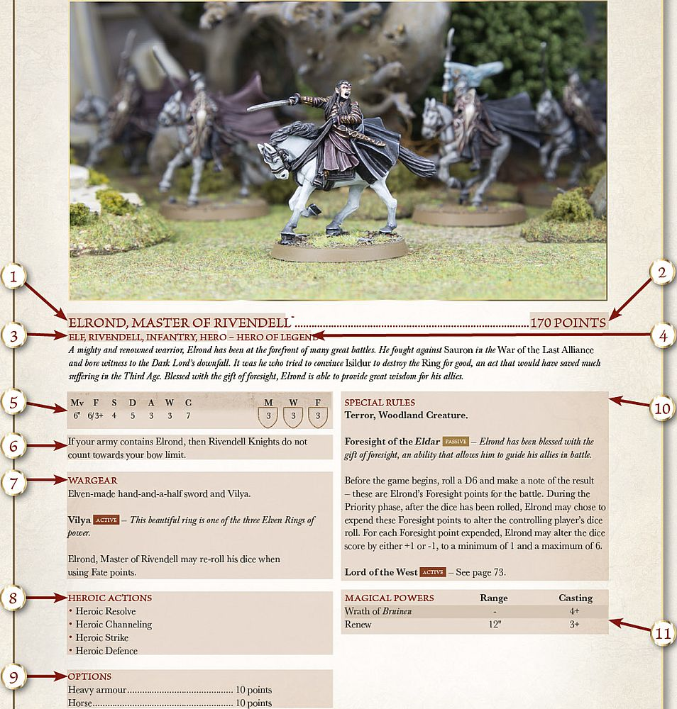

Welcome to the Middle-earth Strategy Battle Game, the hobby of collecting, painting and gaming with all of your favourite characters from *The Lord of the Rings*™ and *The Hobbit*™ using beautifully detailed Forge World and Citadel models. If you have ever wanted to explore the world of Middle-earth, its races and its heroes then this is definitely the hobby for you.

Chances are that at least some people reading this will have never played a tabletop wargame before, and so a tome as big as this may at first seem a little daunting to newer players. But fear not, within the pages of the Middle-earth: Strategy Battle Game rules manual you will be guided upon your journey into the wonderful realm of tabletop wargaming, with all of the rules laid out for you in a clear and easy to follow manner, complete with a series of examples to clear up any questions you may have. There is also a section towards the back of this manual that showcases many of the amazing models available, as well as a selection of example armies to inspire you to build your own. What more could you want!

#### MIDDLE-EARTH IN MINIATURE

Many of us who have followed the journeys of the characters of *The Lord of the Rings*™ and *The Hobbit*™ have at some point dreamt of being part of the action, fighting in one of the epic battles of Middle-earth or strolling along the paths of *The Shire*. The Middle-earth Strategy Battle Game unlocks the potential to relive all of your favourite moments from the books and films, transporting you to Middle-earth and letting your imagination run wild.

If you are reading this, then there is a good chance that you have already seen a selection of the stunning range of Citadel and Forge World models of the various characters and creatures from Middle-earth, in fact it is a distinct possibility that many of you may already own one or two!

This rules manual is here to guide you on your journey through building, painting and gaming with your own collection of highly detailed Middle-earth models, so that you can get the most fun and enjoyment out of them. Whether you simply want to collect your favourite characters and creatures from the world of Middle-earth, or if you wish to gather a mighty army of Men, Orcs, Elves or something else and do battle with your friends, this manual will take you every step of the way.

#### HOW TO USE THIS RULES MANUAL 

The Middle-earth Strategy Battle Game rules manual contains within its pages all of the information that you will need to organise your collection and play exciting games set in the world of Middle-earth. The game allows you to faithfully recreate all of your favourite scenes and battles from *The Lord of the Rings*™ and *The Hobbit*™ trilogies, as well as collect armies of the numerous and varied factions, realms and races of Middle-earth. This manual contains all of the rules that you will need to play games set within Middle-earth; including moving and shooting, fighting in close combat, and even how to use Magical Powers and fight epic siege battles.

This rules manual also contains a selection of specially written Matched Play Scenarios, perfect for use in organised play events or to test your skill and tactical ability as a general of your own army.

All of the profiles for all of your favourite heroes, warriors and creatures can be found within the relevant army book, either The Armies of *The Lord of the Rings*™, or The Armies of *The Hobbit*™, along with a series of Narrative Play Scenarios that allow you to use your collection of Middle-earth models to recreate some of the most famous battles or scenes from the films on the tabletop.

#### PLAYING THE GAME

Those of you who have never played a tabletop battle game before may be wondering how it all works. Over the next few pages, we will look at how you go about setting up and getting started with your first game of the Middle-earth Strategy Battle Game.

The first thing you need, and possibly the most important, is a friend to play your games with. You will then need to decide on what type of game you are going to play. There are three main ways to play games set in Middle-earth:

1. **Narrative Play** — Recreate all of your favourite battles and scenes from the *The Lord of the Rings*™ and *The Hobbit*™ using your collection of Citadel and Forge World models...and maybe change the course of history! You'll find more details on Narrative Play on page 124.

2. **Open Play** — Play the Middle-earth Strategy Battle Game with no restrictions. Unleash all of your models against your friends' in an all-out fight to the death or create your own 'What If?' Scenarios. More details on Open Play can be found on [page 126].

3. **Matched Play** — Organise your collection into mighty armies using the points values and army lists found within The Armies of *The Lord of the Rings*™ and The Armies of *The Hobbit*™, then play battles against your friends to see who has the deadliest  army. More details on Matched Play can be found on [page  128].

#### SETTINGUP THE BATTLEFIELD

Narrative Play and Matched Play games will have instructions and ideas on how to set up your battlefield ready for your game, including maps and even photos to help guide you. In addition, in each Scenario we give an idea of what the terrain could be, and The Armies of *The Lord of the Rings*™ and The Armies of *The Hobbit*™ contain a variety of exciting Scenarios to allow you to recreate your favourite scenes from the books and films. If you do not have all of the scenery that is recommended, don't panic! You can still play the game with a bit of improvisation and imagination — most wargamers play their first games with books standing in for hills and ruins, and twigs from the garden for trees.

**CHOOSE FORCES**

Every Narrative Play Scenario contains a list of participants to help you put together a game that faithfully recreates the scenes from the films, and will require no small amount of cunning and wits. In the picture below, Adam has opted to take control of the Good forces, consisting of *Faramir* and the Rangers of Ithilien, whilst Jay has sided with the *Dark Lord* and controls the *Mûmakil* of Harad as they march to join the army of Mordor.

**OBJECTIVES**

Every Narrative Play Scenario has a series of rules that will determine who wins the game. In this Scenario, Faramir and his Rangers must try to prevent the Mûmakil from reaching Mordor, slaying them if possible, whilst the Haradrim attempt to eliminate as many of the Rangers as possible. 

#### THE RULES

The rules are what make the game work on the tabletop — they govern all aspects of play, including how far a model can move, how many Attacks they may make and whether or not an arrow hits its target. The rules might seem a little intimidating at first, but don't be put off. After a game or two, it will all seem like second nature.

***EXAMPLES***

*There are boxes just like this one dotted throughout this manual. These contain important examples and notes that further explain key features of the game, to help avoid any confusion on the battlefield. The number next to the header corresponds to matching numbers near the relevant rule.*

#### CHARACTERISTICS

Every model, from the most heroic of Men to the most craven Orc, has a profile that reflects how powerful, brave and skilled they are in battle.

A profile is a collection of letters and numbers that at first glance may seem abstract and confusing, however, each of these letters and numbers directly relates to a specific aspect or ability. Throughout a game, you'll often find yourself referring to these to see which model wins a Duel, or whether a weapon's blow wounds a victim, etc.

**Mv (Move)** — This characteristic is probably used the most in the game — it tells you how far in inches (") that model may move in each of its Move phases.

**F (Fight)** — Fight is the characteristic that denotes a model's skill at fighting a Duel and firing a shooting weapon. This characteristic comprises two numbers divided by a slash. The first number is called the Fight value and shows how skilful the model is in a Duel; the better they are, the higher the Fight value. The second number is called the Shoot value and is always followed by the + sign; this shows the model's skill with missile weapons. The number indicates what score needs to be rolled in order for the model to hit its intended target; so in this instance, the lower it is, the better.

**S (Strength)** — This characteristic shows how strong the model is. A mighty Troll will have a much higher Strength than a lowly Hobbit, for example. The higher a model's Strength, the more easily it will injure an opponent.

**D (Defence)** — Defence represents how hard it is to hurt a model. If a model is clad in thick armour, or is inherently tough and resilient, its Defence will be higher, and the higher it is, the harder the model is to wound in battle.

**A (Attacks)** — The Attacks characteristic represents how many blows a model can land upon an enemy during a Duel. It literally translates to the number of dice that a model will roll during the Fight phase, both for making the initial Duel roll, and for making Strikes against an enemy.

**W (Wounds)** — This denotes how many injuries a model can sustain before it will succumb to its wounds and be slain. If at any point during the game a model's Wounds are reduced to 0, they are immediately removed from the board as a casualty. Most fighters will have just a single Wound, so will be removed as soon as they are wounded. Some creatures and characters are possessed with an exceptional resolve or massive bulk and can suffer two, three or even more Wounds before they are slain.

**C (Courage)** — How brave and determined a model is is measured by their Courage characteristic. The lower this value, the more likely the model is to quail in fear from a terrifying foe or flee the battlefield when the going gets tough.

**M, W, F (Might, Will, Fate)** — Some models, known as Hero models, possess an additional three characteristics known as Might, Will and Fate. Unlike the other characteristics, these are represented by a store of points that can be spent during the game.

A **Hero** can use these points to perform special actions throughout the course of the game, avoid harm or any number of other heroic feats. More information about **Hero** models and these extra characteristics can be found on [page 64].

### ANATOMY OF A PROFILE

Shown opposite is an example of a profile for the Middle-earth Strategy Battle Game, using the profile for *Elrond*, Master of Rivendell, from the Rivendell army list. While at first this may seem rather confusing if you haven't seen one before, it is actually really simple to understand. Here we will take you through each part of a character's profile and explain what they all mean — that way you'll be able to understand them in no time at all!

#### 1. CHARACTER'S NAME
This provides the name of the profile in question, sometimes these are quite long and may denote what part of time during the stories the profile represents. It is important when you are writing down your army list to use the full name of the profile as certain characters may have more than one profile (*Thorin Oakenshield* has three profiles for example), that way there is no confusion for either player.

#### 2. POINTS VALUE
Here you will find the cost in points of the model. The points cost given is for the full profile, with the exception of any options they may be able to purchase — these are explained in point 9.

#### 3. KEYWORDS
 ere you will find the list of all the keywords that are associated with the profile. Many special rules will reference certain keywords in order to explain which models will be affected. Here we can see that Elrond has four different keywords: **Elf**, ***Rivendell***, **Infantry** and **Hero**. For more on keywords, [see page 16].

#### 4. HEROIC TIER
Profiles that have the **Hero** keyword will also have a Heroic Tier associated with them. This represents how high up the ranks of their particular army they are and, depending on their Heroic Tier, how many followers they can have in their warband. For more on Heroic Tiers, [see page 132].

#### 5. CHARACTERISTICS
MF Here you will find all of the profile's characteristics as mentioned on [page 7]. If the model has the **Hero** keyword, then you will also find their Might, Will and Fate characteristics here as well.

#### 6. ADDITIONAL RULES
In some rare situations, a profile may have an additional rule that will affect how an army is built. This could be anything from which other **Hero** models they can be in a force with, to how the model's inclusion affects the force's bow limit. If the profile has such a rule, it will be found here.

#### 7. WARGEAR
Every model in the Strategy Battle Game has a selection of wargear that comes with their profile, as listed here. The rules for these can usually be found in the Weapons & Wargear section of this rules manual ([see pages 82-91]). Sometimes, a model will have specific wargear that has its own special rules. When this is the case, they will be listed below the profile's list of wargear. For example, Elrond has the wargear '*Vilya*', the rules for which as listed here.

#### 8. HEROIC ACTIONS
**Hero** models have the ability to spend Might points to declare certain Heroic Actions. Some of these are available to every **Hero**, whilst others are only available to certain **Hero** models. Here will be listed all of the additional Heroic Actions available to the **Hero**. If there are no Heroic Actions listed here, then the **Hero** cannot declare any of the additional Heroic Actions. For more on Heroic Actions, [see page 68].

#### 9. OPTIONS
Some profiles have a list of options available to the warrior or hero. These can include weaponry, armour, mounts, and even other more unusual items. Every option has a points cost associated with it that will increase the cost of the profile if taken.

#### 10. SPECIAL RULES
Some profiles will have special rules that represent the wide variety of abilities and skills that many of the characters and creatures of Middle-earth have. Some of these will just have the name of the special rule under the header. The effects of these can be found in the Special Rules section of this manual ([see page 102]). Others will have the full effects of the special rule, including whether it is Active or Passive or not ([see page 103]). Finally, others reference the specific page of the same book that the special rule can be found on.

#### 11. MAGICAL POWERS
In Middle-earth, there are many beings that have the ability to use Magical Powers to aid them or defeat their enemies. Here will be listed all of the Magical Powers available to the profile, the range of the powers, and their Casting value. The full effects of the Magical Powers can be found on [pages 92-101].
