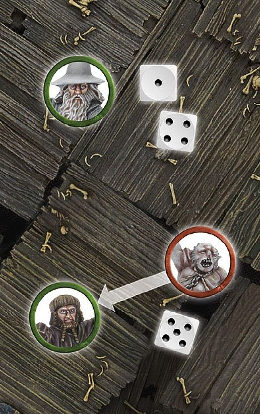

Certain models have the ability to cast magical powers — whether these are cunning powers or dark sorcery, these powers are capable of changing the course of a battle. They range from subtle enchantments that are designed to manipulate or befuddle the enemy to those that can strengthen the resolve of friendly forces nearby or cause direct harm in the form of deadly black darts or fireballs. 

## USING MAGICAL POWERS

### WHO CAN USE MAGICAL POWERS

Any model with Magical Powers listed in their profile can use Magical Powers. Using Magical Powers also requires having Will points to spend -- so typically speaking, a model without any Will points will not be able to use any Magical Powers.

### WHEN CAN YOU USE MAGICAL POWERS?

A model with Magical Powers (and Will points available) can attempt to cast one (and only one) during each Move phase. They can use the power before they move, during their move or at the end of it. A **Hero** can even use a Magical Power in the same turn that it Charges, or if they don't move at all. A favoured ploy is to cast the Magical Power against the same model that you are charging, for instance.

A model that is already Engaged in combat cannot use a Magical Power.

### WHO CAN YOU TARGET?

Magical Powers come in three basic types: those that target a particular model, those that target all models within a certain distance and those that don't target anyone specific. Who, or what, the Magical Power can affect is made clear in the Magical Power's description.

A model can be targeted by a Magical Power even if it is Engaged in combat, unless the rules for the specific Magical Power state otherwise.

When targeting a **Cavalry** model with a Magical Power that states the Attacker must choose if the rider or mount is affected, the Attacker must choose before they make their Casting roll.

Whilst it is technically possible for a Good model to harm friendly models with a Magical Power (such as blasting a foe into them or dropping rocks on an enemy within range), this should only really be done as a last ditch attempt to save them from an even worse fate.

### CHECK RANGE AND LINE OF SIGHT

A model will need Line of Sight in order to target an enemy model with a Magical Power. Measure as you would for a missile weapon when working out whether your target is in range. The range of a Magical Power will either be in the entry of the casting model or in the description of the Magical
Power.

If a Magical Power targets a particular model, the caster must also be able to see their target — use the rules for Line of Sight [(see page 16]) when determining if a model can see their target.

### MAKING A CASTING ROLL

To successfully cast a Magical Power, the **Hero** must take a Casting test. Every Magical Power has a Casting value (given as a dice score), listed in the entry of the model casting it.

The controlling player states which Magical Power the **Hero** is attempting to cast and expends one or more Will points. For each Will point the **Hero** expends, they roll a D6. All the dice are rolled together and if the score on any of the dice equals or exceeds the Magical Power's Casting Value, the spell is successfully cast — resolve its effects as detailed in the Magical Power's entry.

If none of the dice have a high enough score, the Magical Power is not cast and has no effect. Remember, however, that **Hero** models that also have Might points can spend their Might to adjust their Casting rolls — one Might point for each number you increase by. If you wish to increase the Casting roll, you must do so immediately (as you will see later, it's important that your opponent knows what your final score is).

***CASTING ROLL***

*Frodo has been sapped of his Will at the hands of the Nazgûl, so Gandalf decides to attempt to replenish him with the Strengthen Will Magical Power.*

*Gandalf spends two Will points, and rolls a 3 and a 5. Since the Magical Power has a Casting value of 4+, the score of a 5 is high enough so the Casting test is passed and the Magical Power is cast successfully.*

## RESISTING A MAGICAL POWER

If a model is targeted by a Magical Power, there is a chance they can Resist its effects. Before resolving the effects of the power, the player controlling the target must decide whether to spend Will to Resist the Magic Power (assuming the model has any). This is called a Resist test.

For each Will point spent, the defending player rolls a D6 in their Resist test. If any of the dice equal or beat the Casting roll, the model has resisted the power and there is no effect. Note, the player must choose how many Will points to expend before rolling any dice. **Hero** models may use Might to increase the score of a Resist test. If, when making a Resist test, any of the dice rolled from spending Will points rolls a natural 6, the **Hero** immediately regains that point of Will. Note that rolling a natural 6 with 'free' points of Will (such as those from Resistant to Magic, Fortify Spirit or Heroic Resolve, etc.) does not confer this effect.

Some powers can affect a model indirectly — for instance, a **Hero** might be caught in the path of another model who has been hurled aside by the Sorcerous Blast Magical Power. In cases where a model is indirectly affected, but not the initial target of the power, no Resist roll can be made — so be careful where you place your models!

***CASTING AND RESISTING***

*Gandalf is trying to help Thorin's Company escape from the Goblins pursuing them. Seeing that Grinnah is in range to charge* Ori, *Gandalf attempts to cast Immobilise (requiring a Casting roll of a 3+) in order to slow Grinnah down. Gandalf chooses Grinnah as his target and expends two Will points. Rolling his dice, Gandalf rolls a 1 and a 4, which is enough to cast the Magical Power. Grinnah, not wanting to be prevented from moving, decides to spend a Will point to make a Resist test and rolls a 5. The magical power has been resisted and Grinnah can continue its relentless pursuit of Thorin's Company.*

### RESISTING POWERS WITH NO TARGET

Some Magical Powers have no specific enemy target; some affect only the caster or friends within a certain distance, and so on. Magical Powers that do not affect enemy models cannot be resisted unless specified otherwise.

### RESISTING POWERS WITH MULTIPLE TARGETS

Some Magical Powers affect several enemies (such as Nature's Wrath, for instance). Such Magical Powers can only be resisted by a single model — their targets' controlling player chooses any one of the models in range to Resist the Magical Power. Expend their Will and take the Resist test as described above. If the test is passed, then the Magical Power has no effect on any of the models in range. If they fail, then all models in range are affected. If a Channelled power increases the number of models targeted to multiple models, any one of the targeted models can take the Resist test.

## MAGICAL POWER DURATIONS

Every Magical Power has a duration that specifies how long it lasts. The effects of a Magical Power automatically come to an end if the caster is slain or leaves the battlefield. Some Magical Powers have a special or unique duration, in these cases, it is made clear in the Magical Power's description. The three standard Magical Power durations are explained below:

### INSTANT

Magical Powers with this duration take effect straight away. After they are resolved, they end. These Magical Powers tend to be those that cause damage, such as Black Dart or Sorcerous Blast.

### TEMPORARY

Magical Powers with this duration remain in play until the End phase of the turn in which they are cast, such as Immobilise or Shroud of Shadows.

### EXHAUSTION

Magical Powers with this duration remain in play until the caster reaches 0 Will points, such as Aura of Dismay or Fortify Spirit.

### HEROIC CHANNELLING

Heroic Channelling is a Heroic Action (see page 68). When a **Hero** uses this Heroic Action, their Magical Powers become magnified, providing greater (or different) effects; the **Hero** will benefit from the exceptions for the Channelled power, instead of the ordinary rules.

## MAGICAL POWERS LIST

### AURA OF DISMAY

**DURATION: EXHAUSTION**

*Weaving a web of deceit, or some other darker power, the caster conjures the image of what their enemies most fear.*

This power targets the caster themself. While this power is in effect, the caster and all friendly models within 6" cause Terror.

**Channelled** — The range of this power is increased to 12".

### BANISHMENT

**DURATION: INSTANT**

*By unleashing a blast of pure and brilliant light, the caster is able to drive off spirits and creatures of the undead.*

This power targets one enemy model within range. This power only affects Spirit models. The target model automatically suffers 1 Wound, exactly as if it had been wounded in combat. If the target is a **Cavalry** model, the caster must choose whether the rider or the mount suffers the effects.

**Channelled** — The target suffers D3 Wounds rather than 1.

### BLACK DART

**DURATION: INSTANT**

*A mysterious power that thrusts itself into the flesh of its targets, only the Dark Lord's most deadly of servants possess this means of murder from afar.*

This power targets one enemy model within range. The target immediately suffers one Strength 9 hit. Do not roll To Hit or for In The Way tests. If the target is a **Cavalry** model then the Attacker must choose whether the rider or the mount is hit. This power can still be used on a target that is Engaged in combat.

**Channelled** — A wounding hit will cause D3 Wounds rather than 1.

### BLADEWRATH

**DURATION: TEMPORARY**

*The caster's chanting causes the blades of their allies to glow dark red with a molten power.*

This power targets one friendly model within range. In the Fight phase, all Strikes made by the target model are resolved at Strength 6, regardless of other modifiers.

**Channelled** — All Strikes are instead resolved at Strength 10.

### BLESSING OF THE VALAR

**DURATION: INSTANT**

*The words spoken by the caster are imbued with power, those who hear them find their hope renewed; arrows seem to miss and what would have been fatal blows become no more than a close call.*

This power targets one friendly model within range. They immediately recover a Fate point spent earlier in the battle. This may not take a model's Fate beyond its starting level. If the target is a **Cavalry** model, the caster must choose whether the rider or the mount recovers the Fate point.

**Channelled** — The target instead recovers D3 Fate.

### BLINDING LIGHT

**DURATION: TEMPORARY**

*Conjuring a brilliant white light, the caster illuminates the area around them, allowing the caster's allies to see as clear as day and dazzling their enemies with the sudden brightness.*

This power targets the caster themselves. While this power is in effect, any shooting attacks directed at the caster, or a friendly model within 6" of them, will only hit on a To Hit roll of a 6. Additionally, an area within a 12" radius around the caster is illuminated as if it were daylight (perfect when you are fighting underground!).

**Channelled** — The duration becomes Exhaustion.

### CALL WINDS

**DURATION: INSTANT**

*Summoning the winds of nature, the caster forces their foes away from their allies with a strong gale that is capable of knocking enemies to the ground.*

This power targets one enemy model within range. The target is blown D6" directly away from the caster in a straight line. If the model comes into contact with another model or terrain such as an Obstacle like a hedge, house or large rock, then it will stop 1" away from it. In either case the target model is knocked Prone. If the target is in combat, the effect is the same as described above, but every other model in the combat is also knocked Prone.

**Channelled** — The target is instead blown 2D6" away.

### CHILL SOUL

**DURATION: INSTANT**

*A vile magical power that targets its victim's very life essence, Chill Soul ignores physical defences, sparing only those that have enough willpower to resist its dark magic.*

This power targets one enemy model within range. The target model suffers a Wound, exactly as if it had been wounded in combat. If cast on a **Cavalry** model, the Attacker decides whether the rider or the mount suffers the Wound. This power may be cast on a model Engaged in close combat.

**Channelled** — The range of this Magical Power is increased by 6".

### COLLAPSE ROCKS

**DURATION: INSTANT**

*The caster harnesses their magical power unleashing a deafening blast that sunders rock and stone, causing blocks and boulders to tumble onto the heads of their foe.*

This power targets one enemy model within range. This power may only be cast on a model that is within a ruin, stone or brick building, cave, rock pile or another similar piece of terrain where a Wizard could crack rocks either underfoot or overhead. The target suffers one Strength 5 hit.

**Channelled** — All models (friend and foe) within 2" of the target also suffer one Strength 5 hit.

### COMMAND/COMPEL

**DURATION: TEMPORARY**

*The caster is able to infiltrate the mind of their target, rendering them powerless against the caster's commands. Often those who fall prey to this power will lose control of not just their mind, but their body as well.*

This power targets one enemy model within range. The caster may move the target model up to half of its maximum Move distance. They can do this even if the model has already moved this turn. The move cannot force the target to jump, leap, climb, dismount or lie down, but can take them into difficult terrain, and even make them Charge an enemy. No Courage test is required to Charge Terror-causing foes. It can even force an unengaged victim to drop an object (but not wargear) that it is holding or to put on The One Ring (if they carry it). Once the target has finished the move, it may move no further that turn for any reason. Finally, the target suffers the effect of the Immobilise/Transfix magical power.

**Channelled** — Additionally, while this power is in effect, the target will halve their Fight and Attacks characteristics (rounding up), and may not Strike if they win a Duel.

### CURSE

**DURATION: INSTANT**

*Some in Middle-earth seem destined for greatness or glory, protected by fate, or some other power. The most potent of curses, however, are capable of stripping away that protection, leaving their targets vulnerable to the blades and bows of their foes.*

This power targets one enemy model within range. The target model immediately loses 1 Fate point. If the target is a **Cavalry** model, the caster must choose whether the rider or the mount loses the Fate point.

**Channelled** — The target model immediately loses all remaining Fate points.

### DRAIN COURAGE

**DURATION: INSTANT**

*Even the bravest of heroes cannot hold their nerve forever, especially when the dark powers of their enemies are gnawing at their resolve, gradually draining their valour away.*

This power targets one enemy model within range. The target immediately reduces their Courage characteristic by 1 for the remainder of the battle, to a minimum of 1. This power can take effect multiple times over the course of a battle, reducing the target's Courage each time. If the target is a **Cavalry** model, the caster must choose whether the rider or the mount reduces their Courage value.

**Channelled** — The target's Courage is instead reduced by D3.

### ENCHANTED BLADES

**DURATION: TEMPORARY**

*The caster is able to imbue the blades of their allies with powerful and ancient magic, making their weapons more likely to find a chink in their enemy's armour.*

This power targets one friendly model within range. In the Fight phase, the target may re-roll all failed To Wound rolls.

**Channelled** — Additionally, the target may add 1 to all To Wound rolls. This is cumulative with using a two-handed weapon.

### ENRAGE BEAST

**DURATION: TEMPORARY**

*Having spent long periods of time in the wilderness, the caster is able to whip the beasts of the wild into a frenzy and imbue them with a thirst for blood. Such fury is not without its drawbacks — many of these beasts will collapse with exhaustion moments later.*

This power targets one friendly model within range. This power can be used against a single Bat, (unridden) Warg or Spider model within range. If successful, the target's Fight, Attacks, Strength and Courage are increased by 2 until the End phase. During the End phase, the target suffers one Strength 10 hit.

**Channelled** — The target's Fight, Attacks, Strength and Courage are instead increased by 3.

### FLAMEBURST

**DURATION: INSTANT**

*The caster summons forth a jet of searing flame, which jumps from their outstretched palm in an attempt to burn and slay their foe.*

This power targets one enemy model within range. The target immediately suffers one Strength 6 hit.

**Channelled** — The target instead suffers the effects of the Set Ablaze special rule.

### FORTIFY SPIRIT

**DURATION: EXHAUSTION**

*This magical power shields the caster's allies against the dark magics of their enemies, renewing hope and rekindling spirits against the malign forces that seek to bring despair.*

This power may target one friendly model within range. While this power is in effect, the target rolls two extra dice when making Resist tests. These extra dice do not reduce the target's store of Will and can even be rolled if the target has no Will points remaining or chooses not to expend any Will.

**Channelled** — The target also adds 1 to their highest dice score when resisting magic.

### FURY (X)

**DURATION: EXHAUSTION**

*Chanting strange incantations to invoke a crude form of magic, the caster incites those around them into a reckless and fearless mob of warriors who believe themselves impervious to pain.*

Every model with this Magical Power will have a bracket after Fury denoting the models that will be affected by the power (e.g., Fury (Goblin)). This power targets all friendly models within 6" that are included in the bracket. Whilst this power is in effect, all targets will automatically pass any Courage tests they are required to make. In the case of **Cavalry** models, a degree of common sense is required when applying this effect.

**Channelled** — Additionally, each time a target suffers a Wound whilst within range of at least one friendly model that has cast Fury, roll a D6. On the roll of a 6, the target ignores the Wound exactly as if a point of Fate had been spent. This roll is taken immediately after the Wound has been suffered, can be taken before Fate rolls are made and Might may be used to influence it.

### IMMOBILISE/TRANSFIX

**DURATION: TEMPORARY**

*The victim's limbs become as heavy as lead, leaving them rooted to the ground. Defending themselves becomes more difficult, leaving them susceptible to attack or unable to keep up with their allies.*

This power targets one enemy model within range. While this power is in effect, the target model may not move (except to Back Away should they lose a Fight), shoot, cast Magical Powers, declare Heroic Actions, call a Stand Fast! or use Active abilities and may not Strike if they win a Duel.

**Channelled** — Additionally, while this power is in effect, the target will halve their Fight and Attacks characteristics (rounding up).

### INSTILL FEAR

**DURATION: INSTANT**

*Whether they conjure an image that terrifies their foes or unleash an unnatural and bloodcurdling screech, the caster causes such fear that nearby foes will flee in terror.*

This power targets all enemy models within range. Each affected model must take a Courage test, in an order chosen by the caster; if the test is failed then the model must move its maximum Move distance directly away from the caster. If a model comes into base contact with the edge of the board, they will immediately stop moving.

**Channelled** — Courage tests caused by this Magical Power are taken on 3D6, discarding the highest result.

### NATURE'S WRATH

**DURATION: INSTANT**

*Unleashing the awesome power of nature, the caster causes the ground to shake, gales to blow and rivers to surge — knocking their foes to the ground with tremendous force.*

This power targets all enemy models within range. All enemy models within 6" of the caster are knocked Prone. **Cavalry** models are automatically treated as having suffered a Knocked Flying result on the Thrown Rider table — both rider and mount are then knocked Prone.

**Channelled** — All enemy models suffer one Strength 2 hit after being knocked Prone.

### PANIC STEED

**DURATION: INSTANT**

*The mind of a simple beast is much easier to infiltrate than overcoming the willpower of a warrior. The caster can create a strong sense of fear within a mount, causing it to buck its rider and bolt from the field of battle.*

This power targets one enemy model within range. This power may only target **Cavalry** models. The rider is immediately thrown and the mount instantly flees. Remove the mount from play and roll on the Thrown Rider table to determine the effect on the rider.

**Channelled** — This power also targets all enemy models within 3" of the initial target.

### PARALYSE

**DURATION: INSTANT**

*Drawing upon their dark powers, the caster inflicts this wicked spell upon their foe, rendering their victim utterly helpless. In their paralysed and vulnerable state, those that find themselves under this power often find themselves at the mercy of their enemies.*

This power targets one enemy model within range. The target is immediately paralysed. It is knocked Prone and may do nothing until it recovers, including using Active special rules. The target may make no Duel rolls and will automatically lose any Duels it takes part in unless joined by a friendly model.

**Channelled** — At the end of each turn that the target remains Paralysed, they suffer one Strength 5 hit.

### PROTECTION OF THE VALAR

**DURATION: TEMPORARY**

*Drawing on their own reserves of inner strength, the caster surrounds themselves in a glowing nimbus of pure energy, providing a shield of light that protects against dark powers and thwarting the will of Evil.*

This power may target the caster or a single friendly model within 3". The target may not be targeted by an enemy's Magical Powers or special rules.

**Channelled** — The power will affect all friendly models within 3".

### REFRESHING SONG

**DURATION: INSTANT**

*With a merry song, as pure as a tinkling bell, wounds of the body and the weariness of the mind are forgotten, and hurt and sorrow are washed away as if by cool, clear water.*

This power targets one friendly model within range. The target immediately recovers a single lost Wound, as well as a single lost Might, Will and Fate point spent earlier in the battle. The target also immediately recovers from the effects of any Magical Power they wish.

**Channelled** — The target instead recovers all lost Wounds rather than just one, in addition to all other effects.

### RENEW

**DURATION: INSTANT**

*Wounds heal quickly, and bones fuse back together as weary and tired warriors suddenly find themselves ready to jump back into the thick of battle.*

This power targets a single friendly model within range. The target immediately regains a single Wound lost earlier in the battle. If the target is a **Cavalry** model, the caster must choose whether the rider or the mount regains the Wound.

**Channelled** — The target instead regains D3 lost Wounds.

### SAP WILL

**DURATION: INSTANT**

*This is an attack directly upon the willpower of the victim, overpowering them and leaving them helpless against the magical barrage that will undoubtedly follow.*

This power targets one enemy model within range. The target immediately loses D3 Will points. If the target is a **Cavalry** model, the caster must choose whether the rider or the mount loses the Will.

**Channelled** — The target loses D6 Will points.

### SHATTER

**DURATION: INSTANT**

*The caster mutters terrible words of power and, as they do so, the equipment carried by their foes shatters or crumbles apart, leaving them unarmed.*

This power targets one enemy model within range. Pick a single piece of wargear on the target model. The selected item is immediately destroyed and cannot be used for the remainder of the game. All special rules associated with the selected item are lost.

**Channelled** — The target additionally suffers one Strength 6 hit.

### SHROUD OF SHADOWS

**DURATION: TEMPORARY**

*The caster calls down dark shadows to conceal their allies from the eyes of their enemies.*

This power targets a friendly model within range. The target is considered to be invisible until the End phase. They cannot be targeted by enemy models' Magical Powers, special rules or shooting attacks.

**Channelled** — Additionally, during the Fight phase, any enemy model Engaged in combat with the target halves its Fight value for the duration of the Duel.

### SORCEROUS BLAST

**DURATION: INSTANT**

*The caster hurls their target aside with an unseen force, sending them, and those unlucky enough to be nearby, sprawling to the ground.*

This power targets one enemy model within range. The target is blasted D6" directly away from the caster and knocked Prone. If the target comes into contact with another model that is Strength 5 or less, it will immediately stop and both models will be knocked Prone.

**Channelled** — The initial hit is instead Strength 6 and every other model suffers instead one Strength 4 hit.

### STRENGTHEN WILL

**DURATION: INSTANT**

*Channelling their own fortitude, the caster is able to instill greater resolve into their allies, renewing their flagging spirits to continue the fight.*

This power targets one friendly model within range. The caster can use this spell to give 1 Will point to a friendly **Hero** within range. The target's Will can be increased past their starting amount.

**Channelled** — The target instead receives D3 Will points.

### TERRIFYING AURA

**DURATION: EXHAUSTION**

*Drawing upon their power, the caster's visage becomes suddenly more ferocious, their physique more intimidating — causing their foes to quake in fear.*

This power targets the caster themselves. While this power is in effect, the caster causes Terror.

**Channelled** — Models wishing to Charge the caster whilst this power is in effect must take their Courage test on 3D6, discarding the highest dice.

### TREMOR

**DURATION: INSTANT**

*The caster causes the ground beneath their feet to tremble and shake, sending a crack towards the enemy that throws their foes to the floor as a gaping fissure spreads across the battlefield.*

This power targets one enemy model within range, and any model that falls under the line. Draw a straight line, 1mm wide, that extends D6" from the target in the direction directly away from the caster.

**Channelled** — The line instead extends out 2D6".

### WITHER

**DURATION: INSTANT**

*The caster harnesses a crude form of dark magic, causing their victims to wither and weaken. Bones become brittle and muscles begin to waste away.*

This power targets one enemy model within range. The target's Strength is reduced by 1 (to a minimum of 1) for the remainder of the game. If the target is a **Cavalry** model, the caster must choose whether the rider or the mount has their Strength reduced.

**Channelled** — The target's Strength is instead reduced by D3.

### WRATH OF BRUINEN

**DURATION: INSTANT**

*Harnessing the mighty power of nature, the caster summons forth bubbling, surging waters to spring from the ground and sweep their enemies from their feet. Those who venture too close to a river or pond will feel the full force of this power as they are buffeted by the raging currents the caster summons.*

This power targets all enemy models within range. All enemy models within 6" of the caster are knocked Prone. **Cavalry** models are automatically treated as having suffered a Knocked Flying result on the Thrown Rider table — both rider and mount are then knocked Prone.

**Channelled** — All enemy models instead suffer one Strength 3 hit after being knocked Prone or one Strength 9 hit if they are in a stream, river or similar water terrain feature.

### YOUR STAFF IS BROKEN

**DURATION: INSTANT**

*A rare magical power that can shatter the formidable Staffs of Power belonging to the Wizards, only the greatest of sorcerers and magic users can harness this power.*

This power targets one enemy model within range, so long as they have a staff. This power destroys the staff of the target model. All the advantages associated with the staff are immediately lost.

**Channelled** — The target additionally suffers a Strength 7 hit.
