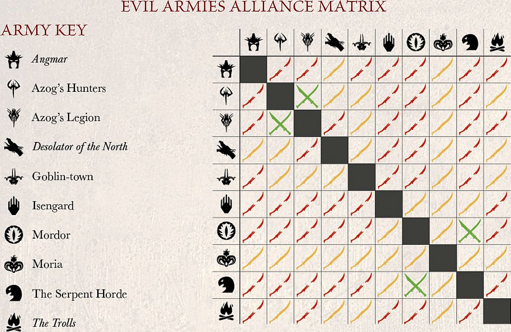

In a Matched Play game, you and your opponent gather your forces of heroes and warriors from your collection, up to an agreed points limit, before unleashing your armies upon each other for the fate of Middle-earth. Matched Play games are another fun and interesting way to use the models and armies that you like most, and to test your skill and tactical ability upon the tabletop.

Perhaps the greatest strength of a Matched Play game is that they are ideally suited for 'pick-up-and-play' games at home, your local gaming club or even on your lunch break at school (or work if you're really lucky!). They are also perfect for you to organise tournaments or gaming weekends around. All you need for a Matched Play game is an agreed points limit, some terrain and, of course, an opponent. In this section of the rules manual we present all of the rules required to gather your models together and to organise them into an army.

## POINTS VALUES

Every model is given a points value, which is listed in their profile. The points value is how we measure how formidable that model will be in battle. A lowly Hobbit Militia costs a mere 4 points, whilst the Dark Lord Sauron weighs in at a whopping 400 points! All of these values reflect the overall power and usefulness of that model on the battlefield; some characters might be quite expensive in points because they can slaughter dozens of their foes, whilst others are valuable through their ability to make their allies more effective.

By adding together the points values of all of the **Hero** and **Warrior** models you have selected, you can work out the points value of your army. Knowing the points value of your army is important, as it gives you a handy way of reckoning its effectiveness and makes sure you have an even contest. If you have enough Hobbits, it is possible to overwhelm even the mightiest of foes!

## SIZE OF GAME

To play a Matched Play game, you and your opponent will have to agree on a points limit. The agreed limit is the maximum amount of points each player can spend on their army. If you decide on a points limit of 700 points, then each player can select up to 700 points worth of models for their force.

In reality, most armies are actually just shy of the agreed points limit. Sometimes, it will be impossible to spend every last point — many 700 point armies end up being 698 points or 699 points. In a friendly game, most players are happy to let their opponent go over the agreed total by a few points — a few extra points are unlikely to upset the battle's course. At organised play events, it's considered good form to be exactly right on points, or a little below — but certainly not over!

### WHAT POINTS LIMIT?

What size game you and your opponent wish to play should depend on the amount of time you have available — nothing is more irritating than having to abandon an exciting game because you have run out of time.

Games of the Middle-earth Strategy Battle Game will fit into one of three categories depending on how many points both players use, either a Skirmish, a Battle or All-out War. Depending on what sized game you decide to play, you may have to set aside more time for it to ensure that it will reach its natural conclusion.

A Skirmish is usually in the region of about 400 points per side, this will usually allow each player to have one or two warbands each with a couple of low-ranking **Hero** models, or a single warband that is being led by one really major character. A small game will usually take no longer than an hour, sometimes even shorter, to finish — perfect for a quick lunchtime clash or if you are tight on time.

A Battle will typically be around the 600-1,000 point mark, but this will often vary depending upon the amount of time available. A Battle will allow players to field an average of three or four warbands, although some armies may get more or less depending on what they put in their force. A Battle also allows you to field some of your much bigger models that you may not be able to field at Skirmish level. Battles will usually take somewhere between one and a half to two and a half hours to play, making them ideal for tournaments, gaming weekends or just a casual afternoon with some friends.

All-out War games are the biggest scale games that you can play, starting around the 1,250 point mark and going upwards from there, making for a truly epic confrontation. An All-out War will allow most players to achieve at least six warbands each, even if they take lots of big monsters and legendary heroes along with them, allowing for players to field a mighty army with everything they will want to field! An All-out War game can take a long time — many will last for the whole day and for the biggest, maybe even an entire weekend. They are perfect for getting all your friends round and having a glorious battle.

## OBJECTIVE MARKERS

Some Matched Play Scenarios require the use of Objective markers to represent various things on the battlefield. All Objective markers should be the same size — we recommend using 25mm markers.

## CHOOSING AN ARMY

Once you have agreed on the size of your game, you will want to select your army. All **Hero** and **Warrior** models are organised into different army lists; which you will find within the pages of *The Armies of The Lord of the Rings™* and *The Armies of The Hobbit™.*

Those of you that have large collections of *The Hobbit*™ models need not fear — the rules for all of these can be found either in *The Hobbit: Motion Picture Trilogy There and Back Again*™ or within the Heroes and Villains download available at games-workshop. com. There is also another download that states what is in each of *The Hobbit*™ army lists as well as giving you the Heroic Tiers and Heroic Abilities for each character within these lists. All of this exciting content, along with much more, will be available within a new publication in the near future...

## WARBANDS

Every Matched Play game comprises one or more warbands per side. Each warband represents a Hero, of varying skill and leadership, and the **Warrior** models that follow them into battle, if any. Some **Hero** models are capable of leading more **Warrior** [models than others depending on their Heroic Tier (see page] 132). All models in your force must be part of one of its warbands.

It's worth noting that there is no limit to the number of warbands that your army can include, so long as every model is part of a warband, other than the points value you have agreed.

### THE CAPTAIN

To choose a warband, you must first select a **Hero** to be its captain. The captain can be given any of the options presented in their army list entry. This can include relatively commonplace items, such as armour or a shield, but can also encompass slightly more esoteric items depending on the army in question, such as a rabbit-drawn sled, or a magical ring...If an option is not included in the army list entry, the **Hero** cannot take it.

Sometimes **Hero** models are bought as a pair or more, such as *Sigrid & Tilda*. Where this happens, you must choose which is the warband's captain — the other becomes one of their followers, even though this is not normally permitted.

### FOLLOWERS

Once your warband's captain is chosen, you can select a number of **Warrior** models from the same army to be their followers. The number of **Warrior** models that the captain can lead depends upon their Heroic Tier ([see page 132]). A captain does
not have to take followers, although you cannot take a warband that contains only **Warrior** models and no **Hero** models (except in a couple of rare situations). Similarly, you cannot usually include more than one **Hero** per warband (the captain). Other **Hero** models must form warbands of their own, even if they don't have any followers.

### WARGEAR AND BOW LIMIT

As with captains, followers can select wargear from their army list entry.

*For example: A **Warrior** of Minas Tirith equipped with a shield would cost 8 points. A **Warrior** of Minas Tirith with a spear and a shield would cost 9 points.*

Also, don't forget that if you have changed the type of weapon that your model is carrying that it will cost an extra 1 point to do so if it is a Warrior, and an extra 5 points if it is an unnamed **Hero** — named **Hero** models cannot change the type of weapons they are carrying — see page 86.

However, some types of missile weapons are restricted — keeping an army supplied with the many hundreds of arrows that it needs is a hard task. Because of this, there is a limit to the number of bows you can include in your force.

Your army can have one third (rounding up) of its **Warrior** models equipped with any type of bows or crossbows — simply put, one **Warrior** in every three can carry a bow. Note that certain models, or indeed entire armies, might have their own special rules which can take precedence over this limit — where this is the case, it will be clearly marked out. Bows and crossbows carried by **Hero** models do not count towards an army's Bow Limit.

*For example: The Bow Limit of a 35-model force is 12 models with bows (35 divided by 3, rounded up).*

### SIEGE ENGINES

Some armies may contain a Siege Engine. A Siege Engine forms their own warband led by the Siege Veteran (or the Engineer Captain if they have been upgraded). They are classed as Minor Heroes, however — their warband will only ever contain the Siege Engine and all the crew members, and may not include other followers. An army, or allied contingent, may only include one Siege Engine for each **Hero** with a Heroic Tier of **Hero** of Fortitude or above.

### THE RULE OF ONE

As a final important note — there will be instances where more than one of the same named character or named wargear is available. For instance, there are two profiles for Aragorn, one for him as a Ranger and one for him as the King of Gondor. Similarly, there are characters that both have access to the same piece of wargear — both Thorin and Legolas are listed as being able to carry Orcrist, for example. In these instances, only one of each character or named wargear may be taken per army. This requires some form of common sense. No taking multiple *Stings* or multiple Gandalfs — as much as you may want to!

## HEROIC TIERS

Some heroes in Middle-earth are greater than others and as such command much greater respect and loyalty. Aragorn, for example, would inspire many more warriors to follow him than Damrod. As such all **Hero** models fit into one of five different Heroic Tiers depending on their rank and prowess upon the battlefield.

### TIER 1 — HEROES OF LEGEND

*The finest lords and kings and most formidable fighters in all of Middle-earth, Heroes of Legend command the greatest numbers of warriors to fight alongside them — even in the face of death.*

Heroes of Legend may lead up to 18 followers in their warband. Additionally, if a **Hero** of Legend is your leader then they gain the Last Stand special rule.

**Last Stand** — The first time a model with this special rule takes a Courage test as a result of your force being Broken, they will pass the test automatically.

### TIER 2 — HEROES OF VALOUR

*Heroes of Valour may not be destined to reach the same heights as those they serve. However, they are still mighty enough to impact the fate of Middle-earth -- for Good or for Evil.*

Heroes of Valour may lead up to 15 followers in their warband.

### TIER 3 — HEROES OF FORTITUDE

*Commanding portions of a much larger army, these heroes are usually no more than captains or similar. However, in the midst of great battles, they are more than capable of proving their worth.*

Heroes of Fortitude may lead up to 12 followers in their warband.

### TIER 4 — MINOR HEROES

*There are some in Middle-earth who do not inspire those around them to follow them into battle — either through their lack of experience, cowardly nature or their position within the army's structure.*

Minor Heroes may lead up to six followers in their warband. However, they may not be the army's leader.

### TIER 5 — INDEPENDENT HEROES

*These are instances when a **Hero** is incapable of leading warriors into battle — either through their lack of martial prowess, inability to communicate with those around them or simply are far too deadly for a **Warrior** to risk following.*

Independent Heroes may not lead troops and may not be the army's leader. They may, however, be included in another **Hero** model's warband as one of their followers.

## THE LEADER

Once you have selected all the warbands for your force, you will need to indicate which one of your **Hero** models is the leader of the army. The leader will automatically be the **Hero** model that has the highest Heroic Tier in your army. If two or more **Hero** models in your army are tied for the highest Heroic Tier then you may choose which of them will be the army leader. Your army must have a leader.

## ARMY BONUS

If your army consists entirely of models from a single army list, then the army receives its own unique Army Bonus. Each Army Bonus will be listed in the introduction for each army list. Note that, unless otherwise stated, the Army Bonus will only come into effect as long as your force only contains models from a single army list (although certain alliances will allow for the forces to keep their Army Bonus — [see page 134]).

## ADDING ALLIES

Many of the most memorable moments in Middle-earth's history came about when several groups united in a common cause. To represent this, you don't have to choose all of your warbands from the same army list; they can come from any other army list from the same alignment (Good or Evil). However, each allied contingent must have at least one **Hero** model in it.

There are many advantages to adding allies into your force, either to overcome a weakness within your current force or to allow you to use all of your favourite models in your collection. Allies can also make your army behave differently on the battlefield, opening up fresh tactical opportunities.

### WHO CAN ALLY?

When playing Matched Play games, there are only really two real sides; you are either trying to defeat Sauron (Good) or help him conquer Middle-earth (Evil). Good armies may only ally with other Good armies and Evil armies may only ally with other Evil allies. One force cannot contain both Good and Evil models.

Some armies have long-standing friendships and will ride to war in aid of their allies upon the battlefield; whilst others will only form an alliance under dire circumstances, and there are even some armies that simply did not exist at the same time as others. Whilst it is possible for you to ally any armies together in Matched Play games, there are benefits to taking armies that are proven allies — and even disadvantages for taking those that did not exist at the same time!

## ALLIANCE MATRIX

On the next page we feature a cut down version of the Allies Matrix, one that covers a selection of the major factions within Middle-earth, as well as all the information that you need to use the Allies Matrix within your games. There is one Allies Matrix for Good, and a separate one for Evil, and each denote which armies have which level of alliance with each other. There are three varying levels of alliance — each with their own effects:

 **HISTORICAL ALLIES — GREEN**

Historical Allies are those that risked everything to fight alongside each other, such as Minas Tirith and Rohan at the battle of the Pelennor. They could also represent those forces that provided invaluable help to each other for a common goal, such as Rivendell and The Fellowship. Historical Allies are allowed to keep all of their Army Bonuses even though the force is selected from more than one army list.

 **CONVENIENT ALLIES — YELLOW**

 Convenient Allies are those armies that were around at the same point in time, but never actually fought together (such as Isengard and *The Serpent Horde*). While they may not have fought side-by-side, it is possible that, given the right circumstances, they might have found themselves upon the same battlefield. Convenient Allies lose their Army Bonus, but suffer no further effects.

 **IMPOSSIBLE ALLIES — RED**

As mentioned earlier, there are some armies in Middle-earth that simply just did not co-exist (Isildur had been dead for over 3,000 years by the time of the *War of The Ring*!). Whilst it is possible for you to make these alliances in your Points Match games, there are a few disadvantages for crossing time lines. []

Impossible Allies lose their Army Bonus. Additionally, all models may only benefit from Heroic Actions or the Stand Fast! special rule if they were called by a **Hero** from the same army list.

### MORE THAN TWO ALLIES

There are occasions where you may wish to include models from more than two different army lists. In these situations, the lowest level of alliance from the Alliance Matrix is used for all alliances.

*For example, Jay wishes to include models from the Númenor, Rivendell and Lóthlorien army lists. Although Númenor and Rivendell are Historical Allies, Númenor are only Convenient Allies with Lóthlorien. This means that all the alliances in Jay's force are considered to be Convenient Allies.*

### ALLIES AND BOW LIMIT

If your army is made up of several allied contingents, Bow Limit is not calculated across the entire force, but separately across each allied contingent — so, one in three models in each allied contingent can be given bows, rather than one in three across the entire force.

*For example, Adam is collecting an Evil army that contains an allied contingent from Mordor and another one from Isengard. Though his force is 75 models strong, his warbands in the Mordor contingent only have a total of 31 **Warrior** models. The bow limit on the allied contingent from the* Mordor *list is therefore 11.*

### ALLIES AND THE LEADER

If your army contains several allied contingents, your leader must still be the **Hero** from the highest Heroic Tier as stated on [page 133].

The full Allies Matrix, complete with all of the armies present within the Middle-earth Strategy Battle Game, can be found within the pages of The Armies of *The Lord of the Rings*™ and The Armies of *The Hobbit*™.

## THE ARMIES

All of the Matched Play Scenarios are designed to be fought between two armies of equal points value. However, there's nothing to stop you and your opponent having different points values for your forces. Sometimes a hopeless defence can be just as fulfilling as a battle you have an even chance of winning — it's certainly just as exciting!

### MULTI-PLAYER GAMES

These Scenarios are intended to be fought between two opposing forces, but that doesn't mean you're limited to two players! If you've several players, simply divide into two teams and work out which **Hero** should be in charge of the alliance, giving you two armies to fight the battle with.

Of course, this works best if a team is composed of entirely Good or entirely Evil models, but if this isn't possible, you'll simply have to come up with a good explanation for Good and Evil fighting together. Note that only Good models can use Stand Fasts! and Heroic Actions from Good **Hero** models, and only Evil models can use Stand Fasts! and Heroic Actions from Evil **Hero** models.

Similarly, Good banners only affect Good models, and Evil banners only affect Evil models.

## LAYOUT

It's important to note that the Layout section of each Scenario will only set out any unusual or notable terrain features that must be placed on the battlefield — normally ones tied to the objectives. The rest of the layout is up to you and your opponent to agree upon, but you should aim to have 33%-50% of the board covered with terrain of some kind.

The quickest (and fairest) way of setting up the battlefield is for one player to place all of the terrain, and the other to automatically win the roll-off to choose deployment zones. Alternatively, you and your opponent can alternate placing terrain features (which can range from individual trees and walls, to entire forests, from tumble-down ruins to large buildings) until you're both happy that there's enough on the board. Whichever method you choose, you should do everything you can to create a battlefield that evokes the imagery of Middle-earth, and also presents a challenging strategic situation for both players!

## STARTING POSITIONS

This is the section of the Scenario that tells you where to deploy your force. Some Scenarios tell you to deploy all of your models at the start of the game. Others direct you to bring your warbands on as Reinforcements as the game goes on ([see page 33]).

## INITIAL PRIORITY

This is where the Scenario tells you which side has Priority in the first turn.

## OBJECTIVES

Points Match Scenarios calculate the winner and loser of a Scenario using Victory Points. Both sides score Victory Points based on certain achievements on the battlefield, such as killing enemies, capturing ground and so on. At the end of the game, the force with the most Victory Points wins. If one force has double or more Victory Points than the other, it not only wins but can claim a Crushing Victory! If both forces have the same number of Victory Points, the game is a draw.

### FIRST AMONGST EQUALS

If you're playing a multi-player game, it can be a good idea for players to keep track of their own Victory Points separately. At the end of the game, both sides can total the Victory Points of all their players to determine which side has won, but the player with the most Victory Points on the winning side can, naturally, claim bragging rights for having earned the most glory!

## SPECIAL RULES

Finally, this section will contain any special rules that apply during the Scenarios. These will often govern how reinforcements enter the board, but can also introduce other, more dramatic effects.

## SUDDEN DEATH

In addition to the victory conditions listed in the battles, if one player's force is completely wiped out, their opponent automatically wins!

## GOOD VS GOOD AND EVIL VS EVIL

Whilst the game is designed to be played as Good versus Evil, there will be occasions in which you may find both players playing as either Good or Evil. In these situations you will need to decide which of you will be the 'Good' player and which of you will be the 'Evil' player for the purpose of roll-offs.

## SCENARIOS

With your armies chosen, you're ready to begin your Matched Play game. Here you will find a selection of twelve Scenarios, designed to give both players an even chance of winning. You can either agree with your opponent which Scenario you would like to play, or you can randomise by rolling on the charts below. First roll a D6 to determine which of the two tables to roll on next. Then roll a second D6 to determine which Scenario you will play. It is usually a good idea for one player to roll the first dice then the other player roll the second — that way which Scenario you play is equally both players' fault!

**D6 ROLL OF 1-3**

| D6 ROLL | RESULT  |
| ------- | -------------------- |
| 1 | Domination  |
| 2 | To the Death! |
| 3 | Seize the Prize |
| 4 | Storm the Camp |
| 5 | Reconnoitre  |
| 6 | A Clash by Moonlight |

**D6 ROLL OF 4-6**

| D6 ROLL | RESULT  |
| ------- | --------------------- |
| 1 | Hold Ground  |
| 2 | Lords of Battle |
| 3 | Heirloom of Ages Past |
| 4 | Capture and Control |
| 5 | Fog of War  |
| 6 | Contest of Champions |

 Each Scenario contains all of the information you need to get set up and start playing. This information is broken down into the following categories: The Armies, Layout, Starting Positions, Initial Priority, Objectives and Special Rules (if there are any for that Scenario).
