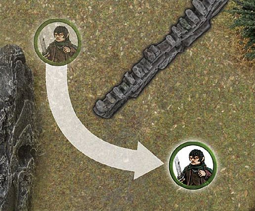
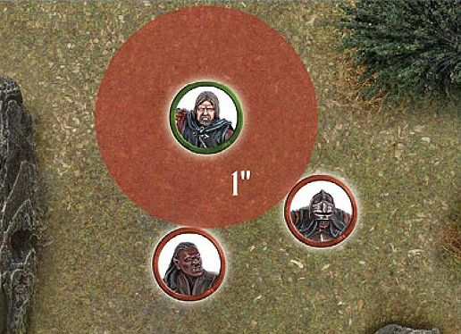
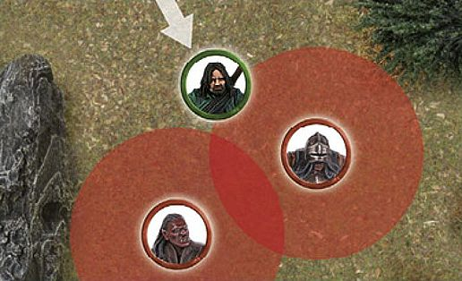
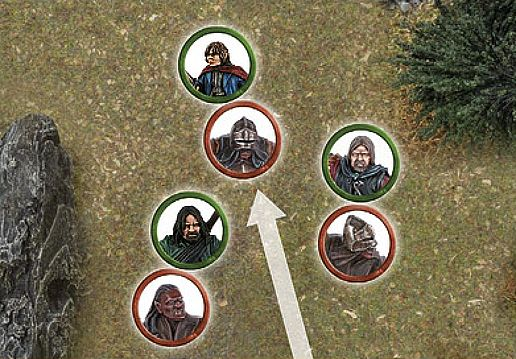
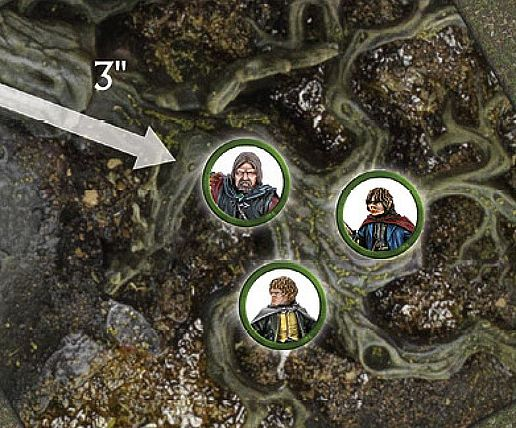
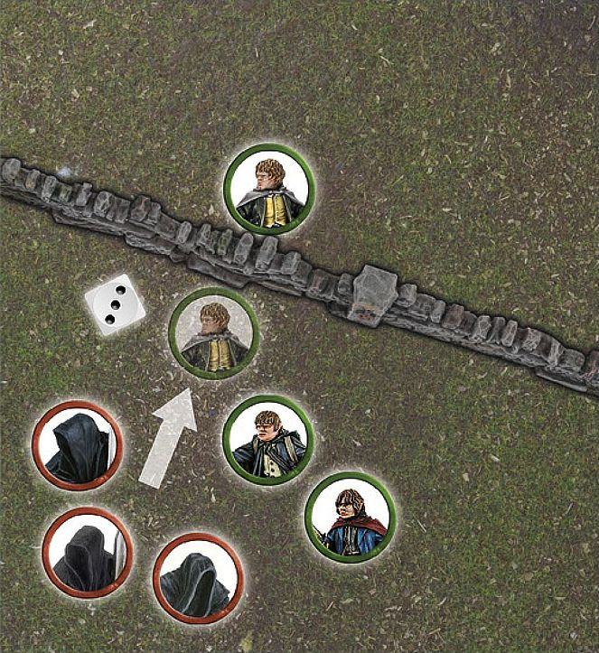
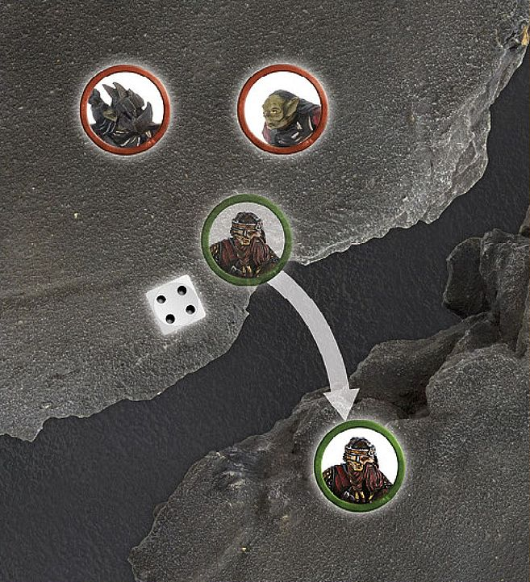
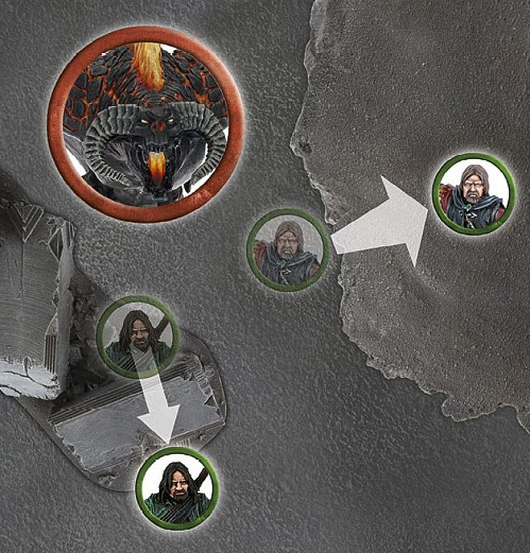
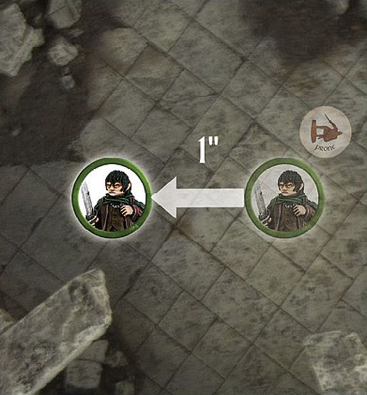

As battle rages on, success often goes to those who gain control of the field of battle and seize critical positions.  Whether the goal is to carefully infiltrate the ruins of *Osgiliath* or to flee the rampaging *Morannon* Orc hordes that burst forth from the *Anduin*, a firm grasp of the Move rules is required to achieve victory.

## PRIORITY

In the Move phase, the player with Priority moves first. They may move all, some or none of the models under their control. Once the player with Priority is completely finished, the opposing player then gets to do likewise.

## MOVING MODELS

Ordinarily, you can move each of your models in the Move phase. You can move your models in any order that you choose — as long as you complete
the move of one model before starting the move of a different one.

A model can move a distance up to its Move characteristic in inches ("), as listed in each model's profile. This is referred to as the model's 'maximum Move distance' or its 'Move allowance'.

To move a model, measure how far it can travel and then move it along the correct amount. Models are not required to move only in straight lines — in fact you will often need them to move around corners, obstacles, other models and even traverse complicated battlefields. A model may move in any direction it wishes, as long as it does not exceed its Move characteristic.

Terrain has a big impact on the game, with models constantly having to traverse many different styles of battlefield. There may be some instances whereby a model will be faced with a piece of terrain that it could in theory fit through, however, its base will not fit (such as a **Cavalry** model moving through a gate). In these situations, if it is obvious that a model would be able to move through the gap, even though its base would not allow it, then you and your opponent are free to agree that it is possible — in fact, we would encourage that you do this.

Models may not move 'through' other models. Indeed, for a model to move past or between other models, there must be enough space for its base to be able to pass through without disrupting another model's base. If there is not enough room to pass through, then the model will have to go around or wait.

Generally, the facing of a model doesn't make any difference (aside from a few models, such as the Mûmakil), since we imagine they are actually fighting and looking around, rather than static playing pieces. However, there may be occasions when you want to rotate your models outside of your Move phase for dramatic effect, for example, you may want to rotate your archers to face their target or to rotate models in combat to face each other. This is fine to do, but only to make your battle look more cinematic. There should be no rotating your models to gain an extra In The Way roll, or any other in-game advantage.

#### MODELS UNABLE TO MOVE

Sometimes, a model will be unable to move for one reason or another. When this is the case, it will be made clear in the rules. Examples of this include models that have already been charged by an enemy or that are under the influence of a specific Magical Power.

#### END OF YOUR MOVE PHASE

Some events or abilities occur 'at the end of your Move phase'. Such events and abilities happen immediately after you finish moving all of your models that you wish to move that turn.

***MOVEMENT 1***

Frodo Baggins *is trying to keep up with the rest of The Fellowship. A ruler is placed next to Frodo to measure his Move allowance of 4". It is important to not exceed a model's Move allowance (frankly, that's cheating!). With the distance determined, the Hobbit moves level with the 4" mark.*

***MOVEMENT 2***

*The ruined wall shown here is in Frodo Baggins' path. The controlling player measures around it to work out where the Hobbit's move will end.*

***MOVEMENT 3***

*With other members of The Fellowship blocking the way, Frodo Baggins can only just squeeze his base through the gap between their bases — note how the gap between* Gimli *and* Sam *is just wide enough for him to pass through.*

## CONTROL ZONES

Although all of the models are immobile, we imagine that they are, in fact, quite dynamic, ready to fight in the swirling maelstrom of battle. To represent this, every model has a Control Zone — a 1" imaginary ring that extends out from the edge of the model's base. No model may enter the Control Zone of an enemy unless they are charging the model in question (we will cover the rules for charging in a moment).

There may be occasions when a model is forced into an enemy model's Control Zone due to some other rule, such as being forced to Back Away after losing a Fight ([see page 44)] or failing a Jump test or Climb test. In these instances, it is acceptable to move the model into the Control Zone, making sure that a small distance still separates the models' bases. Note that a model cannot choose to enter an enemy's Control Zone without charging — it can only happen when another rule forces it to.

Control Zones can be a very useful tool, allowing you to keep your enemies out of a certain area of the battlefield. This can be particularly handy for protecting an objective, or an individual, from attack.

#### STUCK IN A CONTROL ZONE

It is possible for a model to start its move already within an enemy model's Control Zone. In these circumstances, your model has three choices:

- Remain where it is and forego its movement.
- Charge one of the enemy models whose Control Zone it is in.
- Move Away. In this third instance, a  model may move within the Control Zone of an enemy, provided that it doesn't get any closer to the  enemy whose Control Zone it started in.

**CONTROL ZONES 1**

Boromir *is facing off against two* Uruk-hai *Scouts. Due to Boromir's Control Zone, the Uruk-hai may not enter this space unless they are charging Boromir.*

## CHARGING ENEMIES

Across Middle-earth, there are many great fighters who possess an exceptional skill with a blade, axe or another preferred weapon. For these warriors to utilise their skills, they must fight in combat, and to do that they must Charge an enemy.

Charging is a special type of move that allows your model to end its move in base contact with an enemy model. The main rule that governs whether or not a model may Charge is that it must have Line of Sight to its intended target before it starts its Move. If the model has Line of Sight to its intended target, proceed as follows. If the model does not have Line of Sight, try looking for a different target, moving another model first or moving to a better spot for the next turn.

Making a Charge is simple — measure the distance as you would for making any other move and, if you have enough movement to reach your target, move your model into base contact with the target.

Once a model has charged into an enemy and is in base contact with it, they are both Engaged in combat and cannot move any further in the Move phase.

There are occasions when a model that was already Engaged in combat might suddenly find itself unengaged (a model that charged an enemy may have been slain by a throwing weapon or Magical Power, causing their opponent to become disengaged). If this happens, and the newly disengaged model's opportunity to move has not yet passed, it may still do so.

It is quite possible, due to the order in which you move your models, that a model that could not make a Charge earlier in the phase might well be able to do so as your Move phase continues. This makes the order in which you move your models extremely important. Models may block one another's movement or, if moved in the right order, may free each other to move more effectively.

#### CHARGES AND CONTROL ZONES

There are a couple of rules regarding Control Zones that come about due to Charges:

The first rule is that if a model enters an enemy's Control Zone, they must Charge that enemy, although they may continue moving within that model's Control Zone in order to Charge a different part of the model's base if they so wish and have movement remaining. If a model enters two Control Zones simultaneously, the controlling player may choose which one it will Charge.

The second rule is that a model that is Engaged in combat has its Control Zone cancelled out. This means that you can eliminate the Control Zones of enemy models in order to clear a route through them.

The third rule is that once a charging model enters a Control Zone, it may ignore the Control Zones of other models in order to continue charging its original target. This means that, no matter how closely packed enemy models are, a model is always able to Charge the first enemy model whose Control Zone it moves into.

#### CHARGING MULTIPLE ENEMIES

There are times when a model who is especially skilled in combat (or desperate) will wish to Charge more than one enemy at a time. This can serve a number of tactical advantages, not least of which is enabling them to cut down several enemies in quick succession.

Charging multiple enemies is very straightforward. As long as your model has a high enough Move characteristic to reach all of its intended targets, and its base is large enough to touch multiple models, move its base into contact with its enemies.

Remember that a model ignores subsequent Control Zones after the first one it enters, so it is free to enter the Control Zones of a second, or even third model, etc., to fight in a Multiple Combat ([see page 47)].

#### DEFENDED POSITIONS

Sometimes, a model will wish to Charge a model that is on the other side of a wall, hedge or other barrier. The rules for this are more fully detailed in the Fight phase section ([see page 48]).

**CHARGING 1**

*Gimli has charged into this Uruk-hai Scout. Because it is now Engaged, the Uruk-hai may not move any further this Move phase.*

**CHARGING 2**

Aragorn *charges the nearest Uruk-hai — entering its Control Zone first. As soon as he enters the Control Zone of the first model, he is free to continue moving within that Control Zone, so long as he ends up charging the model whose Control Zone he entered first.*

*Here, there is a narrow gap between Aragorn and Boromir, but the Uruk-hai would like to Charge the much weaker* Pippin. *However, because of Aragorn's and Boromir's Control Zones, the Uruk- hai cannot pass through without first charging one of the two Men.*

*To get around this, the Evil player has two other Uruk-hai Charge Aragorn and Boromir. Now that they are Engaged in combat, Aragorn's and Boromir's Control Zones have been cancelled out.*

*With both Aragorn and Boromir Engaged in combat, the path is clear through to poor Pippin, who must now fight for his life!*

**CHARGING 3**

*Boromir is an incredibly mighty hero, and can fearlessly face multiple Uruk-hai at once. With this in mind, the Good player Charges him headlong into a pair of nearby Uruks.*

## PAIRING OFF FIGHTS

At the end of the Move phase, it is important to work out which models are Engaged in combat with one another, for the sake of clarity. Any models that are Engaged in combat with an enemy need to be paired off into Fights, which are more fully detailed in the Fight Phase section ([see page 42]).

You may have situations where two, or maybe more, enemies face a single model. This is called a Multiple Combat. At the end of the Move phase, opponents are always paired off into one-on-one Fights where possible.

First, all models in base contact with an enemy must fight, so make sure all models Engaged in combat are still in a Fight when you are done.

Second, if a model could be involved in more than one Fight, the player with Priority may choose which of the possible combats they are assigned to.

In practice, it is usually a good idea for both players to look over all of the potential combats at the end of the Move phase and split them into their Fights — with the player with Priority deciding on any where there are multiple options. It can be a good idea to separate the combats slightly, so the Fights actually have a little distance between them. However, this should only ever be done for the sake of clarity, not to gain a benefit in-game. It's probably not a good idea to do this if it would have an effect on the models — such as moving a model out of proximity with a banner, or moving models out of their Shieldwall formation. In any case, if models are separated for the sake of clarity, they will still count as being in base contact with what they were beforehand.

Sometimes, there will be situations whereby a rule will target or affect a model in a Fight which could cause multiple other models to be affected as well; this could be a throwing weapon, a Magical Power (such as Sorcerous Blast) or a special rule. This can cause some issues as models are not divided into Fights until the end of the Move phase, so players may be unsure of who is actually involved in the Fight. If this situation arises, the player with Priority may decide how the Fights are split before the end of the Move phase so as to make resolving the effects of the rule easier and simple to understand.

**PAIRING OFF FIGHTS**

*Frodo is in base contact with Moria Goblin A. As it's clear who Frodo is fighting, and there are no other models in the fight, no pairing off is required.*

*Sam is in base contact with Moria Goblins B and C. Merry is also in base contact with Moria Goblin C, and so Merry is paired off against Moria Goblin C, leaving Sam to fight only Moria Goblin B.*

*Finally, and most complex of all, Pippin is in base contact with Moria Goblins D and E, while Aragorn is in base contact with Moria Goblins E and F. It is clear that Pippin is fighting against Moria Goblin D and Aragorn is fighting Moria Goblin F. However, as Goblin E is in base contact with both Pippin and Aragorn, and both are already in a fight, the player with Priority chooses which fight the Goblin is paired off into. As the Evil player has Priority, they choose to pair off Goblin E into Pippin's fight bad news for the Hobbit!*

## TERRAIN

Middle-earth is full of exciting and vibrant places filled with all manner of terrain, from the peaceful rolling hills of The Shire to the war-torn ruins of Osgiliath or the rocky caves of *The Misty Mountains*. It is often the battlefields that we play on that make the game so enjoyable and immersive, but to ensure that our games still run smoothly, we need a couple of rules to govern them.

#### OPEN GROUND

Generally speaking, the majority of any battlefield is open ground. This covers such surfaces as grassy fields, sandy beaches, carved stone passageways or wooden walkways. There are no special rules assigned to such terrain, and any abilities that affect terrain do not affect open ground. Moving on such surfaces is completely normal and natural; models can move around on them up to their full Move.

#### DIFFICULT TERRAIN

Areas of loose rocks, thick undergrowth, especially long grass and other terrain that makes movement awkward, but not dangerous, is considered to be difficult terrain. This sort of ground isn't especially threatening (indeed it's not really dangerous at all, in most circumstances), but it does tend to slow down the movement of our fighters.

Any model that enters difficult terrain counts the distance it moves whilst in it as double. Thus, a model that moved half an inch through a piece of difficult terrain has used up a whole inch of movement, and so on. This penalty is applied any time that even part of the model's base is within difficult terrain.

**DIFFICULT TERRAIN 1**

*Boromir of* Gondor *(a Man with a Move of 6") is racing through the thick undergrowth of* Amon Hen *to rescue* Merry *and Pippin. For every 1" Boromir moves, he counts as having moved 2".*

*Merry and Pippin are in need of more help, so Boromir rushes into the difficult terrain to save them. Boromir moves across 2" of open ground before he reaches the difficult terrain. Since he only has 4" of movement remaining, he can only move 2" into the thick undergrowth.*

#### OBSTACLES

Barricades, broken walls, fallen trees, hedges and piles of rocks are scattered across the battlefields and wild places of Middle-earth. These provide shelter from missile fire, as well as obstructions for our adventurers to traverse. Carefully placed Obstacles can slow the advance of an entire army as models are forced to jump over or travel around them.

The term Obstacle describes linear objects on the battlefield that impede movement, but can still be crossed, such as low walls, fences and so on. A model's ability to cross any such Obstacle is determined by comparing the height of the model and the Obstacle in question.

Any model can automatically cross an Obstacle that is less than half its height, without penalty — simply move the model over the Obstacle, imagining that it is stepping over it. This means that a Man will be able to stride effortlessly over an Obstacle that a Hobbit or Dwarf might struggle — with while this may seem unfair, it is true that little folk would find some obstacles to be much more difficult than big folk might.

A model can attempt to cross an Obstacle that is greater than half its height, but must take a Jump test or Climb test to do so ([see pages 28 and 30] respectively). Usually, you can tell whether a model can cross an Obstacle without a test just by looking at it. In those rare situations where you must know exactly, measure the model from the top of its head to the bottom of its feet. Be sure to work out the model's 'true height', not the height of it in a strange pose (crouching low or perched on something, for example), and be sure to agree with your opponent. Once you have determined the height of the model, compare it to the height of the Obstacle to see if a test is needed.

## JUMPING

From fallen trees to low walls, there are many items that impede movement on the battlefield. Jumping represents vaulting (or, in the case of Hobbits, a type of mad scrambling) to get across an Obstacle. Any attempt to do this is resolved with a Jump test.

A model may jump an Obstacle that is up to (but no greater than) its own height. If the top of the Obstacle is higher than the top of the model's head, it must instead make a Climb test ([see page 30]).

Making a Jump test is simple. Move your model into base contact with the Obstacle that you wish to jump over, roll a D6, compare the result to the Jump table on the left and follow the instructions given.

The horizontal movement your model makes when it jumps an Obstacle still counts towards the distance that model has moved this turn (although the vertical movement does not).

#### JUMP TABLE

| D6  | RESULT                                                                                                                                                                                                                                         |
| --- | ---------------------------------------------------------------------------------------------------------------------------------------------------------------------------------------------------------------------------------------------- |
| 1   | **STUMBLES AND FAILS** The model does not cross the Obstacle, but instead ends its movement for the turn.                                                                                                                                |
| 2‑5 | **SUCCESS** The model successfully clambers over the Obstacle and reaches the other side. Place your model on the other side of the Obstacle, with its base touching it. The model may move no further this Move phase.                  |
| 6   | **EFFORTLESSLY BOUNDS ACROSS** The model vaults across the Obstacle with ease, and may even complete its movement up to its maximum Move distance (minus the distance it already used getting up to and across the Obstacle, of course). |

**JUMPING**

*Merry is fleeing from the* Nazgûl *as they pursue the Hobbits, and now wishes to cross over a low wall. As the wall is no taller than Merry, he may attempt to jump over it. He moves into base contact with it and makes his Jump test. He rolls a 3 and moves over the wall to the other side.*

*Pippin catches up with his friend and also attempts to jump over the same wall. He takes his test and rolls a 6. Pippin therefore not only crosses the wall, but may continue his move with his remaining allowance.*

*Seeing his friends jump over the wall ahead of him, Sam desperately attempts to jump the same wall and takes his Jump test. However, Sam only rolls a 1, meaning that he fails to jump the wall and must now face the wrath of the* Black Riders*.

## LEAPING

With rickety walkways, yawning chasms and other such hazards decorating our battlefields, there are plenty of opportunities for models to leap across intervening gaps. Any attempt to do this is resolved with a Leap test. To leap across a gap, your model's maximum Move allowance must reach far enough across the gap to be able to place it fully on the other side, otherwise it's just too far to leap across.

A model can leap across a gap with a width of up to twice the height of the model (compare the model to the gap in question if you are in any doubt). If the gap is wider than twice the model's height, they cannot attempt to leap across it.

Making a Leap test is simple. Move your model up to the gap that you wish it to leap over, roll a D6, compare the result to the Leap table on the right and follow the instructions given.

#### LEAP TABLE

| D6 | RESULT                                                                                                       |
|-----------|--------------------------------------------------------------------------------------------------------------|
| 1         | **STUMBLES AND FAILS** The attempt to leap the gap has gone wrong. The model falls to the bottom of the gap, suffering falling damage as described on page 31 and is knocked Prone. |
| 2‑5       | **SUCCESS** The model manages to leap across safely. Place the model on the other side of the gap, with its base touching it. The model may move no further this Move phase. |
| 6         | **EFFORTLESSLY BOUNDS ACROSS** The model leaps across without missing a step. Place it on the other side; it may even complete its movement up to its maximum Move allowance. |

**LEAPING**

*Being chased by two Moria Goblins, Gimli decides to leap across a chasm to safety. Trusting to luck, he rolls a dice and consults the Leap table to see if he makes it to the other side. Rolling a 4, the Leap is a success, and he moves to the other side of the gap.*

## CLIMBING

When faced with especially tall Obstacles, the likes of a rock face, a tumble- down pile of statuary or raised scaffolding, a Climb test is often in order. The major difference between jumping and climbing is whether a model is attempting to increase its altitude by more than its own height.

When a model attempts to make a Climb test, it is important that there is some way for it to scale the surface — handholds, jutting rocks, wooden crosspieces, and so on. Whenever a model climbs in this manner, they are moving through difficult terrain ([see page 26]). Areas that do not have these are considered to be unscalable (see below).

Making a Climb test is simple. Move your model to the bottom of the surface you wish to scale, roll a D6, compare the result to the Climb table on the left and follow the instructions given.

A model may climb a surface or Obstacle of any height, provided that it is scalable (see below). **Cavalry** models may not make Climb tests.

#### CLIMB TABLE

| D6  | RESULT                                                                                                       |
|-----------|--------------------------------------------------------------------------------------------------------------|
| 1         | **FALL** The model slips and falls to the ground, and becomes Prone (see page 32) at the bottom of the surface it attempted to climb, place a Prone marker next to it. If the model began its climb at ground level, it suffers no further damage, but if it was higher than this, it may suffer falling damage (see opposite). |
| 2‑5       | **CONTINUE TO CLIMB** The model climbs until it has moved its maximum Move distance, or reaches the top, after which it may move no further this Move phase.           |
| 6         | **SWIFT ASCENT** The model climbs until it has moved its maximum Move distance, or reaches the top. It may even complete its move up to its maximum Move distance after it reaches the top (minus the distance it has already used climbing up, of course). |

#### CLIMBING VERY TALL STRUCTURES

In rare circumstances, models may wish to climb up very tall structures that will take more than one turn's worth of movement to reach the top. In these instances, either perch the model in a satisfactory way at roughly the correct height or leave the model at the bottom and place a dice beside them to indicate how many inches they have progressed.

#### UNSCALABLE TERRAIN

To prevent strange situations in our games, and to reduce the risk of damage to our models, we assume that any surface that is sheer (such as a fortress wall) or where we cannot balance a model without the risk of it falling off (such as a small pillar or a tree), cannot be climbed in our games. This means we can satisfactorily rule out situations where models are balanced atop tree leaves, teetering on rock pillars or other unlikely situations. If it doesn't look great, and doesn't instinctively 'feel right' for both players, then steer clear of it.

#### LADDERS, ROPES AND SIMILAR

There are a number of ways to make climbing easier, such as using a ladder, a rope or even a steep set of steps. Climbing up or down one of these doesn't typically require a Climb test, and neither is it difficult terrain. A model must simply expend the requisite movement to reach the top.

**LEAPING AND CLIMBING**

*With the* Balrog *hot on the heels of The Fellowship, they must do everything they can to escape. Aragorn decides to try to move over a small fallen pillar — he must take a Jump test. Boromir, on the other hand, wants to put some height between himself and the demon, and so chooses to scramble up a rocky cliff — he must take a Climb test.*

**CLIMBING**

*Aragorn,* Legolas *and Gimli are cut off from their allies in* Helm's Deep *and need to climb the scaffolding to reach them. Aragorn spends 1" of movement to reach the base of the scaffold and then takes a Climb test. Rolling a 4, he is successful and moves to the top. Legolas follows suit and rolls a 6 on his Climb test. He moves up the scaffold and then spends his remaining movement (note that climbing is considered difficult terrain, so he has precious little left). Finally, Gimli reaches the bottom of the scaffold, but rolls a 1 for his Climb test. He fails to climb and instead falls to the floor, and a Prone marker is placed next to him.*

## DESCENDING AND FALLING

What goes up, must come down, or so the old expression says. Models can move downwards in two ways — they either descend safely or they fall.

#### DESCENDING

A model may automatically descend a distance equal to its own height without any penalty (the distance the model moves downwards is ignored for working out how far the model has moved that phase). If a model needs to descend further, they must make a Climb test, with the exception that they move directly down instead of up — there must also be some way for the model to climb down, such as handholds, etc. If the Climb test is failed (a roll of a 1) or the model falls for some other reason, it will suffer falling damage, as follows.

#### FALLING

A model that falls is knocked Prone at the base of the surface they have fallen from. If the model has fallen a distance greater than its own height, it immediately suffers falling damage: one Strength 3 hit ([see page 40)], plus one additional Strength 3 hit for every 1" more than its height it has fallen.

**LADDER**

*Frodo Baggins doesn't fancy climbing this rockface, and so finds a ladder to scale instead. The ladder is 3" high, and so he moves up it at the cost of 3" of movement.*

## PRONE MODELS

During battles in *Middle-earth*, there are times when a model will find itself lying on the ground — whether this is the result of being charged by a Cavalry model, falling whilst trying to climb or attempting to hide from a foe. A model that is Knocked to the Ground is said to be Prone and should have a Prone marker placed next to it to show that the model is on the floor — this prevents any unnecessary damage to our precious models. Prone models have certain special rules that govern how they act.

#### CONTROL ZONES

A Prone model does not have a Control Zone.

#### PRONE MODELS AND LINE OF SIGHT

When a model is Prone, we can imagine it is writhing on the floor or cowering beneath a shield. Usually, a model would be able to see over a model that is Prone, however in some extreme circumstances (such as a Cave Troll being knocked Prone) this may not be the case. For these reasons, a Prone model is considered to be half its normal height (from the top of its head to its feet) for the purpose of working out Line of Sight. 

#### CRAWLING

A model that is Prone may crawl 1" in the Move phase, regardless of its maximum Move allowance or the manner of terrain it is in. If a model crawls, the only other movement it may make that turn is to stand up. Crawling models may not make Jump, Leap or Climb tests. Prone models may not Charge — they must stand up first.

#### STANDING UP/LYING DOWN

A Prone model may stand up at the cost of half of its maximum Move allowance, and may still Charge if it does so. Likewise, a standing model may lie down for the same cost. A model may not both lie down and stand up during its own Move phase.

#### CHARGING PRONE MODELS

Prone models may be charged as normal. As they have no Control Zone, an enemy can move within 1" of them unimpeded, provided it doesn't come into base contact.

#### JUMPING OVER PRONE MODELS

You may attempt to jump over a Prone model by moving your model as close as you can to the Prone model, without making base contact, and then taking a Jump test (see page 28). If you pass (results 2-6), move your model over the Prone model (place it as close to the model as possible without making base contact) and proceed as if it had jumped an Obstacle. If you fail the roll, and the Prone model is a friendly model, then the jumping model just fails the Jump test. If you fail the roll, and the Prone model is an enemy, the jumping model must instead Charge the Prone enemy model, receiving any charging bonuses it would normally get.

**PRONE MODELS**

In previous iterations of the game, we used to lie our models down to represent them being Prone. However, over the years this has caused some of our beloved models to be chipped or damaged and so the rules for this have changed in order to protect our models from harm.

**PRONE & MOVEMENT**

*Frodo Baggins has been knocked Prone by a pursuing Ringwraith. The Hobbit crawls 1" towards safety and then stands up — enabling him to move his full Move allowance in the following turn.*

## REINFORCEMENTS

*As the battle rages, additional warriors often flock to the fray, drawn on by the sounds of combat.*

Reinforcements typically enter play after a player has moved all of their models in a specified Move phase. To move a model onto the board, a point is chosen on the specified board edge, then the model will move onto the board from that point. The model may then move as usual, except that it may not Charge in that Move phase.

In Matched Play games, whole warbands will move onto the board from the same point via the Reinforcements rule. The player who chooses where the reinforcements enter play must choose a place where the entire warband may be fully deployed. If there is physically no way for this to be accomplished, the reinforcements may enter on the next turn instead, where they will roll again with a +1 bonus to their roll.

**REINFORCEMENTS**

*Faramir's warband have arrived via the rules for Reinforcements. First, Faramir moves onto the board from the point chosen, followed by his warband, one by one.*
