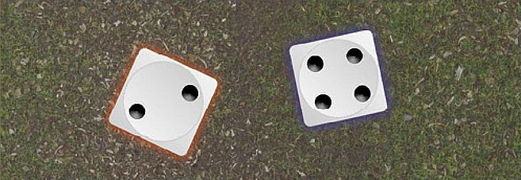

Priority is how we determine which player acts first in the subsequent phases of a turn. It represents one force acting swiftly (or the other biding its time) and can present a range of tactical opportunities and consequences throughout the turn that follows.

In Narrative Play, Priority will always go to the Good player on the first turn, unless the Scenario specifically states otherwise.

In Matched Play and Open Play games, it is common for both players to roll for Priority in the first turn — re-rolling any ties.

Regardless of what type of game you are playing, from the second turn onwards both players will roll a D6 in the Priority phase to see which player has Priority for the subsequent turn. The player who rolls highest has Priority. In the event of a tie, Priority passes to the player who did not have it in the previous turn. For this reason (and indeed, for reminding yourself who has Priority throughout the turn), it is a good idea to have a suitable counter or token so that it is easy for both players to see who currently has Priority, and to pass it between players as and when Priority changes during the course of the game.

As you play more games and gain experience, you'll quickly realise there are both advantages and disadvantages to having (or not having) Priority. After a few battles, it will become apparent that there are tactics and ruses that you can use to make the Priority phase work to your advantage. Something else to bear in mind is that there are a number of special abilities that can alter the ordinary workings of the Priority phase (Heroic Actions, certain special rules and so on). These are explained fully in the relevant sections.

*A battle is taking place, and it is now the Priority phase. Each player rolls a D6 to determine who has Priority. Adam rolls a 4, whilst Jay rolls a 2, resulting in Adam gaining Priority. If the result had been a tie, Priority would have gone to Jay as Adam had Priority in the previous turn.*

