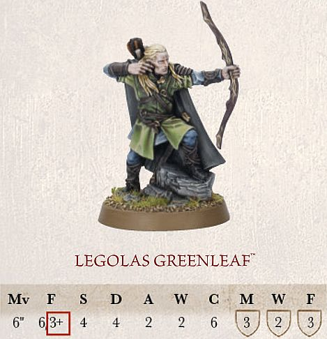
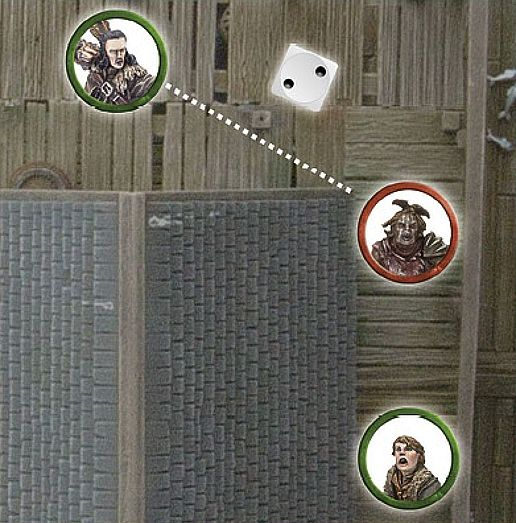
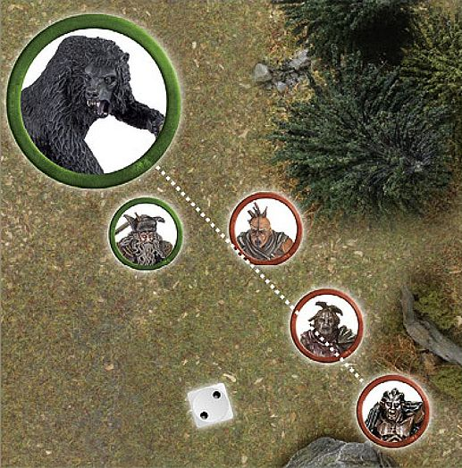
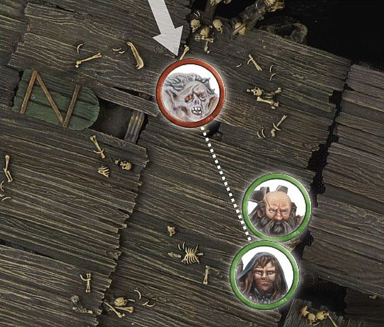
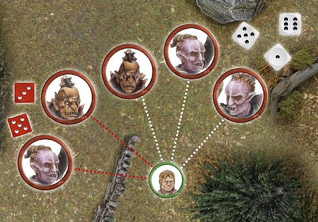

Many armies will employ the use of archers, crossbows or some other form of ranged weaponry, tasked with raining down death from afar. These weapons vary in all manner of size and ways of use, from the traditional bow and arrow used by the Warriors of Minas Tirith, to the deadly crossbows wielded by the fearsome Uruk-hai and the finely balanced throwing spears the Riders of Rohan plunge into their enemies. Though these weapons are all different, they are all used to fulfill the same task — namely to fell their enemies before they can reach the fight.

During the Shoot phase, each player's eligible models can make a shooting attack with their missile weapons. To make a shooting attack, they must first pick a target, roll To Hit and then roll To Wound.

## PRIORITY

The player with Priority shoots first. They select one of their models and resolve its shooting attack. Once they are finished, they select another of their models and resolve its shooting attack — repeating this process until they have made all of the shooting attacks that they wish to. Once the player with Priority has resolved all of their shooting attacks, the other player may then do likewise.

## HOW TO SHOOT

Shooting is a fairly simple practice, especially after you have done it a few times. Here are the steps you need to take to make a shooting attack:

1. Check Line of Sight to your intended target — Make sure that the model can actually see part of the model that they wish to shoot at.

2. Work out the number of models or Obstacles that are In The Way — If the Line of Sight to the target is obscured, you will need to know what it is that blocks this Line of Sight as this may affect whether the model may shoot or not.

3. Roll To Hit — Roll a D6 to see if your model has hit its target based on their Shoot value.

4. Make any In The Way rolls — If there are models/terrain along the path to the target, you will need to roll to see if the shot hits something along the path, or hits its intended target.

5. Roll To Wound — If the shot hits a model, you'll need to make another roll to see if the hit has caused a serious wound.

6. Remove Casualties — Any model that was slain is removed from the battlefield.

**FINDING THE SHOOT VALUE**

All models have a Shoot value listed in their profile — it is the second number beneath the Fight characteristic (and is always followed by a plus sign). Here you can see Legolas has a Shoot value of 3+.

*For example: Having worked out that he can see his target, and that his target is in range, Legolas lets his arrow loose against the Hunter Orc. To see if the shot is a hit, Legolas rolls a D6, which results in a 5. This is enough to hit the target, but if he had rolled a 1 or a 2, the shot would have missed.*

## WHO CAN SHOOT?

There are a variety of factors that determine whether or not a model is eligible to make a shooting attack. If a model has a missile weapon, has a target to shoot at, hasn't moved too far in the preceding Move phase and is not Engaged in combat, it may make a shooting attack.

### MISSILE WEAPONS

In order to shoot, a model must be equipped with a missile weapon (for example, a bow, crossbow, etc), many of which are described on [page 88]. 

### PICKING A TARGET

A model must have a target to shoot at. For an enemy model to be a viable target, they must be in Line of Sight and in range. It is likely that there will be multiple enemy models that are eligible targets. When this is the case, simply choose one of them to shoot at.

### LINE OF SIGHT

When you select a model to make a shot, you need to check if they have any enemy models within Line of Sight.

***LINE OF SIGHT***

*Legolas is readying himself to make a shot and there are four Hunter Orcs (A, B, C, D) before him. Hunter Orc A is in the open, and therefore is an eligible target. Hunter Orc B is partially concealed by the tree trunk, but is still a viable target. Hunter Orc C is almost completely concealed, but Legolas can see some of his face, so he is still a legitimate target. Hunter Orc D, on the other hand, is completely concealed except for his hand and a waving weapon — he cannot be targeted.*

### MEASURE RANGE

You will also need to check to see if an enemy model is in range. Every missile weapon has a maximum range that tells you how far it can shoot in inches. Check to see how far each model's weapon can shoot by looking at the Missile Weapon chart on [page 88] (a cut down version can be seen below). If the distance to an enemy model is equal to or less than the weapon's maximum range, then it is in range.

### MISSILE WEAPON CHART

| NAME   | RANGE | STRENGTH |
|-----------|-------|----------|
| Bow    | 24"  | 2    |
| Dwarf bow | 18"  | 3    |
| Elf bow  | 24"  | 3    |
| Great bow | 24"  | 4    |
| Ore bow  | 18"  | 2    |

## MOVING AND SHOOTING

Moving too far can keep a model from making a shooting attack that turn (it's hard to aim a bow and run across a battlefield). A model can move and shoot as long as it has not moved further than half its Move allowance in the preceding Move phase. In addition, a model may not shoot if it has attempted a Jump, Leap, Climb or Swim (see pages 28-30 and [109]) test in the preceding Move phase (even if they rolled a 6), or if it is Prone.

Bear in mind that certain types of terrain have the effect of slowing models down further, as described in the Move phase. A model in difficult terrain, for example, would only be able to move a quarter of its usual maximum Move distance and still shoot (halving its Movement for the terrain and then
halving it again if they wish to shoot).

## ROLLING TO HIT

Once a target has been chosen, you will need to see if they are hit. Not all fighters have an equal skill when shooting. Some, like Legolas Greenleaf, are expert archers with finely wrought bows, whilst others are clumsy or make crude shots with poorly made weapons. However, when shooting at the foe, there is always a chance (however small) that the shot will hit.

We represent this by making a dice roll and comparing it to the firer's Shoot value — this is called a Shoot roll. A model's Shoot value is the score it needs to equal or beat for the shot to hit its target. To see if your shot hits, roll a D6 — if the score is equal to or higher than the target number, you have hit!

If the score rolled is not high enough, the shot misses its target and causes no harm, probably clattering to rest somewhere nearby or sticking harmlessly into a piece of scenery.

### IN THE WAY

Often, you will find that there are objects (or even other models) obscuring the shots you wish to make. When you are taking a look to see if your model can see its target, keep an eye out for any obstructions such as these. If you pass your Shoot roll, you will need to take an In The Way test for each obstruction.

Taking an In The Way test is simple — roll a D6 and compare the result to the In The Way chart below. If the result equals or beats the number given by the In The Way chart, the shot continues on its way to the target. Should you fail, the shot hits the obstruction instead. If the obstruction in question is another model, the shot may even result in some damage ([see page 40]).

Depending on what is between your model and their target, the roll will be easier or harder. If two or more obstructions stand In The Way of your shot, you will need to take an In The Way test for each of them, starting with the obstruction closest to the shooter.

There are rare situations where a model will be able to draw multiple Lines of Sight to a large model, and it can be difficult to know which path the shot will take. Normally, common sense will prevail and it will be obvious which route the shot takes. However, there may be situations where there is some dispute. In these situations, the shooting model's controlling player should roll a D6 before rolling To Hit. On a 1-3, their opponent chooses the path that the shot takes. On a 4+, the shooting model's controlling player may choose. If their opponent is allowed to choose, the controlling player may elect to target a different model instead should the shot no longer be preferable. Note that if there are models In The Way, then a path must be selected that goes through at least one model. Good
models still cannot shoot at enemy models that are obscured by friendly models.

### IN THE WAY CHART

| OBSTRUCTION     | Score to Pass |
|-------------------------------------------------|---------------|
| Purpose built fortifications, large rocky outcrops, windows and doorways. | 5+  |
| Flimsy fences, bushes, crops and long grass. | 4+  |
| Walls, rocks, tree trunks, sturdy fence, intervening models and elevated positions (Combat only) | 3+  |

***TERRAIN IN THE WAY***

*Here,* Bard *wants to shoot at the Hunter Orc scout bearing down upon* Bain. *However, Bard cannot see the whole Hunter Orc model. Some of it is being blocked by a house, so the house is In The Way. Bard rolls To Hit, scoring a 5 — a hit! He must then make his In The Way roll for the house, needing a 4+ to succeed. Bard rolls a 2 and his arrow sticks firmly in the wooden house — bad news for* Bain!

### MODELS IN THE WAY

Sometimes, when you are taking shots with your models, you will find that other models partially obscure your original target. This is a slightly more complicated situation than when scenery is In The Way of a shot. 

Firstly, Good models may not take shots where there is any risk of striking another Good model. Evil models don't care for the lives of their 'friends' and can make shots regardless of what (or who) is In The Way.

The shooter must still be able to see their target; if the intervening model blocks the target completely, then the shot cannot be attempted.

***MODELS IN THE WAY 1***

*Adam wants his* Narzug *to shoot at Jay's* Beorn *with his Orc bow. However, there are two Hunter Orcs In The Way of Beorn to the right, and *Radagast *is In The Way of Beorn to the left. Adam and Jay have differing ideas as to which is the correct path for the shots to take, so to speed things up Adam (as Narzug's controlling player) rolls a D6 — and rolls a 2 meaning that the shot will pass through the two Hunter Orcs. Adam now has to decide whether he wants to risk hitting his own warriors or whether to look for another target.*

***MODELS IN THE WAY 2***

*Bard wants to take a shot at a Hunter Orc, who is closing in on Bain. The controlling player takes a look to see if the shot is clear and realises Bain is in The Way of the shot. Because Bard is a Good model, he may not risk hurting a friendly model, and so the shot cannot be made.*

### SHOOTING FROM BEHIND COVER

A model that is in base contact with an Obstacle or piece of cover that it can see over (or around) ignores that item for the purposes of In The Way tests when it is shooting. This represents the warrior using a low wall, crop of boulders or even the trunk of a tree as cover.

***SHOOTING FROM BEHIND COVER***

*Legolas, behind a low wall, wishes to shoot at the Hunter Orcs that are closing in on him. Because he is in base contact with the wall, he can shoot across it without penalty.*

### SHOOTING FROM BEHIND FRIENDS

Whilst other models are typically considered to be obstructions when it comes to making shots, we make an exception for models who are in base contact with a friendly model with a base of the same size or smaller than theirs. We imagine that the friendly model simply leans out of the way or kneels to avoid obstructing the shot. However, models that are Engaged in combat cannot do this, they are too busy fighting for their lives to make way for the shot.

***SHOOTING FROM BEHIND FRIENDS***

Kili *is standing behind* Dwalin *(a rather safe place to be!), and wishes to take a shot at the Goblin rushing towards them. Because he is in base contact with Dwalin, Kili can shoot past him and no In The Way test is required.*

### SHOOTING AT MODELS ENGAGED IN COMBAT

Evil models can shoot at an enemy that is Engaged in combat (Good models wouldn't dare take such a shot, for fear of striking their friends). Because Fights don't actually take place between static models, but rather between warriors hacking and slashing at one another, there is a risk that the shot could strike another model in the Fight.

To shoot a model Engaged in combat, the shooter must be able to see their target. If they can, roll To Hit as normal and take any In The Way tests for obstructions up to, but not including, those models actually Engaged in the same Fight.

Finally, you'll need to make a special In The Way test: roll a D6 to see who in the Fight is hit. On a 1-3, the friendly model closest to the firer is hit. On a 4-6, the original target is hit instead.

***SHOOTING INTO COMBAT***

Fimbul *wants to shoot at* Thorin*, *who is Engaged in combat against a pair of Hunter Orcs. Because he is an Evil model, Fimbul may take the shot. First he rolls To Hit, scoring a 6 a very clear hit! Next, he takes the special In The Way test to see if he hits Thorin, or one of the Hunter Orcs. Fimbul rolls a 2, meaning that he instead hits the Hunter Orc closest to him!*

### MOVING AND SHOOTING

If a model has moved, it will have less time to prepare to make a shot (all that jostling around has an impact on accuracy). Any model who wishes to shoot in the same turn that it has moved suffers a penalty to their Shoot value, making it slightly harder for them to score a successful hit.

This is represented by making the Shoot value of a model that has moved 1 point worse for the rest of the turn. Thus, a model with a Shoot value of 4+ that has moved will instead require a 5+ to hit their target that turn. A roll of a 6 always hits.

Note that turning on the spot does not count as movement (in fact, it's a great way to pose your models so that they are aiming at their target).

***MOVING AND SHOOTING***

*Kili is trying to keep up with his friends, whilst also whittling down the Goblins bearing down upon them. He wishes to shoot at the Goblin nearest to him, and has moved this turn. Normally Kili needs a 3+ to hit a target with his bow, but because he has moved this turn, he instead needs a 4+. Kili rolls a 4, which is a hit!*

## ROLLING TO WOUND

When a shot hits its target, there is a chance it will cause serious injury or death. Of course, there is also the chance it will merely inflict a flesh wound
or be deflected by armour, causing no damage at all!

Every missile weapon has a Strength value, which is often different to the user's and represents the power of the weapon itself. A weapon's Strength value
can be found on the Missile Weapons chart on [page 88].

First, compare the Strength of the weapon to the Defence of your target on the To Wound chart shown above. The result indicates the minimum dice roll required to inflict one Wound on your enemy. A score of 6/4, 6/5 or 6/6 means you must roll a single dice and score a 6, followed by a further dice that must score either 4+, 5+ or another 6, respectively. A '-' means that model cannot wound the target, they are just too tough to be harmed. If your dice roll is not high enough, no Wound is inflicted (the target just ignores the blow).

### TO WOUND CHART

**ROLLING TO WOUND**

*Kili's arrow has hit his target, so now we need to know if the shot has caused any damage. Checking the To Wound chart, we discover that Kili's Dwarf bow (with a Strength of 3) needs a 4 or better To Wound the Goblin (whose Defence is 3). Luckily, Kili rolls a 6, and the Goblin suffers a Wound and is slain!*

## RECORDING WOUNDS AND REMOVING CASUALTIES

When a model suffers a Wound, check against its profile to see how many Wounds it has. A model that has a Wound characteristic of 1 is slain as soon as it suffers its first Wound. A model that has two Wounds must be wounded twice before it is killed, and so on. For models with multiple Wounds, it helps to place a counter beside the model (or make a note on a piece of paper) to remind you how many Wounds the model has remaining.

When a model loses its last Wound, simply remove it from the game as a casualty — pick it up and place it carefully to one side.

## TAKING SHOTS TOGETHER

Sometimes you will have several models firing at the same target. These situations can be resolved quicker by taking all the shots together. To do this, count up the number of firers, and roll that many dice at once. Work out which have struck the target, and then roll To Wound.

To make things clearer, it helps to roll different coloured dice for different variables. If the shooting models have different Shoot values, have different obstructions In The Way of their shots or will require a different score To Wound their foes, you can designate a particular colour to the variable: '*Blue dice need 3 or more to hit, red dice need 5 or more,*' for instance.

Taking shots together can really make your game flow more quickly and smoothly, and works very well if both players communicate clearly with each other as they play.

If you have multiple models shooting at multiple targets, it is best to break them up into smaller groups and resolve shots at individual targets as above.

***TAKING SHOTS TOGETHER***

Bilbo Baggins *is in trouble — five Hunter Orcs are lining up to take shots at him. Two of the Hunter Orcs will need to take an In The Way test for a low wall, however (indicated by the red lines). To keep track of these and to make rolling all of the dice quicker, the dice can be rolled in two batches: the three shots that are unobstructed, and the two shots that will require In The Way rolls. Once it is clear which shots have hit, all of the To Wound rolls can be made at once.*
