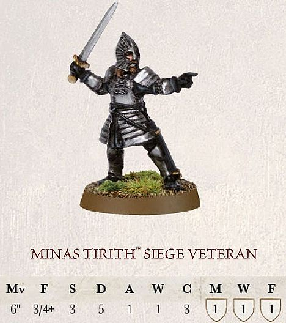
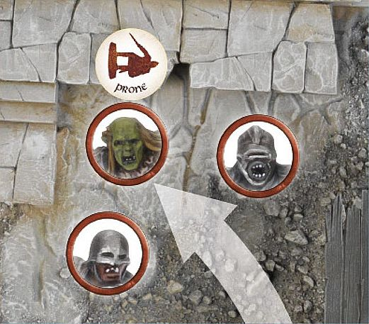
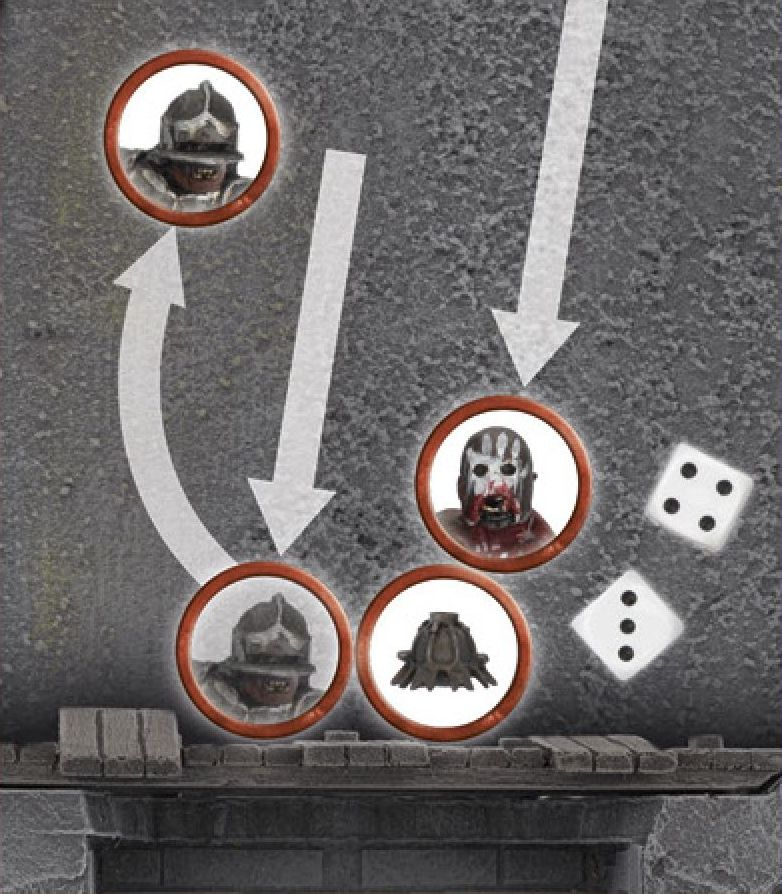

There are many races within Middle-earth that utilise the devastating power of a Siege Engine. From the mighty Battlecry Trebuchets used by the defenders of Minas Tirith at the battle of the Pelennor, to the ballistae brought by the army of the Iron Hills to wage war upon the fields of Erebor. Whatever form they take, Siege Engines provide an obvious threat to an enemy force. Here we present the rules for using siege engines in your games.

A **Siege Engine** has a profile in the same way that Warrior, Hero and Monster models do. Understandably, some of the values on an ordinary profile are simply not relevant to a big, inanimate hunk of metal and wood, and this is reflected in the smaller number of characteristics on a Siege Engine's profile.

| Seige Engine                | Strength | Defence | Wounds |
|---------------------|----------|---------|--------|
| BATTLECRY TREBUCHET | (10)       | 10      | 3      |

A **Siege Engine** also always comes with a crew specified in its profile -- these are fighters who have been specially trained to operate it. Crew have their own characteristic profiles — the crew may not move more than 6" from their **Siege Engine** unless it is first destroyed.

#### SIEGE VETERANS

Additionally, a single member of every **Siege Engine** crew is always a Siege Veteran. A Siege Veteran has exactly the same profile as the rest of the crew, except they also have a single point each of Might, Will and Fate, and will replace the Warrior keyword with the Hero keyword. Unlike other Hero models, Siege Veterans may use their Might to influence To Hit, To Wound and Scatter rolls for the Siege Engine.

#### MINAS TIRITH SIEGE VETERAN

A Siege Veteran is a Minor Hero with the following exception:

The Siege Veteran's warband will only ever contain the Siege Engine and all the crew members. As a Siege Veteran is a Minor Hero, there can only ever be a maximum of six crew members to each Siege Engine. The Siege Engine does not count towards the size of the warband (see page 131).

#### MOVING THE SIEGE ENGINE

A **Siege Engine** cannot move itself, but may be moved by its crew or other nearby friendly models. Three models may move a **Siege Engine** up to their usual maximum Move distance, providing that all three start the Move phase in base contact with the **Siege Engine** and remain in base contact with it throughout their move. The **Siege Engine** moves at the rate of the slowest model. Two models may move a Siege Engine, but only up to half their maximum Move distance. A single model may not move a **Siege Engine** by itself. A Monster counts as three models for the purpose of moving a Siege Engine. A **Siege Engine** cannot move through difficult terrain or cross Barriers. 

#### FIRING THE SIEGE ENGINE

A **Siege Engine** may be fired once each turn, provided that it has not moved that turn, and has at least two unengaged crew models on foot in base contact with it who are not Prone. If there are fewer crew, or too many of the crew are Engaged in combat, then the **Siege Engine** cannot fire. Other models may assist the crew, but any model that does so will cause the Siege Engine to be less accurate, as described in the Untrained Crew rules on [page 116]. Models that are unable to move for whatever reason, such as being under the effects of the Transfix Magical Power, are not able to fire, or help to fire, a Siege Engine.

A **Siege Engine** is always defined as either large or small — this will be stated in its profile. A small **Siege Engine** only requires one unengaged crew model in base contact in order for it to fire.

All **Siege Engine** models have a range of 48" unless otherwise stated in their profile. When firing a Siege Engine, you may either aim at a model or at a point on a fortification.

Roll To Hit as normal, using the Shoot value of the crew. If different crew members have different Shoot values, the highest Shoot value available is always used, so long as the model is not Engaged in combat. If you fail to hit, the missile has gone astray of the target or some mechanical error has occurred — either way, the shot misses. If the shot hits, roll on the Scatter table if firing at a Battlefield target (see left); if firing at a Siege target, no roll on the Scatter table is required. Note, if a model involved in a Fight is hit by a Siege Engine shot then all models in the Fight are automatically hit.

**FIRING THE SIEGE ENGINE**

*A Battlecry Trebuchet is defending a Minas Tirith outpost from a horde of attacking Mordor Orcs. The Trebuchet nominates an* Orc *as a target and rolls To Hit; scoring a 5 — a clear hit! Because Infantry models are Battlefield targets, the Battlecry Trebuchet now rolls on the Scatter table, scoring a 6, and so the* Orc *Warrior suffers one Strength 10 hit and is Knocked to the Ground.*

#### VOLLEY FIRE

A **Siege Engine** that is a catapult or trebuchet can Volley Fire. This enables it to shoot at a target it (and its crew) cannot see, so long as any other friendly model can see the target and it is in range of your Siege Engine. Other Siege Engine models, such as ballistae and bolt throwers, cannot Volley Fire unless otherwise stated in their rules. Models that use the Volley Fire rule for shooting do not make any In The Way rolls for intervening models, terrain or anything else in the path of the shot. However, as the shot is coming from above, a degree of common sense is needed to work out if items above the target model would cause an In The Way roll. Anything that is clearly taller than the target, and would be above the target when the shot would come down, will incur an In The Way roll. This could be anything from branches, bridges, awnings, ledges or rocks that jut out from cliff faces.

#### BATTLEFIELD AND SIEGE TARGETS

Any target that you fire a **Siege Engine** at is either a Battlefield target or Siege target. Battlefield targets tend to be things that can move swiftly or are small, whilst Siege targets are typically large and static. On [page 114] is a list of target types you
will encounter in your games, and the definition of whether they are Battlefield targets or Siege targets. As you play, you will find more items you wish to define. Basically, if both players agree that it would be easy for a trained **Siege Engine** crew to hit, it should be treated as a Siege target — so simply agree with your opponent before the game.

Once you have chosen your target, roll To Hit.

If you are firing at a Siege target, the shot will either hit or miss.

If you are firing at a Battlefield target, there is a chance that the unwieldy weapon will miss its chosen target and instead hit someone, or something, nearby. Roll on the Scatter table that follows and apply the result.

#### TARGET TYPES

**Battlefield Targets:** 
* Infantry models 
* Cavalry models 
* Monster models
* Doors
* Small Siege Engines

**Siege Targets:**
* Large Gates 
* The Mûmak
* Houses
* Boats
* Large Siege Engines

#### FRIENDS IN PROXIMITY AND IN THE WAY

A **Siege Engine** that benefits from Volley Fire does not make In The Way rolls for models between the **Siege Engine** and their target (the shot sails high through the air and crashes down on its victim).

Other **Siege Engine** models may require In the Way rolls. Once you have rolled for scatter and determined the victim of the shot, check to see what, if anything, is In The Way, based on the final path of the shot.

Although there is a high chance of a Siege Engine missing its intended target and instead hitting a friendly model, a Good **Siege Engine** may still fire at a target even if they risk hitting their friends with the scatter. This is an exception to Good models not risking injury to their allies. Note that a Good model may not fire a **Siege Engine** at a target if it would require an In The Way roll for a friendly model.

#### SCATTERTABLE

| D6 | Result                                                                                                                                                              |
|-----------|----------------------------------------------------------------------------------------------------------------------------------------------------------------------|
| 1         | **Wide of the Mark.** Your opponent may nominate one of your Battlefield targets, or a Siege target within 6" of the initial target, as the new target. If no alternative target is within 6", or if the player does not want to do this, the shot misses completely. |
| 2‑5       | **Slight Deviation.** Your opponent may nominate one of their own Battlefield targets within 6" of the initial target as the new target, or choose the original target. |
| 6         | **Dead on!** The shot lands exactly on the target.                                                                                                                      |

#### ROLLING TO WOUND

Once any scatter has been resolved, roll To Wound as normal using the Strength of the **Siege Engine** (shown in brackets on the profile) against the Defence of the victim.

Any Battlefield target struck by a shot from a **Siege Engine** is knocked Prone and will be slain if wounded (regardless of how many Wounds it has remaining). A model only needs to pass one Fate roll to prevent all the Wounds it would have suffered.

The only exceptions to this instant kill situation are if the target has a Defence of 10 or 10 or more Wounds on its starting profile — a wounding hit against such a target will cause the model to suffer a number of Wounds equal to half of its Wounds characteristic, rounded up, rather than die instantly.

Note that if a Cavalry model is struck, the mount, rider and any passengers are all hit and knocked Prone — you must roll To Wound for each of them.

#### INJURY TO NEARBY MODELS

Any models near the target struck by the **Siege Engine** may well be in danger. Look in the firing **Siege Engine** model's special rules for specific details.

#### SIEGE ENGINE CREW

Siege Engine crew may operate any **Siege Engine** that their army may field. For example, Mordor War Catapult crew could skillfully operate any Mordor War Catapult or a Mordor Siege Bow, but not an Uruk-hai Siege Assault Machine or Gondor Battlecry Trebuchet. If they attempt to operate such a machine, they count as untrained crew (as below). A crewman may not operate more than one **Siege Engine** at once.

When you deploy your **Siege Engine**, its crew must be placed in base contact with it.

#### UNTRAINED CREW

A **Siege Engine** that is being operated by more untrained crew than regular crew will only ever hit on the roll of a 6. Additionally, only Siege Veterans and Engineer Captains (see page 119) may use Might to influence rolls To Hit, rolls To Wound or Scatter chart rolls made for the **Siege Engine** ([see page 115]).

#### COURAGE TESTS

The **Siege Engine** itself does not need to make Courage tests (and does not count when working out the total size of the force or the Break Point of the force in a Matched Play game). The crew of a **Siege Engine** take Courage tests as normal and count towards the size of the force.

#### ATTACKINGTHE SIEGE ENGINE

A **Siege Engine** can be shot at normally. If reduced to 0 Wounds, the model is disabled for the rest of the game — leave the **Siege Engine** in place, but it cannot be fired any more.

If an enemy model spends a full turn in base contact with a **Siege Engine** without doing anything else (ie, not shooting, using Magical Powers, or fighting in combat), the **Siege Engine** is automatically disabled, as described above.

A **Siege Engine** does not have a Control Zone.

A **Siege Engine** counts as having a Strength of 6 for the purposes of Sorcerous Blast and similar effects.

#### DEPLOYING A SIEGE ENGINE

In Matched Play and Open Play games, a **Siege Engine** does not follow the usual rules for deployment. Instead, it is always deployed within 6" of the controlling player's table edge — regardless of the Scenario.

In Scenarios where models move onto the board via the Maelstrom of Battle special rule, both players roll a dice to determine their board edges for the purpose of deploying their **Siege Engine** models. The player who scored the highest may choose any board edge to count as their board edge (the opposing player automatically has the opposite board edge) and immediately deploy their **Siege Engine** models. The opposing player then deploys their **Siege Engine** models. In this situation, a **Siege Engine** does not count as having moved in the first turn.

If only one player has a Siege Engine, they automatically count as having won the dice roll.

A **Siege Engine** may never hold an objective in Scenarios that require models to be within a certain range of an objective.

## DEMOLITION CHARGES

Demolition charges are deadly, if unpredictable, siege weapons. Only models from an army that has access to demolition charges can carry demolition
charges.

#### MOVING THE CHARGE

A demolition charge is a Heavy Object, as described on [page 110]. It may never be carried by Cavalry models.

#### DETONATING THE CHARGE

To use the demolition charge, it must be dropped. A model with a flaming brand that is in base contact with the charge, which is not also Engaged in combat, may attempt to set it off at the start of the Fight phase. The model attempting to set off the charge must pass a Courage test. If they fail, they cannot detonate the charge. If they succeed, the controlling player rolls on the Detonation table below to determine the effects.

#### DETONATION TABLE

| D6  | Result                                                                                                         |
|-----------|-----------------------------------------------------------------------------------------------------------------|
| 1         | **Dud.** The charge has been damaged in some way and will not detonate yet — roll again next turn and add +1 to the roll. |
| 2‑5       | **Instant Reaction.** The charge catches instantly, exploding in a roar of smoke and flame, see below.              |
| 6         | **Titanic Explosion.** The powder in the charge detonates with colossal fury as described below, but inflicts 2D6 Wounds rather than D6. |

When it explodes, a demolition charge automatically strikes everything within 2" of the model — walls, gates, doors, and of course, any models (friend or foe) that are in range of it. Each target struck automatically takes D6 Wounds, regardless of its Defence value. Cavalry models take D6 Wounds on both the mount and the rider.

**DETONATING THE CHARGE**

*Here, the Uruk-hai wishes to blast the gates open with a demolition charge. The Uruk-hai moves the charge to the gate and drops it. Once in place, an Uruk-hai Berserker carrying a burning brand moves into base contact. He takes a Courage test (which he easily passes) and then rolls on the Detonation table and applies the result.*

#### DESPERATE DETONATIONS

Without a flaming brand, causing a detonation is hard. Any model from the same army as the demolition charge may attempt a Desperate Detonation at the start of the Fight phase, as long as it is in base contact and not Engaged in combat. It must also pass a Courage test as normal. For each model attempting this, roll a D6. If one or more 6s are rolled, the charge is detonated — roll on the Detonation table as usual.

#### ATTACKING THE CHARGE

The demolition charge can be shot at normally, and has a Defence of 7 and 3 Wounds. If the charge is wounded, roll a D6 per Wound inflicted. On a 6, the charge immediately detonates — roll on the Detonation table as normal.

A demolition charge that is wounded by another demolition charge will be detonated on the roll of a 4+ (per Wound suffered) rather than a 6.

If brought to 0 Wounds without exploding, the demolition charge is shattered and the powder scatters harmlessly on the ground — remove the charge from play.

An enemy model that spends a Fight phase in base contact with a demolition charge, and is not Engaged in combat, may automatically disable it.  Remove it from play.

## SIEGE ENGINE UPGRADES

#### ENGINEER CAPTAIN

If you choose this option, replace the Siege Veteran with a Captain from the relevant army list. You should use a suitable model for this. Engineer Captains have all the usual weapons that a Captain would have, and may even be upgraded to carry any equipment that a Captain could take, with the exception that they can never be mounted. They will also have the Hero keyword and be counted as a Hero of Fortitude. Unlike other Hero models, Engineer Captains may use their Might to influence To Hit, To Wound and Scatter rolls for the **Siege Engine**. Only a single Engineer Captain may be attached to each **Siege Engine**.

#### FLAMING AMMUNITION

If this **Siege Engine** hits a Siege Target, the firing player may re- roll any To Wound rolls of a 1.

#### SEVERED HEADS

The **Siege Engine** may choose to either fire in the normal way, or to fire a collection of severed heads at the enemy. If Severed Heads are fired at a Battlefield Target, ignore the normal Strength of the Siege Engine; instead, the initial target and all models within 2" suffer one Strength 3 hit. This shot will not knock models Prone and will only ever inflict one Wound. Any enemy models hit must immediately pass a Courage test or be removed from play.

#### SUPERIOR CONSTRUCTION

This **Siege Engine** is an impressive feat of engineering, allowing it to fire even further. The **Siege Engine** model's maximum range is increased by 12".

#### SWIFT RELOAD

When firing a **Siege Engine** with this upgrade, the firing player rolls two D6 rather than one, choosing the highest result, when determining the number of shots fired.

#### TROLL

*Some Evil Siege Engines enlist the use of Trolls to load massive rocks onto them, and defend the crew should they need to.*

A **Siege Engine** that has a Troll crew member may re-roll the To Hit roll and the roll on the Scatter chart, providing that the Troll is in base contact with the **Siege Engine** and not Engaged in combat. The Troll does not count towards the minimum number of crew required, so you must have at least two other crew members to operate the Siege Engine. The Troll follows the profile for the relevant Troll from the same army list but may not take any additional upgrades. Only a single Troll may be attached to each Siege Engine.
