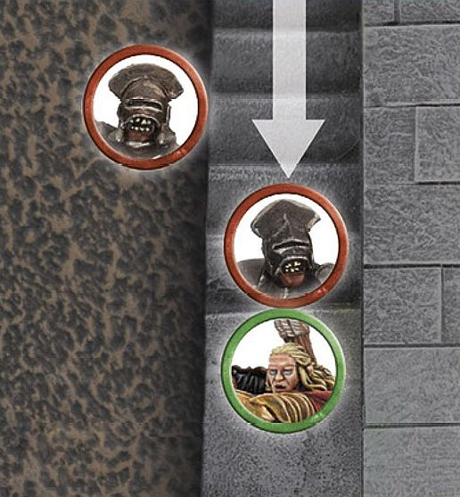

Throughout the history of Middle-earth, many sieges have taken place. From the siege of Helm's Deep where the valiant Men of Rohan desperately defended their people from the onslaught of Saruman's Uruk-hai, to the Battle of Pelennor Fields where arguably the greatest army of the Third Age attempted to breach the walls of Minas Tirith and  bring the realm of Gondor to its knees. Siege battles have been commonplace in Middle-earth's history. On the following  pages you will find the basic rules for fighting your own siege battles — more in-depth rules for siege battles will be made  available in future publications.

## CASTLES AND FORTRESSES

These rules are designed to help you fight battles across purpose-built fortifications, recreating the danger and thrill of laying siege to a castle or defending the walls against a determined attacker. A castle or fortress is made up of two main elements: the walls, and the gates and doors.

**Walls** — Purpose-built defensive walls that are taller than a model cannot be climbed, except by models with the Swift Movement special rule. To assault defenders atop a wall, models will need a siege ladder. This restriction includes wooden palisades, stone walls and similar. We don't make allowances for smashing walls down — it's impossible to predict what kind of fortress you might have in your collection, and in our experience things in a siege get quite complicated enough without this.

**Gates, doors and hatches** — Fortresses and castles invariably have gates and doorways. These tend to be the weakest points of the construction and can all be moved through and destroyed.

#### MOVING AROUND THE FORTRESS

Models move around fortresses in the same way as the rest of the battlefield. Stairways are open ground and, along with walkways, can be moved on without hindrance.

#### MOVING THROUGH DOORS, GATES AND HATCHES.

Defending models can pass through doorways, gates and hatches freely.

Attacking models have to batter them down to pass through ([see page 122]).

#### MOVING WITHIN A FORTRESS

Depending on the configuration of your fortress, there may be doorways and trapdoors that lead through internal rooms and staircases. In these instances, players should agree how much movement it will take for a model to pass through to the exit doorway.

**MOVING WITHIN A FORTRESS**

*Théoden wishes to climb a staircase within the walls of Helm's Deep. The players have agreed that if Théoden enters this turn in one Move phase, he can emerge from the doorway in the next Move phase with half of his Movement allowance remaining.*

#### STAIRS

Models can move up and down staircases without movement penalties. If a staircase is shallow enough, even Cavalry models may move up and down
them — both players should discuss this before the game begins.

#### FIGHTING ON STAIRS

Fighting on staircases is the same as fighting anywhere else, with one exception. A model that loses a Fight on a staircase and has to Back Away down the stairs may fall. Before the Attacker makes Strikes, the loser must roll a D6; on a 1-3, they slip, fall, and become Prone.

**FIGHTING ON STAIRS**

Haldir *is fighting an Uruk-hai on a staircase within Helm's Deep. As the Uruk-hai is lower down on the staircase, if it loses the Duel roll against Haldir, it will need to roll to see if it slips and is knocked Prone. Conversely, as he is higher up, Haldir's footing is more secure and so he will not fall should he lose the Fight.*

## ASSAULTING THE FORTRESS

Generally speaking, one player's army will be outside the fortress and the other within. Attacking a fortress is easy in principle but hard in practice — the attacker must simply breach the gates or scale the walls!

#### ATTACKING GATES (AND DOORS)

A model in base contact with a gate or doorway may attack it in the Fight phase as if it were an enemy model. The Attacker automatically wins the Fight and so rolls To Wound against the Defence of the door. Each successful Strike causes one Wound. Shooting attacks with a Strength of 5 or greater may also damage doors — shooting attacks with a Strength of 4 or less cannot damage doors.

#### MAKING AN ESCALADE

A fancy term for trying to storm the battlements of a castle or fortress, the escalade is the place where warriors cross the walls of an enemy fortification. To do this, they must climb ladders and fight against those at the top of the walls.

## SIEGE LADDERS

Siege ladders are Heavy Objects ([see page 110]). If uncarried, siege ladders can be attacked; they have a Defence of 8, 2 Wounds and automatically lose Duel rolls. If models carrying a siege ladder move into base contact with a wall, the ladder is automatically raised. Place it in position against the wall. Defending models can smash down a siege ladder if they are in contact with it (see Pushing Down Siege Ladders below).

#### FIGHTING UP LADDERS 

Models may climb siege ladders in the same way as any other ladder [(see page 30]). A model may even Charge up a ladder against a defender on the wall, in which case the Fight will be resolved in the same manner as a Fight across a Barrier [(see page 48]).

If a model on a ladder loses a Fight, there is a chance they will fall   from their position. Roll a D6. On a 1-3, the model falls to the   ground and takes falling damage in the usual way. Furthermore, if the fighter falls, roll a D6 for each model below them on the ladder. On a 1-3, these also fall.

**FIGHTING UP LADDERS**

*These Uruk-hai are attacking from siege ladders. This combat is treated as a Fight across a Barrier as described on [page 48]. If the Uruk-hai wins and slays their opponent, they will automatically cross the wall onto the battlements. If they lose, they may fall backwards and fall to the ground and will take additional damage.*

#### PUSHING DOWN SIEGE LADDERS

If a model on the battlements is at the top of a siege ladder, they can attempt to push the ladder to the ground in the Move phase (as long as there is no Attacker at the top of the ladder, otherwise they will have to engage them in combat first). This uses up any remaining movement the model may have.

Roll a D6. On a 4+, the ladder falls to the ground. For every additional model helping to push, add 1 to the roll, and for each model currently on the ladder, apply a -1 modifier. Monsters may modify the dice roll by 3 in either direction depending on if they are pushing, or on the ladder, respectively.

## BATTERINGRAMS

A battering ram is a special siege weapon used to smash open doors, usually a large log that is carried or pushed towards the foe. Battering rams are Heavy Objects ([see page 110]). In the case of very large battering rams, you may wish to increase the number of models that it takes to carry it.

#### BATTERINGGATES AND DOORS

To use the ram, it must end its move touching the target doorway. In the Fight phase, the ram automatically hits the doorway (there is no need to make a Duel roll) with 1 Attack. The Strength of this Attack is equal to the Strength of the strongest model carrying it, +1 for each additional model carrying it, to a maximum of 10. A battering ram that would have a Strength of more than 10 may re-roll failed rolls To Wound.

**BATTERINGDOWN GATES**

*The gates of the* Hornburg *are being hammered by this battering ram. In the Fight phase, the battering ram gets a single Attack. Because there are six Uruk-hai crewing the ram, the ram makes the Attack at Strength 9 (Strength 4 for the first Uruk, plus 5 for the extra fighters carrying it). The gate is in deep trouble!*
